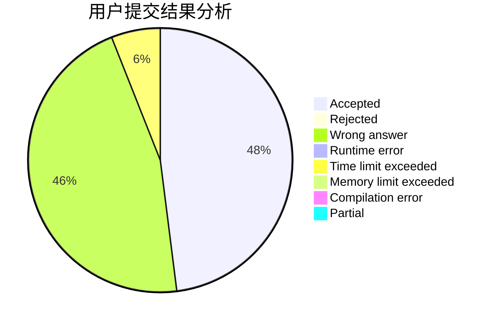
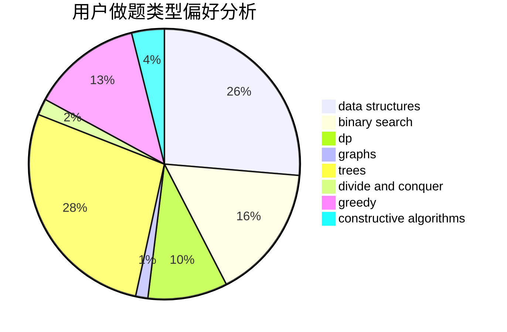

# PDH2000

<!-- tabs:start -->

#### **用户提交结果分析**

#### **用户做题类型偏好分析**

#### **用户错题知识点分析**

<!-- tabs:end -->
# 推荐题目
[1329B](https://codeforces.com/contest/1329/problem/B)		bitmasks,
                        combinatorics,
                        math		  
[1487D](https://codeforces.com/contest/1487/problem/D)		binary search,
                        brute force,
                        math,
                        number theory		  
[991E](https://codeforces.com/contest/991/problem/E)		brute force,
                        combinatorics,
                        math		  
[665C](https://codeforces.com/contest/665/problem/C)		dp,
                        greedy,
                        strings		  
[571C](https://codeforces.com/contest/571/problem/C)		constructive algorithms,
                        dfs and similar,
                        graphs,
                        greedy		  
[113C](https://codeforces.com/contest/113/problem/C)		brute force,
                        math,
                        number theory		  
[545B](https://codeforces.com/contest/545/problem/B)		greedy		  
[717E](https://codeforces.com/contest/717/problem/E)		dfs and similar		  
[628F](https://codeforces.com/contest/628/problem/F)		flows		  
[199B](https://codeforces.com/contest/199/problem/B)		geometry		  
