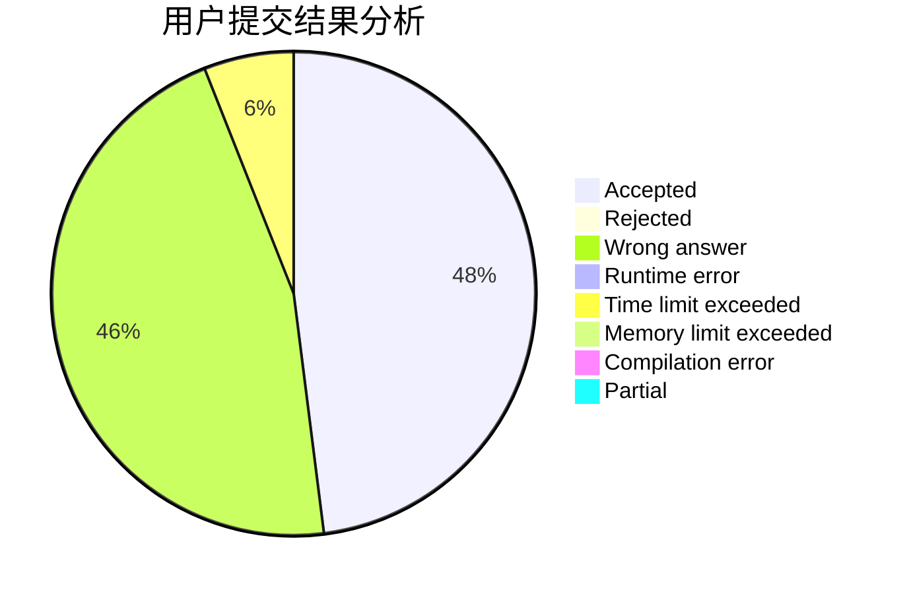
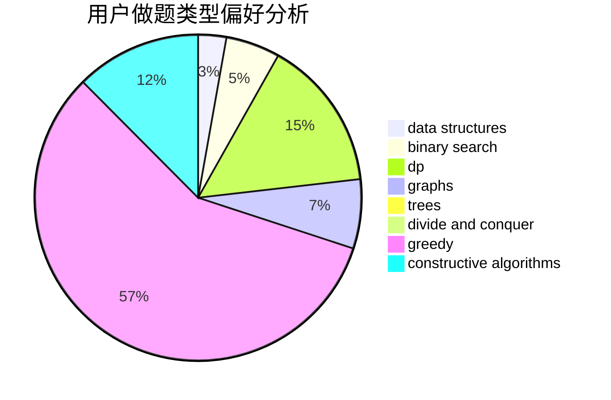

# PDH2000
<!-- tabs:start -->
#### **用户提交结果分析**

#### **用户做题类型偏好分析**

#### **用户错题知识点分析**

<!-- tabs:end -->
# 推荐题目
[Instant Noodles](http://codeforces.com/problemset/problem/1322/C)		graphs,
                        hashing,
                        math,
                        number theory		  
[Ebony and Ivory](http://codeforces.com/problemset/problem/633/A)		brute force,
                        math,
                        number theory		  
[Remove Duplicates](http://codeforces.com/problemset/problem/978/A)		implementation		  
[Tokitsukaze and Strange Rectangle](https://codeforces.com/contest/1191/problem/F)		data structures,
                        divide and conquer,
                        sortings,
                        two pointers		  
[Strange Shuffle](http://codeforces.com/problemset/problem/1470/C)		binary search,
                        brute force,
                        constructive algorithms,
                        interactive		  
[Mike and Frog](http://codeforces.com/problemset/problem/547/A)		brute force,
                        greedy,
                        implementation,
                        math		  
[Alice, Bob and Chocolate](http://codeforces.com/problemset/problem/6/C)		greedy,
                        two pointers		  
[Sum of Digits](http://codeforces.com/problemset/problem/102/B)		implementation		  
[Minimum spanning tree for each edge](http://codeforces.com/problemset/problem/609/E)		data structures,
                        dfs and similar,
                        dsu,
                        graphs,
                        trees		  
[Ping-Pong (Easy Version)](http://codeforces.com/problemset/problem/320/B)		dfs and similar,
                        graphs		  
<!-- tabs:start -->
#### **data structures**
[Instant Noodles](https://codeforces.com/contest/1191/problem/F)		data structures,
                        divide and conquer,
                        sortings,
                        two pointers		  
[Ebony and Ivory](http://codeforces.com/problemset/problem/609/E)		data structures,
                        dfs and similar,
                        dsu,
                        graphs,
                        trees		  
[Remove Duplicates](http://codeforces.com/problemset/problem/1111/E)		data structures,
                        dfs and similar,
                        dp,
                        graphs,
                        trees		  
[Tokitsukaze and Strange Rectangle](http://codeforces.com/problemset/problem/323/C)		data structures		  
[Strange Shuffle](http://codeforces.com/problemset/problem/570/C)		constructive algorithms,
                        data structures,
                        implementation		  
[Mike and Frog](http://codeforces.com/problemset/problem/797/C)		data structures,
                        greedy,
                        strings		  
[Alice, Bob and Chocolate](https://codeforces.com/contest/1261/problem/B1)		data structures,
                        greedy		  
[Sum of Digits](http://codeforces.com/problemset/problem/777/E)		brute force,
                        data structures,
                        dp,
                        greedy,
                        sortings		  
[Minimum spanning tree for each edge](https://codeforces.com/contest/1480/problem/D2)		constructive algorithms,
                        data structures,
                        dp,
                        greedy,
                        implementation		  
[Ping-Pong (Easy Version)](http://codeforces.com/problemset/problem/1200/A)		brute force,
                        data structures,
                        implementation		  
#### **binary search**
[Instant Noodles](http://codeforces.com/problemset/problem/1470/C)		binary search,
                        brute force,
                        constructive algorithms,
                        interactive		  
[Ebony and Ivory](http://codeforces.com/problemset/problem/1138/A)		binary search,
                        greedy,
                        implementation		  
[Remove Duplicates](https://codeforces.com/contest/1169/problem/C)		binary search,
                        greedy		  
[Tokitsukaze and Strange Rectangle](http://codeforces.com/problemset/problem/730/C)		binary search,
                        dfs and similar		  
[Strange Shuffle](https://codeforces.com/contest/866/problem/C)		binary search,
                        dp		  
[Mike and Frog](http://codeforces.com/problemset/problem/889/E)		binary search,
                        dp,
                        math		  
[Alice, Bob and Chocolate](http://codeforces.com/problemset/problem/1492/C)		binary search,
                        data structures,
                        dp,
                        greedy,
                        two pointers		  
[Sum of Digits](http://codeforces.com/problemset/problem/1463/D)		binary search,
                        constructive algorithms,
                        greedy,
                        two pointers		  
[Minimum spanning tree for each edge](http://codeforces.com/problemset/problem/1490/G)		binary search,
                        data structures,
                        math		  
[Ping-Pong (Easy Version)](http://codeforces.com/problemset/problem/1479/D)		binary search,
                        bitmasks,
                        brute force,
                        data structures,
                        probabilities,
                        trees		  
#### **dp**
[Instant Noodles](http://codeforces.com/problemset/problem/1111/E)		data structures,
                        dfs and similar,
                        dp,
                        graphs,
                        trees		  
[Ebony and Ivory](https://codeforces.com/contest/866/problem/C)		binary search,
                        dp		  
[Remove Duplicates](http://codeforces.com/problemset/problem/1140/D)		dp,
                        greedy,
                        math		  
[Tokitsukaze and Strange Rectangle](http://codeforces.com/problemset/problem/274/B)		dfs and similar,
                        dp,
                        greedy,
                        trees		  
[Strange Shuffle](http://codeforces.com/problemset/problem/777/E)		brute force,
                        data structures,
                        dp,
                        greedy,
                        sortings		  
[Mike and Frog](https://codeforces.com/contest/1480/problem/D2)		constructive algorithms,
                        data structures,
                        dp,
                        greedy,
                        implementation		  
[Alice, Bob and Chocolate](http://codeforces.com/problemset/problem/889/E)		binary search,
                        dp,
                        math		  
[Sum of Digits](http://codeforces.com/problemset/problem/1481/E)		data structures,
                        dp,
                        greedy		  
[Minimum spanning tree for each edge](http://codeforces.com/problemset/problem/1492/C)		binary search,
                        data structures,
                        dp,
                        greedy,
                        two pointers		  
[Ping-Pong (Easy Version)](https://codeforces.com/contest/1457/problem/C)		brute force,
                        dp,
                        implementation		  
#### **graph**
[Instant Noodles](http://codeforces.com/problemset/problem/1322/C)		graphs,
                        hashing,
                        math,
                        number theory		  
[Ebony and Ivory](http://codeforces.com/problemset/problem/609/E)		data structures,
                        dfs and similar,
                        dsu,
                        graphs,
                        trees		  
[Remove Duplicates](http://codeforces.com/problemset/problem/320/B)		dfs and similar,
                        graphs		  
[Tokitsukaze and Strange Rectangle](http://codeforces.com/problemset/problem/1111/E)		data structures,
                        dfs and similar,
                        dp,
                        graphs,
                        trees		  
[Strange Shuffle](https://codeforces.com/contest/782/problem/D)		2-sat,
                        graphs,
                        greedy,
                        implementation,
                        shortest paths,
                        strings		  
[Mike and Frog](http://codeforces.com/problemset/problem/491/C)		flows,
                        graph matchings		  
[Alice, Bob and Chocolate](http://codeforces.com/problemset/problem/1487/C)		brute force,
                        constructive algorithms,
                        dfs and similar,
                        graphs,
                        greedy,
                        implementation,
                        math		  
[Sum of Digits](http://codeforces.com/problemset/problem/1437/C)		dp,
                        flows,
                        graph matchings,
                        greedy,
                        math,
                        sortings		  
[Minimum spanning tree for each edge](http://codeforces.com/problemset/problem/1470/D)		constructive algorithms,
                        dfs and similar,
                        graph matchings,
                        graphs,
                        greedy		  
[Ping-Pong (Easy Version)](http://codeforces.com/problemset/problem/1476/C)		dp,
                        graphs,
                        greedy		  
#### **trees**
[Instant Noodles](http://codeforces.com/problemset/problem/609/E)		data structures,
                        dfs and similar,
                        dsu,
                        graphs,
                        trees		  
[Ebony and Ivory](http://codeforces.com/problemset/problem/1111/E)		data structures,
                        dfs and similar,
                        dp,
                        graphs,
                        trees		  
[Remove Duplicates](http://codeforces.com/problemset/problem/274/B)		dfs and similar,
                        dp,
                        greedy,
                        trees		  
[Tokitsukaze and Strange Rectangle](http://codeforces.com/problemset/problem/1479/D)		binary search,
                        bitmasks,
                        brute force,
                        data structures,
                        probabilities,
                        trees		  
[Strange Shuffle](http://codeforces.com/problemset/problem/1511/C)		brute force,
                        data structures,
                        implementation,
                        trees		  
[Mike and Frog](http://codeforces.com/problemset/problem/1499/F)		combinatorics,
                        dfs and similar,
                        dp,
                        trees		  
[Alice, Bob and Chocolate](http://codeforces.com/problemset/problem/1491/E)		brute force,
                        dfs and similar,
                        divide and conquer,
                        number theory,
                        trees		  
[Sum of Digits](http://codeforces.com/problemset/problem/1466/D)		data structures,
                        greedy,
                        sortings,
                        trees		  
[Minimum spanning tree for each edge](http://codeforces.com/problemset/problem/1495/D)		combinatorics,
                        dfs and similar,
                        graphs,
                        math,
                        shortest paths,
                        trees		  
[Ping-Pong (Easy Version)](http://codeforces.com/problemset/problem/1303/G)		data structures,
                        divide and conquer,
                        geometry,
                        trees		  
#### **divide and conquer**
[Instant Noodles](https://codeforces.com/contest/1191/problem/F)		data structures,
                        divide and conquer,
                        sortings,
                        two pointers		  
[Ebony and Ivory](http://codeforces.com/problemset/problem/1461/D)		binary search,
                        brute force,
                        data structures,
                        divide and conquer,
                        implementation,
                        sortings		  
[Remove Duplicates](http://codeforces.com/problemset/problem/1466/G)		combinatorics,
                        divide and conquer,
                        hashing,
                        math,
                        string suffix structures,
                        strings		  
[Tokitsukaze and Strange Rectangle](http://codeforces.com/problemset/problem/1490/D)		dfs and similar,
                        divide and conquer,
                        implementation		  
[Strange Shuffle](https://codeforces.com/contest/1483/problem/C)		data structures,
                        divide and conquer,
                        dp		  
[Mike and Frog](http://codeforces.com/problemset/problem/1491/E)		brute force,
                        dfs and similar,
                        divide and conquer,
                        number theory,
                        trees		  
[Alice, Bob and Chocolate](http://codeforces.com/problemset/problem/1303/G)		data structures,
                        divide and conquer,
                        geometry,
                        trees		  
[Sum of Digits](http://codeforces.com/problemset/problem/1494/D)		constructive algorithms,
                        data structures,
                        dfs and similar,
                        divide and conquer,
                        dsu,
                        greedy,
                        sortings,
                        trees		  
[Minimum spanning tree for each edge](http://codeforces.com/problemset/problem/1482/E)		data structures,
                        divide and conquer,
                        dp		  
[Ping-Pong (Easy Version)](http://codeforces.com/problemset/problem/566/C)		dfs and similar,
                        divide and conquer,
                        trees		  
#### **greedy**
[Instant Noodles](http://codeforces.com/problemset/problem/547/A)		brute force,
                        greedy,
                        implementation,
                        math		  
[Ebony and Ivory](http://codeforces.com/problemset/problem/6/C)		greedy,
                        two pointers		  
[Remove Duplicates](https://codeforces.com/contest/782/problem/D)		2-sat,
                        graphs,
                        greedy,
                        implementation,
                        shortest paths,
                        strings		  
[Tokitsukaze and Strange Rectangle](https://codeforces.com/contest/1478/problem/F)		constructive algorithms,
                        geometry,
                        greedy,
                        math,
                        sortings		  
[Strange Shuffle](http://codeforces.com/problemset/problem/1138/A)		binary search,
                        greedy,
                        implementation		  
[Mike and Frog](https://codeforces.com/contest/1169/problem/C)		binary search,
                        greedy		  
[Alice, Bob and Chocolate](http://codeforces.com/problemset/problem/797/C)		data structures,
                        greedy,
                        strings		  
[Sum of Digits](https://codeforces.com/contest/1261/problem/B1)		data structures,
                        greedy		  
[Minimum spanning tree for each edge](https://codeforces.com/contest/1300/problem/C)		brute force,
                        greedy,
                        math		  
[Ping-Pong (Easy Version)](http://codeforces.com/problemset/problem/1140/D)		dp,
                        greedy,
                        math		  
#### **constructive algorithms**
[Instant Noodles](http://codeforces.com/problemset/problem/1470/C)		binary search,
                        brute force,
                        constructive algorithms,
                        interactive		  
[Ebony and Ivory](https://codeforces.com/contest/1478/problem/F)		constructive algorithms,
                        geometry,
                        greedy,
                        math,
                        sortings		  
[Remove Duplicates](https://codeforces.com/contest/759/problem/A)		constructive algorithms,
                        dfs and similar		  
[Tokitsukaze and Strange Rectangle](http://codeforces.com/problemset/problem/570/C)		constructive algorithms,
                        data structures,
                        implementation		  
[Strange Shuffle](https://codeforces.com/contest/1480/problem/D2)		constructive algorithms,
                        data structures,
                        dp,
                        greedy,
                        implementation		  
[Mike and Frog](http://codeforces.com/problemset/problem/1493/A)		constructive algorithms,
                        greedy		  
[Alice, Bob and Chocolate](http://codeforces.com/problemset/problem/1463/D)		binary search,
                        constructive algorithms,
                        greedy,
                        two pointers		  
[Sum of Digits](https://codeforces.com/contest/1456/problem/B)		bitmasks,
                        brute force,
                        constructive algorithms		  
[Minimum spanning tree for each edge](http://codeforces.com/problemset/problem/1492/D)		bitmasks,
                        constructive algorithms,
                        greedy,
                        math		  
[Ping-Pong (Easy Version)](https://codeforces.com/contest/1504/problem/D)		constructive algorithms,
                        games,
                        interactive		  
#### **sortings**
[Instant Noodles](https://codeforces.com/contest/1191/problem/F)		data structures,
                        divide and conquer,
                        sortings,
                        two pointers		  
[Ebony and Ivory](https://codeforces.com/contest/1478/problem/F)		constructive algorithms,
                        geometry,
                        greedy,
                        math,
                        sortings		  
[Remove Duplicates](http://codeforces.com/problemset/problem/1197/A)		greedy,
                        math,
                        sortings		  
[Tokitsukaze and Strange Rectangle](http://codeforces.com/problemset/problem/777/E)		brute force,
                        data structures,
                        dp,
                        greedy,
                        sortings		  
[Strange Shuffle](https://codeforces.com/contest/1496/problem/C)		geometry,
                        greedy,
                        math,
                        sortings		  
[Mike and Frog](http://codeforces.com/problemset/problem/1495/A)		geometry,
                        greedy,
                        math,
                        sortings		  
[Alice, Bob and Chocolate](http://codeforces.com/problemset/problem/1497/A)		brute force,
                        data structures,
                        greedy,
                        sortings		  
[Sum of Digits](http://codeforces.com/problemset/problem/1427/A)		math,
                        sortings		  
[Minimum spanning tree for each edge](http://codeforces.com/problemset/problem/1461/D)		binary search,
                        brute force,
                        data structures,
                        divide and conquer,
                        implementation,
                        sortings		  
[Ping-Pong (Easy Version)](http://codeforces.com/problemset/problem/1437/C)		dp,
                        flows,
                        graph matchings,
                        greedy,
                        math,
                        sortings		  
<!-- tabs:end -->
