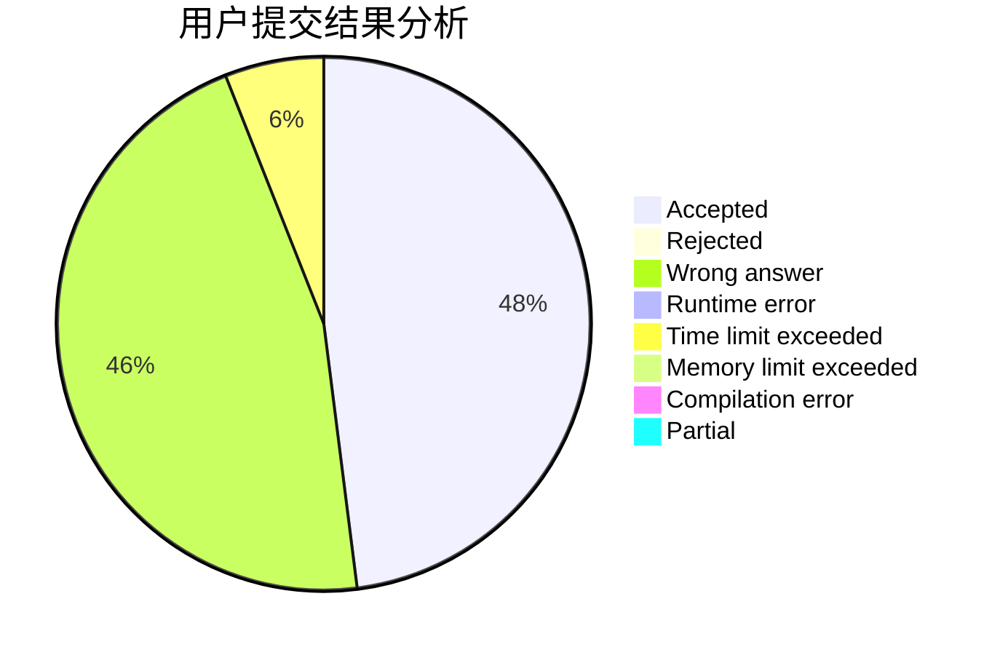
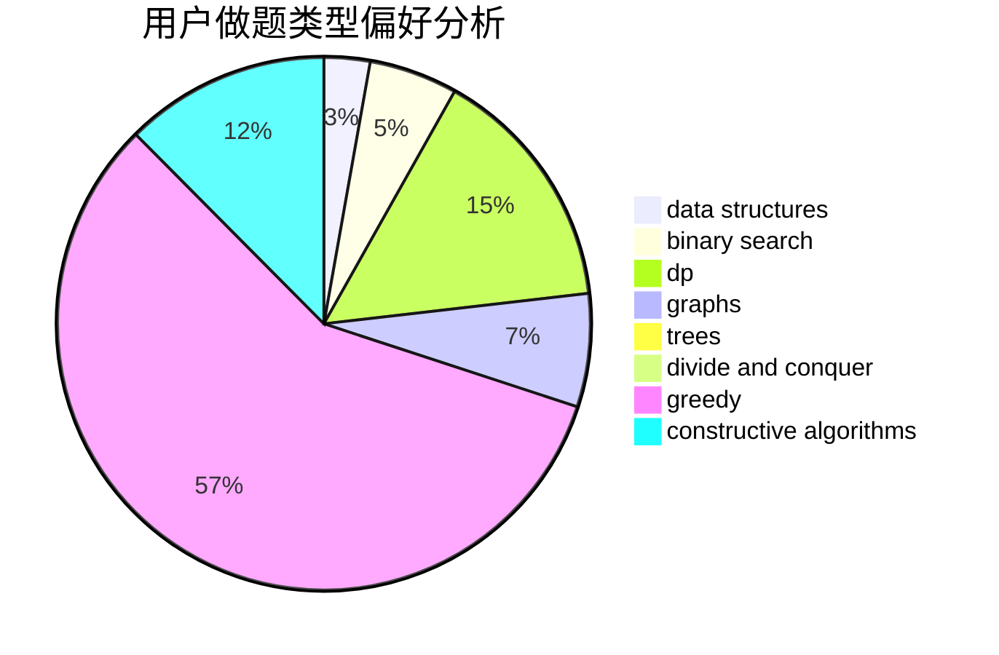

# PDH2000

<!-- tabs:start -->

#### **用户提交结果分析**

#### **用户做题类型偏好分析**

#### **用户错题知识点分析**

<!-- tabs:end -->
# 推荐题目
[1322C](https://codeforces.com/contest/1322/problem/C)		graphs,
                        hashing,
                        math,
                        number theory		  
[1478F](https://codeforces.com/contest/1478/problem/F)		dsu,graphs,sortings,trees		  
[978A](https://codeforces.com/contest/978/problem/A)		implementation		  
[633A](https://codeforces.com/contest/633/problem/A)		brute force,
                        math,
                        number theory		  
[547A](https://codeforces.com/contest/547/problem/A)		brute force,
                        greedy,
                        implementation,
                        math		  
[1138A](https://codeforces.com/contest/1138/problem/A)		binary search,
                        greedy,
                        implementation		  
[51A](https://codeforces.com/contest/51/problem/A)		implementation		  
[6C](https://codeforces.com/contest/6/problem/C)		greedy,
                        two pointers		  
[609E](https://codeforces.com/contest/609/problem/E)		data structures,
                        dfs and similar,
                        dsu,
                        graphs,
                        trees		  
[171E](https://codeforces.com/contest/171/problem/E)		*special problem		  
