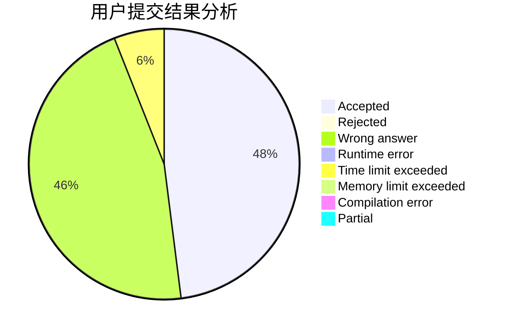
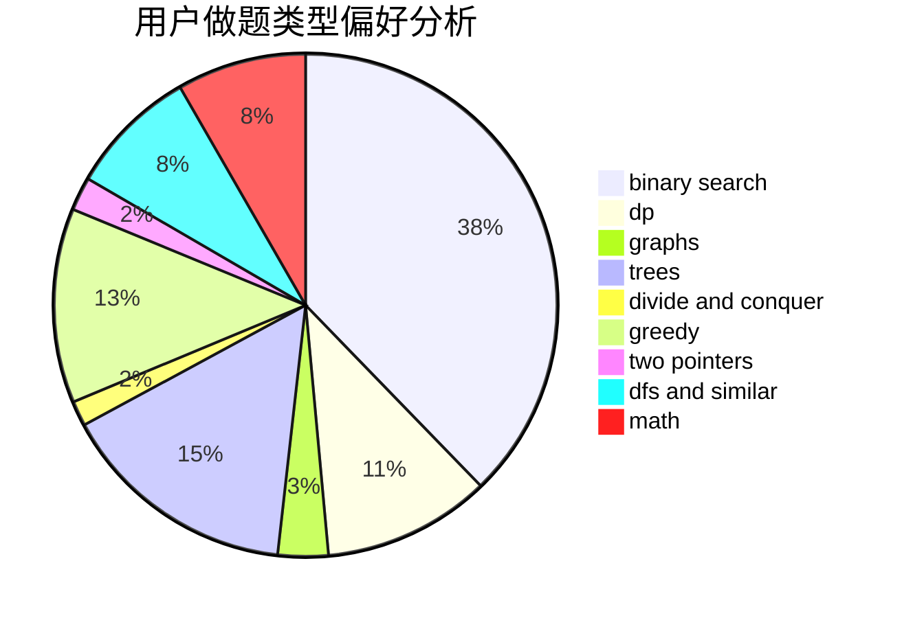

# PDH2000

<!-- tabs:start -->

#### **用户提交结果分析**

#### **用户做题类型偏好分析**

<!-- tabs:end -->
# 推荐题目
[1329B](https://codeforces.com/contest/1329/problem/B)
[1487D](https://codeforces.com/contest/1487/problem/D)
[991E](https://codeforces.com/contest/991/problem/E)
[665C](https://codeforces.com/contest/665/problem/C)
[571C](https://codeforces.com/contest/571/problem/C)
[113C](https://codeforces.com/contest/113/problem/C)
[545B](https://codeforces.com/contest/545/problem/B)
[717E](https://codeforces.com/contest/717/problem/E)
[628F](https://codeforces.com/contest/628/problem/F)
[199B](https://codeforces.com/contest/199/problem/B)
