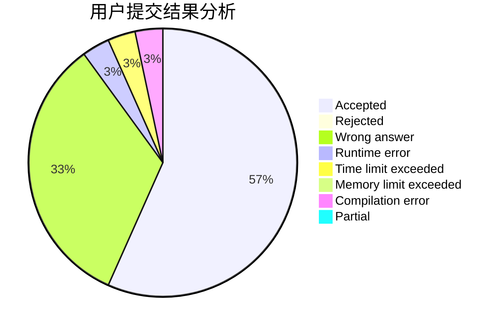
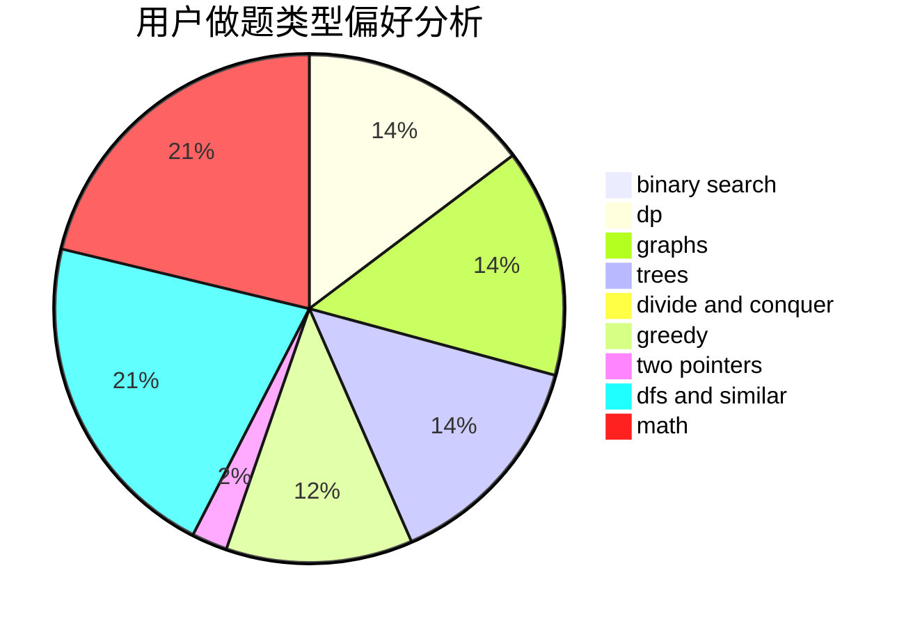

# PP-Automation

<!-- tabs:start -->

#### **用户提交结果分析**

#### **用户做题类型偏好分析**

<!-- tabs:end -->
# 推荐题目
[283B](https://codeforces.com/contest/283/problem/B)
[1065F](https://codeforces.com/contest/1065/problem/F)
[725B](https://codeforces.com/contest/725/problem/B)
[1103D](https://codeforces.com/contest/1103/problem/D)
[17C](https://codeforces.com/contest/17/problem/C)
[818D](https://codeforces.com/contest/818/problem/D)
[841A](https://codeforces.com/contest/841/problem/A)
[48A](https://codeforces.com/contest/48/problem/A)
[1010F](https://codeforces.com/contest/1010/problem/F)
[276E](https://codeforces.com/contest/276/problem/E)
