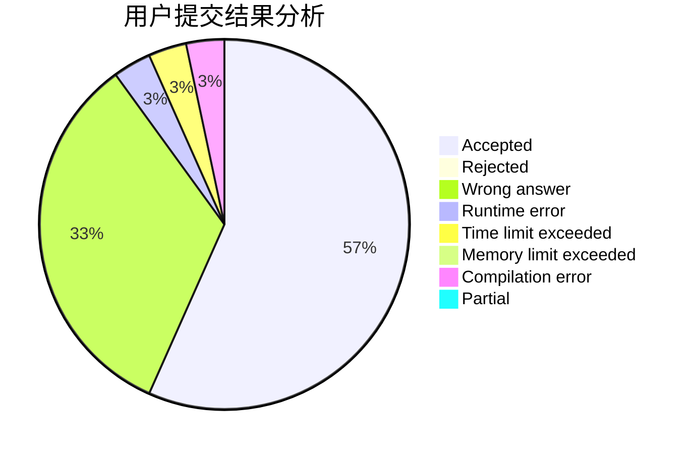
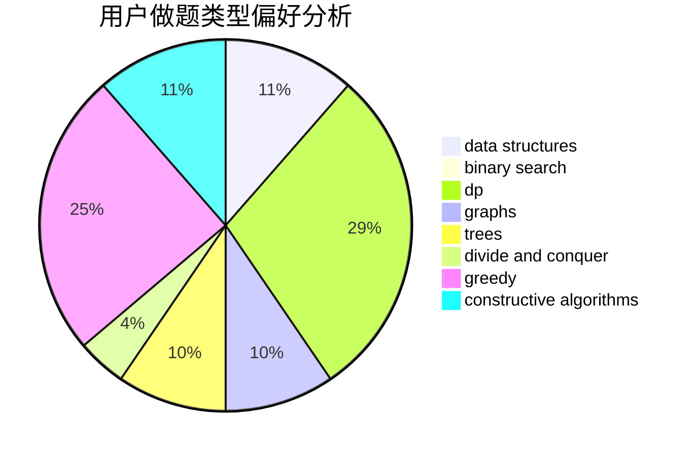

# PP-Automation

<!-- tabs:start -->

#### **用户提交结果分析**

#### **用户做题类型偏好分析**

#### **用户错题知识点分析**

<!-- tabs:end -->
# 推荐题目
[283B](https://codeforces.com/contest/283/problem/B)		dfs and similar,
                        dp,
                        graphs		  
[1065F](https://codeforces.com/contest/1065/problem/F)		dfs and similar,
                        dp,
                        trees		  
[725B](https://codeforces.com/contest/725/problem/B)		implementation,
                        math		  
[1103D](https://codeforces.com/contest/1103/problem/D)		bitmasks,
                        dp		  
[17C](https://codeforces.com/contest/17/problem/C)		dp		  
[818D](https://codeforces.com/contest/818/problem/D)		data structures,
                        implementation		  
[841A](https://codeforces.com/contest/841/problem/A)		brute force,
                        implementation		  
[48A](https://codeforces.com/contest/48/problem/A)		implementation,
                        schedules		  
[1010F](https://codeforces.com/contest/1010/problem/F)		fft,
                        graphs,
                        trees		  
[276E](https://codeforces.com/contest/276/problem/E)		data structures,
                        graphs,
                        trees		  
