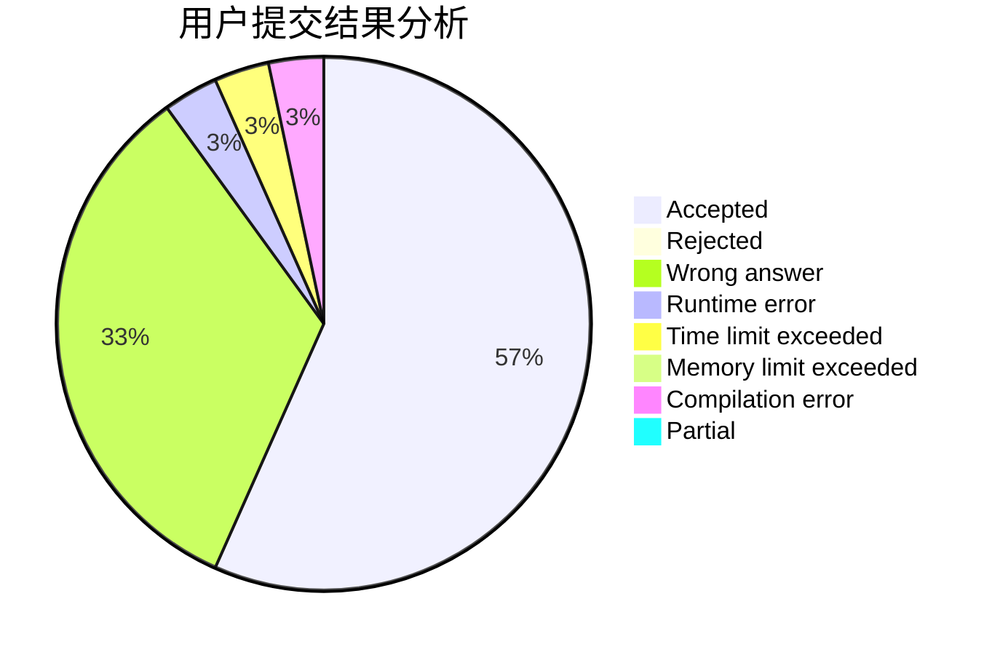
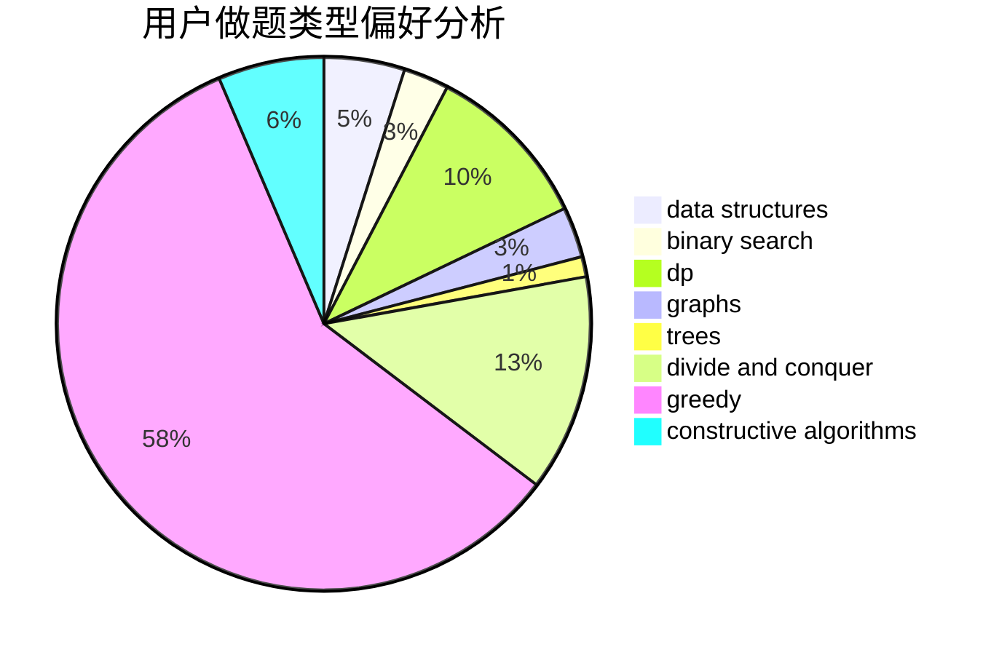

# PP-Automation

<!-- tabs:start -->

#### **用户提交结果分析**

#### **用户做题类型偏好分析**

#### **用户错题知识点分析**

<!-- tabs:end -->
# 推荐题目
[268A](https://codeforces.com/contest/268/problem/A)		brute force		  
[1065B](https://codeforces.com/contest/1065/problem/B)		constructive algorithms,
                        graphs		  
[706E](https://codeforces.com/contest/706/problem/E)		data structures,
                        implementation		  
[1103A](https://codeforces.com/contest/1103/problem/A)		constructive algorithms,
                        implementation		  
[158A](https://codeforces.com/contest/158/problem/A)		*special problem,
                        implementation		  
[802N](https://codeforces.com/contest/802/problem/N)		binary search,
                        flows,
                        graphs		  
[821B](https://codeforces.com/contest/821/problem/B)		brute force,
                        math		  
[471C](https://codeforces.com/contest/471/problem/C)		binary search,
                        brute force,
                        greedy,
                        math		  
[1010C](https://codeforces.com/contest/1010/problem/C)		number theory		  
[259D](https://codeforces.com/contest/259/problem/D)		dsu,graphs,sortings,trees		  
