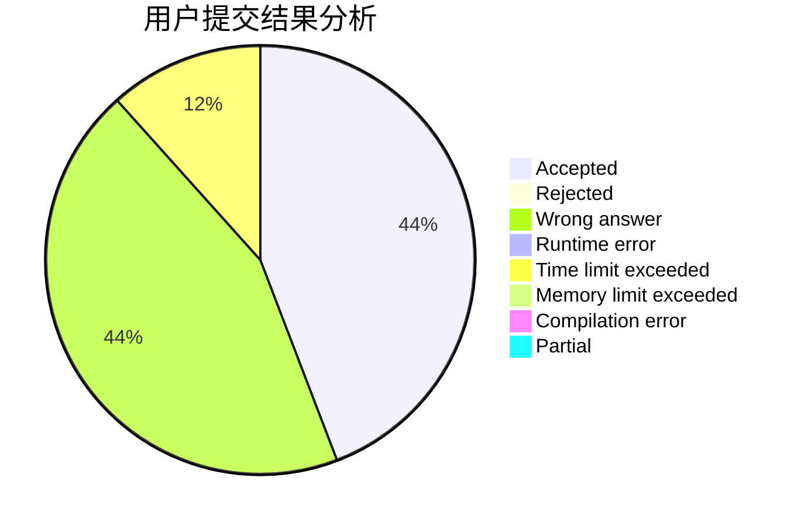
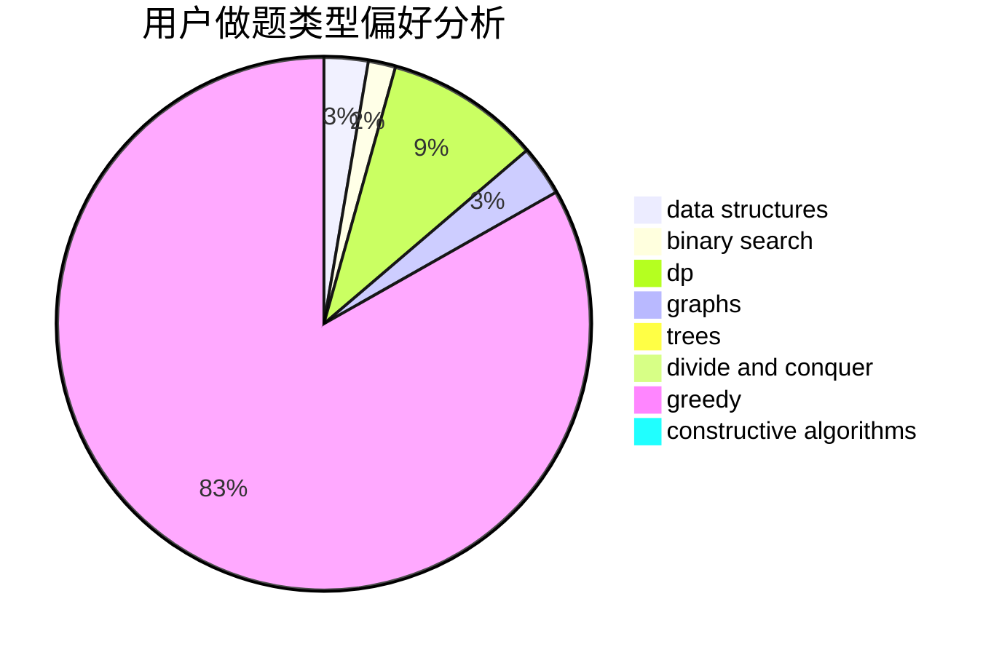

# PPX_pipixia

<!-- tabs:start -->

#### **用户提交结果分析**

#### **用户做题类型偏好分析**

#### **用户错题知识点分析**

<!-- tabs:end -->
# 推荐题目
[1106C](https://codeforces.com/contest/1106/problem/C)		greedy,
                        implementation,
                        math,
                        sortings		  
[830C](https://codeforces.com/contest/830/problem/C)		brute force,
                        data structures,
                        implementation,
                        math,
                        number theory,
                        sortings,
                        two pointers		  
[795K](https://codeforces.com/contest/795/problem/K)		dsu,graphs,sortings,trees		  
[393C](https://codeforces.com/contest/393/problem/C)		dsu,graphs,sortings,trees		  
[215B](https://codeforces.com/contest/215/problem/B)		greedy,
                        math		  
[543B](https://codeforces.com/contest/543/problem/B)		constructive algorithms,
                        graphs,
                        shortest paths		  
[1430G](https://codeforces.com/contest/1430/problem/G)		bitmasks,
                        dfs and similar,
                        dp,
                        flows,
                        graphs,
                        math		  
[1407D](https://codeforces.com/contest/1407/problem/D)		data structures,
                        dp,
                        graphs		  
[1432E](https://codeforces.com/contest/1432/problem/E)		dsu,graphs,sortings,trees		  
[486C](https://codeforces.com/contest/486/problem/C)		brute force,
                        greedy,
                        implementation		  
