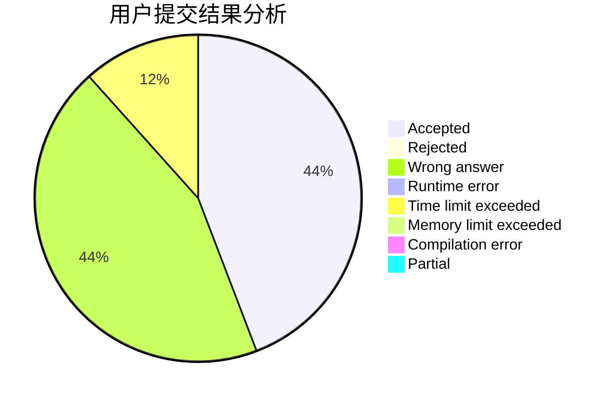
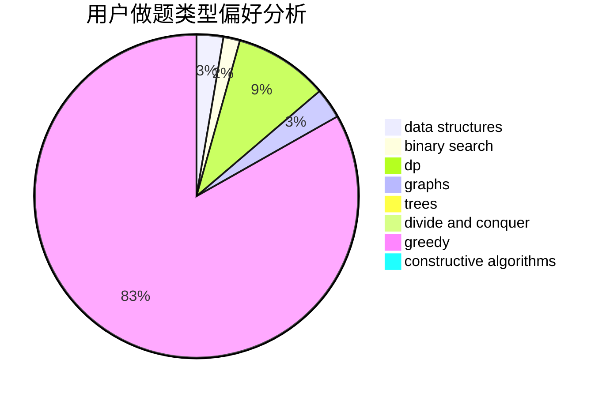

# PPX_pipixia
<!-- tabs:start -->
#### **用户提交结果分析**

#### **用户做题类型偏好分析**

#### **用户错题知识点分析**

<!-- tabs:end -->
# 推荐题目
[A Leapfrog in the Array](https://codeforces.com/contest/950/problem/D)		constructive algorithms,
                        math		  
[Bamboo Partition](http://codeforces.com/problemset/problem/830/C)		brute force,
                        data structures,
                        implementation,
                        math,
                        number theory,
                        sortings,
                        two pointers		  
[Numbers Joke](http://codeforces.com/problemset/problem/784/A)		*special problem		  
[Stepan and Vowels](https://codeforces.com/contest/795/problem/K)		*special problem,
                        implementation,
                        strings		  
[Destroying Roads](http://codeforces.com/problemset/problem/543/B)		constructive algorithms,
                        graphs,
                        shortest paths		  
[Olympic Medal](http://codeforces.com/problemset/problem/215/B)		greedy,
                        math		  
[Blocked Points](https://codeforces.com/contest/393/problem/C)		math		  
[Prizes, Prizes, more Prizes](http://codeforces.com/problemset/problem/208/D)		implementation		  
[Distinguish four 2-qubit states - 2](http://codeforces.com/problemset/problem/1002/B4)		nan		  
[Binary String Minimizing](https://codeforces.com/contest/1432/problem/E)		greedy		  
<!-- tabs:start -->
#### **data structures**
[A Leapfrog in the Array](http://codeforces.com/problemset/problem/830/C)		brute force,
                        data structures,
                        implementation,
                        math,
                        number theory,
                        sortings,
                        two pointers		  
[Bamboo Partition](http://codeforces.com/problemset/problem/1407/D)		data structures,
                        dp,
                        graphs		  
[Numbers Joke](http://codeforces.com/problemset/problem/1452/G)		data structures,
                        dfs and similar,
                        greedy,
                        trees		  
[Stepan and Vowels](http://codeforces.com/problemset/problem/961/B)		data structures,
                        dp,
                        implementation,
                        two pointers		  
[Destroying Roads](http://codeforces.com/problemset/problem/1422/F)		data structures,
                        math,
                        number theory		  
[Olympic Medal](http://codeforces.com/problemset/problem/1492/C)		binary search,
                        data structures,
                        dp,
                        greedy,
                        two pointers		  
[Blocked Points](http://codeforces.com/problemset/problem/1490/G)		binary search,
                        data structures,
                        math		  
[Prizes, Prizes, more Prizes](http://codeforces.com/problemset/problem/1479/D)		binary search,
                        bitmasks,
                        brute force,
                        data structures,
                        probabilities,
                        trees		  
[Distinguish four 2-qubit states - 2](http://codeforces.com/problemset/problem/1497/A)		brute force,
                        data structures,
                        greedy,
                        sortings		  
[Binary String Minimizing](http://codeforces.com/problemset/problem/1491/C)		brute force,
                        data structures,
                        dp,
                        greedy,
                        implementation		  
#### **binary search**
[A Leapfrog in the Array](http://codeforces.com/problemset/problem/487/A)		binary search,
                        brute force,
                        implementation		  
[Bamboo Partition](http://codeforces.com/problemset/problem/1408/C)		binary search,
                        dp,
                        implementation,
                        math,
                        two pointers		  
[Numbers Joke](http://codeforces.com/problemset/problem/1492/C)		binary search,
                        data structures,
                        dp,
                        greedy,
                        two pointers		  
[Stepan and Vowels](http://codeforces.com/problemset/problem/1463/D)		binary search,
                        constructive algorithms,
                        greedy,
                        two pointers		  
[Destroying Roads](http://codeforces.com/problemset/problem/1490/G)		binary search,
                        data structures,
                        math		  
[Olympic Medal](http://codeforces.com/problemset/problem/1479/D)		binary search,
                        bitmasks,
                        brute force,
                        data structures,
                        probabilities,
                        trees		  
[Blocked Points](http://codeforces.com/problemset/problem/1436/E)		binary search,
                        data structures,
                        two pointers		  
[Prizes, Prizes, more Prizes](http://codeforces.com/problemset/problem/1461/D)		binary search,
                        brute force,
                        data structures,
                        divide and conquer,
                        implementation,
                        sortings		  
[Distinguish four 2-qubit states - 2](http://codeforces.com/problemset/problem/1493/C)		binary search,
                        brute force,
                        constructive algorithms,
                        greedy,
                        strings		  
[Binary String Minimizing](http://codeforces.com/problemset/problem/1487/D)		binary search,
                        brute force,
                        math,
                        number theory		  
#### **dp**
[A Leapfrog in the Array](http://codeforces.com/problemset/problem/351/C)		dp,
                        matrices		  
[Bamboo Partition](http://codeforces.com/problemset/problem/1000/D)		combinatorics,
                        dp		  
[Numbers Joke](http://codeforces.com/problemset/problem/1407/D)		data structures,
                        dp,
                        graphs		  
[Stepan and Vowels](http://codeforces.com/problemset/problem/961/B)		data structures,
                        dp,
                        implementation,
                        two pointers		  
[Destroying Roads](http://codeforces.com/problemset/problem/1430/G)		bitmasks,
                        dfs and similar,
                        dp,
                        flows,
                        graphs,
                        math		  
[Olympic Medal](http://codeforces.com/problemset/problem/1151/F)		combinatorics,
                        dp,
                        matrices,
                        probabilities		  
[Blocked Points](http://codeforces.com/problemset/problem/506/E)		combinatorics,
                        dp,
                        matrices,
                        strings		  
[Prizes, Prizes, more Prizes](http://codeforces.com/problemset/problem/1408/C)		binary search,
                        dp,
                        implementation,
                        math,
                        two pointers		  
[Distinguish four 2-qubit states - 2](http://codeforces.com/problemset/problem/1492/C)		binary search,
                        data structures,
                        dp,
                        greedy,
                        two pointers		  
[Binary String Minimizing](https://codeforces.com/contest/1457/problem/C)		brute force,
                        dp,
                        implementation		  
#### **graph**
[A Leapfrog in the Array](http://codeforces.com/problemset/problem/543/B)		constructive algorithms,
                        graphs,
                        shortest paths		  
[Bamboo Partition](http://codeforces.com/problemset/problem/1407/D)		data structures,
                        dp,
                        graphs		  
[Numbers Joke](http://codeforces.com/problemset/problem/893/C)		dfs and similar,
                        graphs,
                        greedy		  
[Stepan and Vowels](http://codeforces.com/problemset/problem/1494/F)		brute force,
                        constructive algorithms,
                        dfs and similar,
                        graphs,
                        implementation		  
[Destroying Roads](http://codeforces.com/problemset/problem/1433/G)		brute force,
                        graphs,
                        shortest paths		  
[Olympic Medal](http://codeforces.com/problemset/problem/1430/G)		bitmasks,
                        dfs and similar,
                        dp,
                        flows,
                        graphs,
                        math		  
[Blocked Points](http://codeforces.com/problemset/problem/1487/C)		brute force,
                        constructive algorithms,
                        dfs and similar,
                        graphs,
                        greedy,
                        implementation,
                        math		  
[Prizes, Prizes, more Prizes](http://codeforces.com/problemset/problem/1437/C)		dp,
                        flows,
                        graph matchings,
                        greedy,
                        math,
                        sortings		  
[Distinguish four 2-qubit states - 2](http://codeforces.com/problemset/problem/1470/D)		constructive algorithms,
                        dfs and similar,
                        graph matchings,
                        graphs,
                        greedy		  
[Binary String Minimizing](http://codeforces.com/problemset/problem/1476/C)		dp,
                        graphs,
                        greedy		  
#### **trees**
[A Leapfrog in the Array](http://codeforces.com/problemset/problem/1452/G)		data structures,
                        dfs and similar,
                        greedy,
                        trees		  
[Bamboo Partition](http://codeforces.com/problemset/problem/1479/D)		binary search,
                        bitmasks,
                        brute force,
                        data structures,
                        probabilities,
                        trees		  
[Numbers Joke](http://codeforces.com/problemset/problem/1511/C)		brute force,
                        data structures,
                        implementation,
                        trees		  
[Stepan and Vowels](http://codeforces.com/problemset/problem/1499/F)		combinatorics,
                        dfs and similar,
                        dp,
                        trees		  
[Destroying Roads](http://codeforces.com/problemset/problem/1491/E)		brute force,
                        dfs and similar,
                        divide and conquer,
                        number theory,
                        trees		  
[Olympic Medal](http://codeforces.com/problemset/problem/1466/D)		data structures,
                        greedy,
                        sortings,
                        trees		  
[Blocked Points](http://codeforces.com/problemset/problem/1495/D)		combinatorics,
                        dfs and similar,
                        graphs,
                        math,
                        shortest paths,
                        trees		  
[Prizes, Prizes, more Prizes](http://codeforces.com/problemset/problem/1303/G)		data structures,
                        divide and conquer,
                        geometry,
                        trees		  
[Distinguish four 2-qubit states - 2](http://codeforces.com/problemset/problem/1454/E)		combinatorics,
                        dfs and similar,
                        graphs,
                        trees		  
[Binary String Minimizing](http://codeforces.com/problemset/problem/1494/D)		constructive algorithms,
                        data structures,
                        dfs and similar,
                        divide and conquer,
                        dsu,
                        greedy,
                        sortings,
                        trees		  
#### **divide and conquer**
[A Leapfrog in the Array](http://codeforces.com/problemset/problem/1461/D)		binary search,
                        brute force,
                        data structures,
                        divide and conquer,
                        implementation,
                        sortings		  
[Bamboo Partition](http://codeforces.com/problemset/problem/1466/G)		combinatorics,
                        divide and conquer,
                        hashing,
                        math,
                        string suffix structures,
                        strings		  
[Numbers Joke](http://codeforces.com/problemset/problem/1490/D)		dfs and similar,
                        divide and conquer,
                        implementation		  
[Stepan and Vowels](https://codeforces.com/contest/1483/problem/C)		data structures,
                        divide and conquer,
                        dp		  
[Destroying Roads](http://codeforces.com/problemset/problem/1491/E)		brute force,
                        dfs and similar,
                        divide and conquer,
                        number theory,
                        trees		  
[Olympic Medal](http://codeforces.com/problemset/problem/1303/G)		data structures,
                        divide and conquer,
                        geometry,
                        trees		  
[Blocked Points](http://codeforces.com/problemset/problem/1494/D)		constructive algorithms,
                        data structures,
                        dfs and similar,
                        divide and conquer,
                        dsu,
                        greedy,
                        sortings,
                        trees		  
[Prizes, Prizes, more Prizes](http://codeforces.com/problemset/problem/1482/E)		data structures,
                        divide and conquer,
                        dp		  
[Distinguish four 2-qubit states - 2](http://codeforces.com/problemset/problem/566/C)		dfs and similar,
                        divide and conquer,
                        trees		  
[Binary String Minimizing](http://codeforces.com/problemset/problem/1428/F)		binary search,
                        data structures,
                        divide and conquer,
                        dp,
                        two pointers		  
#### **greedy**
[A Leapfrog in the Array](http://codeforces.com/problemset/problem/215/B)		greedy,
                        math		  
[Bamboo Partition](https://codeforces.com/contest/1432/problem/E)		greedy		  
[Numbers Joke](http://codeforces.com/problemset/problem/486/C)		brute force,
                        greedy,
                        implementation		  
[Stepan and Vowels](http://codeforces.com/problemset/problem/1315/C)		greedy		  
[Destroying Roads](http://codeforces.com/problemset/problem/978/B)		greedy,
                        strings		  
[Olympic Medal](http://codeforces.com/problemset/problem/1452/G)		data structures,
                        dfs and similar,
                        greedy,
                        trees		  
[Blocked Points](http://codeforces.com/problemset/problem/1029/C)		greedy,
                        math,
                        sortings		  
[Prizes, Prizes, more Prizes](http://codeforces.com/problemset/problem/893/C)		dfs and similar,
                        graphs,
                        greedy		  
[Distinguish four 2-qubit states - 2](http://codeforces.com/problemset/problem/379/C)		greedy,
                        sortings		  
[Binary String Minimizing](http://codeforces.com/problemset/problem/1106/C)		greedy,
                        implementation,
                        math,
                        sortings		  
#### **constructive algorithms**
[A Leapfrog in the Array](https://codeforces.com/contest/950/problem/D)		constructive algorithms,
                        math		  
[Bamboo Partition](http://codeforces.com/problemset/problem/543/B)		constructive algorithms,
                        graphs,
                        shortest paths		  
[Numbers Joke](https://codeforces.com/contest/680/problem/C)		constructive algorithms,
                        interactive,
                        math		  
[Stepan and Vowels](http://codeforces.com/problemset/problem/1494/F)		brute force,
                        constructive algorithms,
                        dfs and similar,
                        graphs,
                        implementation		  
[Destroying Roads](http://codeforces.com/problemset/problem/1493/A)		constructive algorithms,
                        greedy		  
[Olympic Medal](http://codeforces.com/problemset/problem/1463/D)		binary search,
                        constructive algorithms,
                        greedy,
                        two pointers		  
[Blocked Points](https://codeforces.com/contest/1456/problem/B)		bitmasks,
                        brute force,
                        constructive algorithms		  
[Prizes, Prizes, more Prizes](http://codeforces.com/problemset/problem/1492/D)		bitmasks,
                        constructive algorithms,
                        greedy,
                        math		  
[Distinguish four 2-qubit states - 2](https://codeforces.com/contest/1504/problem/D)		constructive algorithms,
                        games,
                        interactive		  
[Binary String Minimizing](https://codeforces.com/contest/1483/problem/A)		brute force,
                        constructive algorithms,
                        greedy,
                        implementation		  
#### **sortings**
[A Leapfrog in the Array](http://codeforces.com/problemset/problem/830/C)		brute force,
                        data structures,
                        implementation,
                        math,
                        number theory,
                        sortings,
                        two pointers		  
[Bamboo Partition](http://codeforces.com/problemset/problem/1029/C)		greedy,
                        math,
                        sortings		  
[Numbers Joke](http://codeforces.com/problemset/problem/379/C)		greedy,
                        sortings		  
[Stepan and Vowels](http://codeforces.com/problemset/problem/1106/C)		greedy,
                        implementation,
                        math,
                        sortings		  
[Destroying Roads](https://codeforces.com/contest/1496/problem/C)		geometry,
                        greedy,
                        math,
                        sortings		  
[Olympic Medal](http://codeforces.com/problemset/problem/1495/A)		geometry,
                        greedy,
                        math,
                        sortings		  
[Blocked Points](http://codeforces.com/problemset/problem/1497/A)		brute force,
                        data structures,
                        greedy,
                        sortings		  
[Prizes, Prizes, more Prizes](http://codeforces.com/problemset/problem/1427/A)		math,
                        sortings		  
[Distinguish four 2-qubit states - 2](http://codeforces.com/problemset/problem/1461/D)		binary search,
                        brute force,
                        data structures,
                        divide and conquer,
                        implementation,
                        sortings		  
[Binary String Minimizing](http://codeforces.com/problemset/problem/1437/C)		dp,
                        flows,
                        graph matchings,
                        greedy,
                        math,
                        sortings		  
<!-- tabs:end -->
