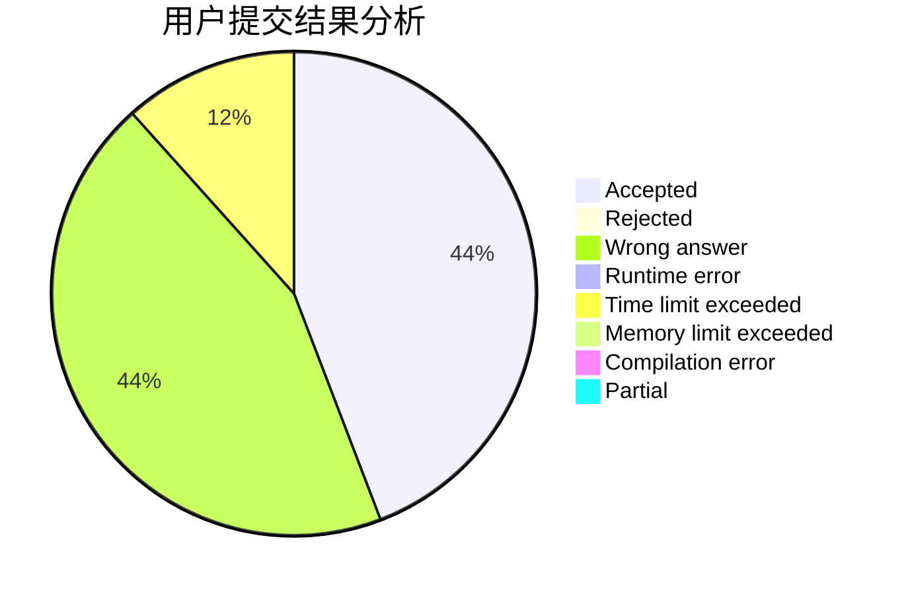
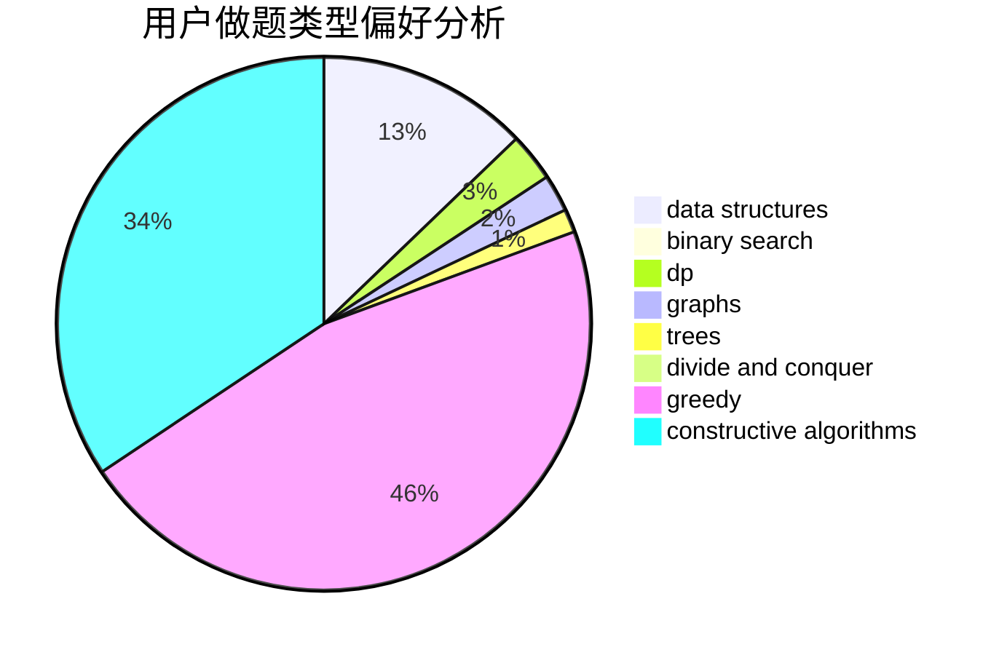

# PPX_pipixia

<!-- tabs:start -->

#### **用户提交结果分析**

#### **用户做题类型偏好分析**

#### **用户错题知识点分析**

<!-- tabs:end -->
# 推荐题目
[1106F](https://codeforces.com/contest/1106/problem/F)		math,
                        matrices,
                        number theory		  
[848C](https://codeforces.com/contest/848/problem/C)		data structures,
                        divide and conquer		  
[810A](https://codeforces.com/contest/810/problem/A)		implementation,
                        math		  
[421B](https://codeforces.com/contest/421/problem/B)		dsu,graphs,sortings,trees		  
[234A](https://codeforces.com/contest/234/problem/A)		implementation		  
[567D](https://codeforces.com/contest/567/problem/D)		binary search,
                        data structures,
                        greedy,
                        sortings		  
[1439E](https://codeforces.com/contest/1439/problem/E)		bitmasks,
                        data structures,
                        games,
                        trees		  
[1418C](https://codeforces.com/contest/1418/problem/C)		dp,
                        graphs,
                        greedy,
                        shortest paths		  
[1442D](https://codeforces.com/contest/1442/problem/D)		data structures,
                        divide and conquer,
                        dp,
                        greedy		  
[507B](https://codeforces.com/contest/507/problem/B)		geometry,
                        math		  
