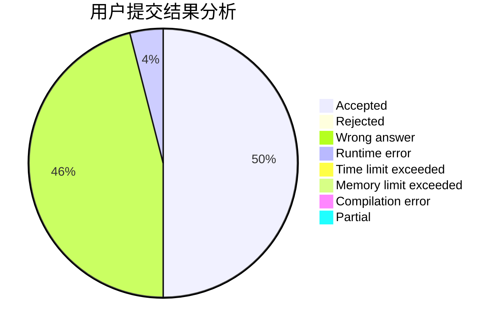
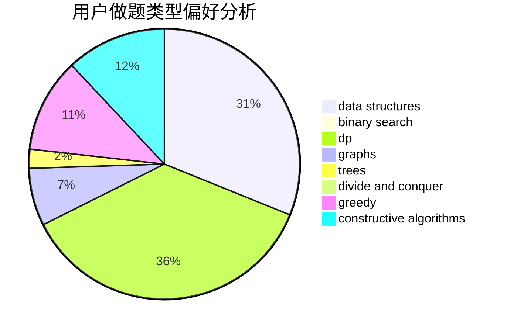

# PaceMak1r

<!-- tabs:start -->

#### **用户提交结果分析**

#### **用户做题类型偏好分析**

#### **用户错题知识点分析**

<!-- tabs:end -->
# 推荐题目
[792C](https://codeforces.com/contest/792/problem/C)		dp,
                        greedy,
                        math,
                        number theory		  
[49E](https://codeforces.com/contest/49/problem/E)		dp		  
[1217E](https://codeforces.com/contest/1217/problem/E)		data structures,
                        greedy,
                        implementation,
                        math		  
[1332F](https://codeforces.com/contest/1332/problem/F)		dfs and similar,
                        dp,
                        trees		  
[1340E](https://codeforces.com/contest/1340/problem/E)		graphs,
                        interactive,
                        probabilities		  
[554A](https://codeforces.com/contest/554/problem/A)		brute force,
                        math,
                        strings		  
[1060B](https://codeforces.com/contest/1060/problem/B)		greedy		  
[580C](https://codeforces.com/contest/580/problem/C)		dfs and similar,
                        graphs,
                        trees		  
[122B](https://codeforces.com/contest/122/problem/B)		brute force,
                        implementation		  
[913G](https://codeforces.com/contest/913/problem/G)		math,
                        number theory		  
