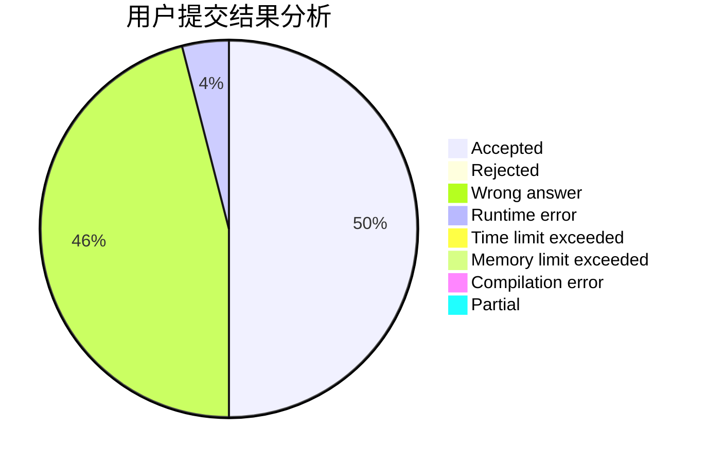
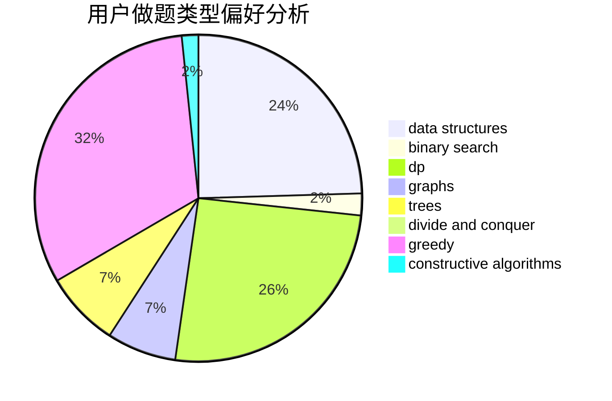
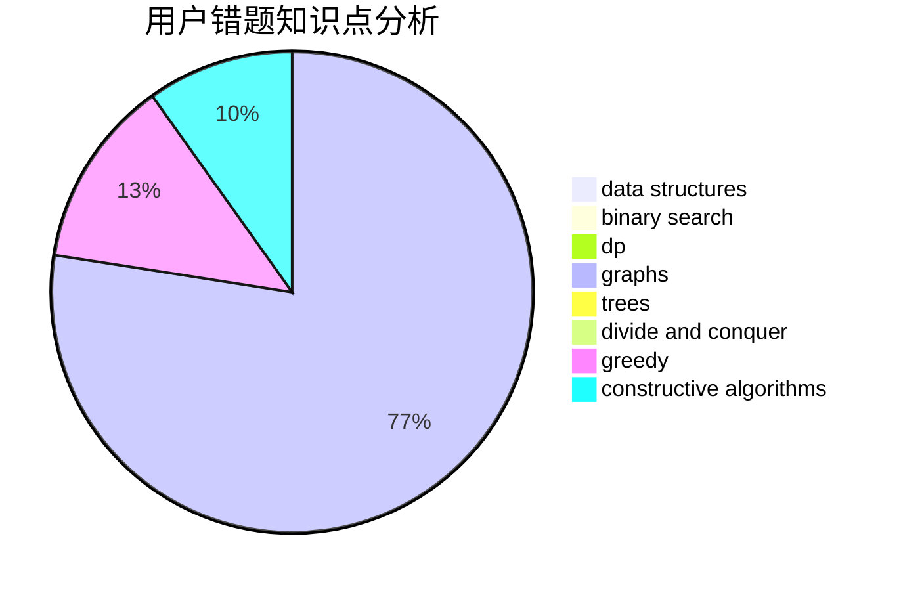

# PaceMak1r

<!-- tabs:start -->

#### **用户提交结果分析**

#### **用户做题类型偏好分析**

#### **用户错题知识点分析**

<!-- tabs:end -->
# 推荐题目
[772E](https://codeforces.com/contest/772/problem/E)		binary search,
                        divide and conquer,
                        interactive,
                        trees		  
[479C](https://codeforces.com/contest/479/problem/C)		greedy,
                        sortings		  
[1213C](https://codeforces.com/contest/1213/problem/C)		math		  
[1326D1](https://codeforces.com/contest/1326D/problem/1)		hashing,
                        string suffix structures,
                        strings		  
[1333F](https://codeforces.com/contest/1333/problem/F)		greedy,
                        implementation,
                        math,
                        number theory,
                        sortings,
                        two pointers		  
[533B](https://codeforces.com/contest/533/problem/B)		dfs and similar,
                        dp,
                        graphs,
                        strings,
                        trees		  
[1059E](https://codeforces.com/contest/1059/problem/E)		binary search,
                        data structures,
                        dp,
                        greedy,
                        trees		  
[557B](https://codeforces.com/contest/557/problem/B)		constructive algorithms,
                        implementation,
                        math,
                        sortings		  
[1221F](https://codeforces.com/contest/1221/problem/F)		binary search,
                        data structures,
                        sortings		  
[896D](https://codeforces.com/contest/896/problem/D)		chinese remainder theorem,
                        combinatorics,
                        math,
                        number theory		  
