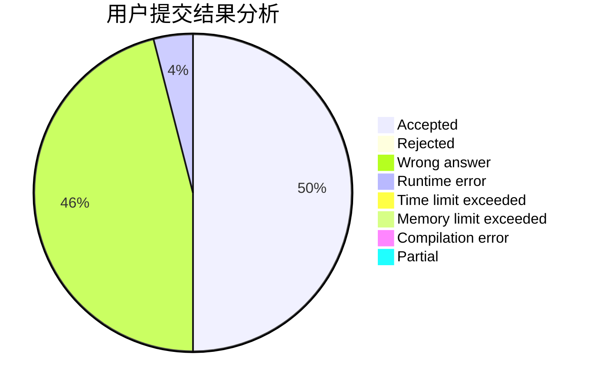
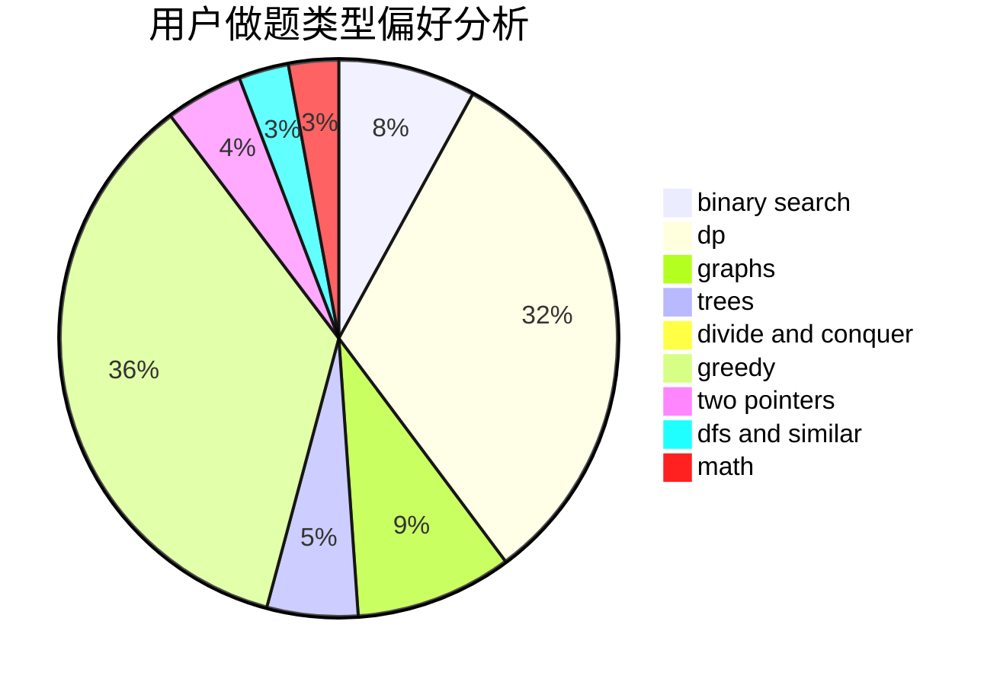

# PaceMak1r

<!-- tabs:start -->

#### **用户提交结果分析**

#### **用户做题类型偏好分析**

<!-- tabs:end -->
# 推荐题目
[792C](https://codeforces.com/contest/792/problem/C)
[49E](https://codeforces.com/contest/49/problem/E)
[1217E](https://codeforces.com/contest/1217/problem/E)
[1332F](https://codeforces.com/contest/1332/problem/F)
[1340E](https://codeforces.com/contest/1340/problem/E)
[554A](https://codeforces.com/contest/554/problem/A)
[1060B](https://codeforces.com/contest/1060/problem/B)
[580C](https://codeforces.com/contest/580/problem/C)
[122B](https://codeforces.com/contest/122/problem/B)
[913G](https://codeforces.com/contest/913/problem/G)
