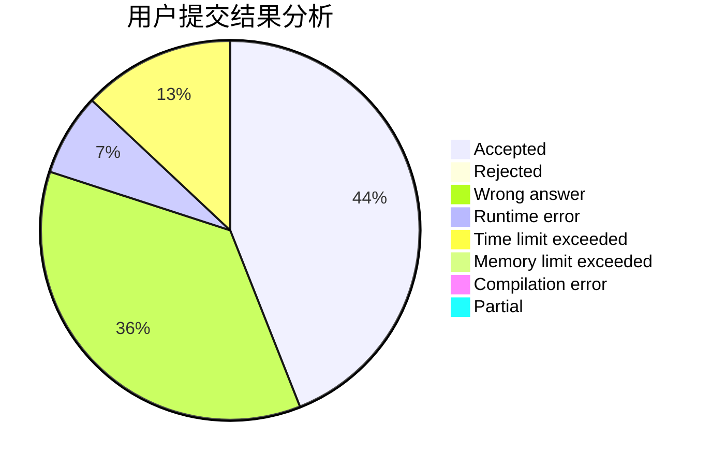
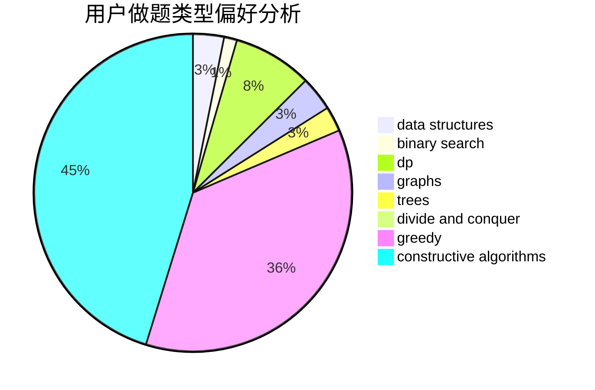
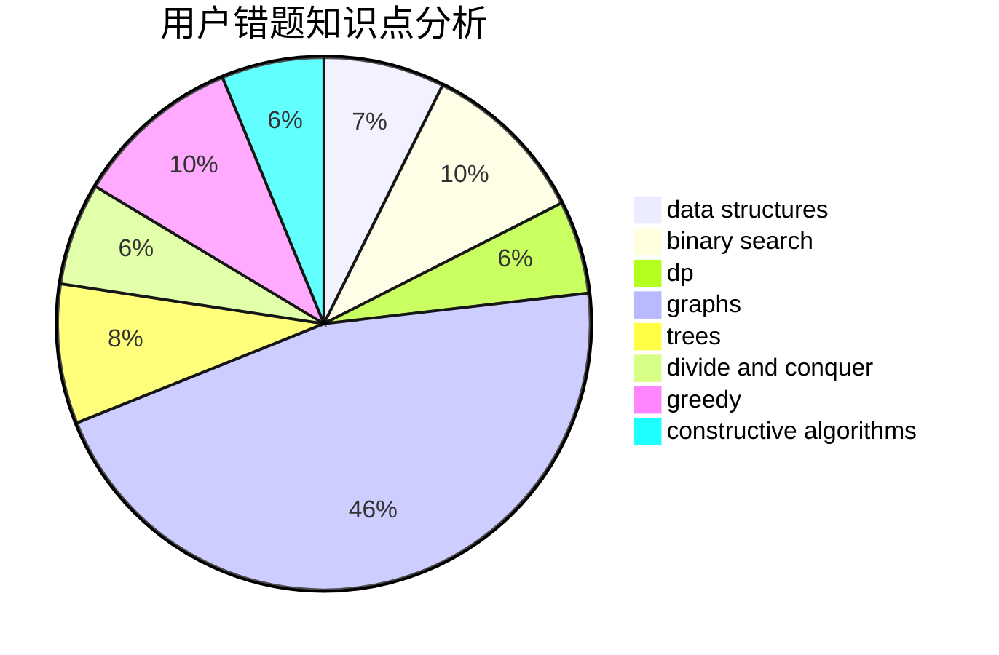

# PaiGuLong

<!-- tabs:start -->

#### **用户提交结果分析**

#### **用户做题类型偏好分析**

#### **用户错题知识点分析**

<!-- tabs:end -->
# 推荐题目
[225E](https://codeforces.com/contest/225/problem/E)		math,
                        number theory		  
[1100A](https://codeforces.com/contest/1100/problem/A)		implementation		  
[1030B](https://codeforces.com/contest/1030/problem/B)		geometry		  
[19A](https://codeforces.com/contest/19/problem/A)		implementation		  
[1140F](https://codeforces.com/contest/1140/problem/F)		data structures,
                        divide and conquer,
                        dsu		  
[1182C](https://codeforces.com/contest/1182/problem/C)		data structures,
                        greedy,
                        strings		  
[431E](https://codeforces.com/contest/431/problem/E)		binary search,
                        data structures,
                        ternary search		  
[987F](https://codeforces.com/contest/987/problem/F)		dsu,graphs,sortings,trees		  
[914H](https://codeforces.com/contest/914/problem/H)		combinatorics,
                        dp,
                        games,
                        trees		  
[1132C](https://codeforces.com/contest/1132/problem/C)		brute force		  
