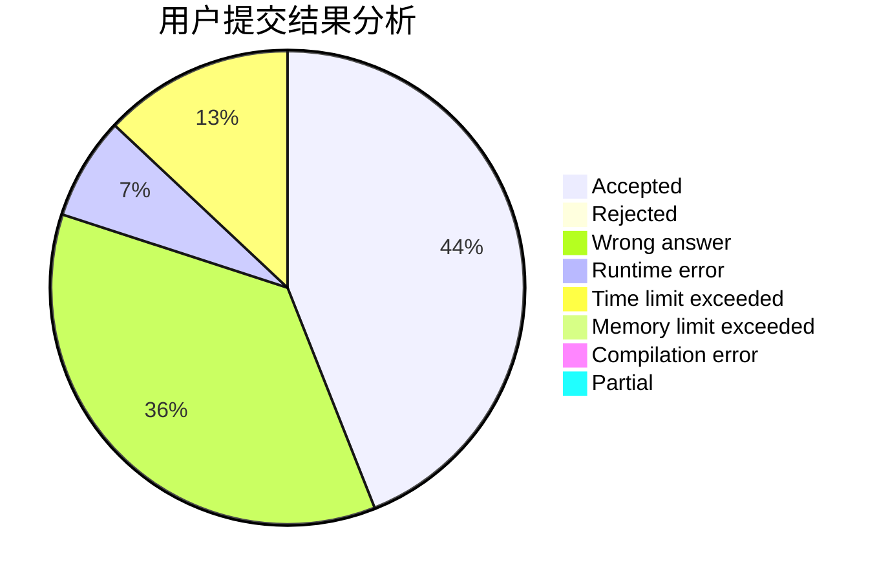
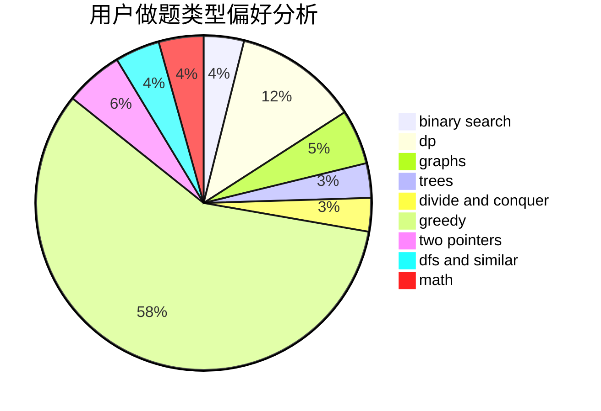

# PaiGuLong

<!-- tabs:start -->

#### **用户提交结果分析**

#### **用户做题类型偏好分析**

<!-- tabs:end -->
# 推荐题目
[225E](https://codeforces.com/contest/225/problem/E)
[1100A](https://codeforces.com/contest/1100/problem/A)
[1030B](https://codeforces.com/contest/1030/problem/B)
[19A](https://codeforces.com/contest/19/problem/A)
[1140F](https://codeforces.com/contest/1140/problem/F)
[1182C](https://codeforces.com/contest/1182/problem/C)
[431E](https://codeforces.com/contest/431/problem/E)
[987F](https://codeforces.com/contest/987/problem/F)
[914H](https://codeforces.com/contest/914/problem/H)
[1132C](https://codeforces.com/contest/1132/problem/C)
