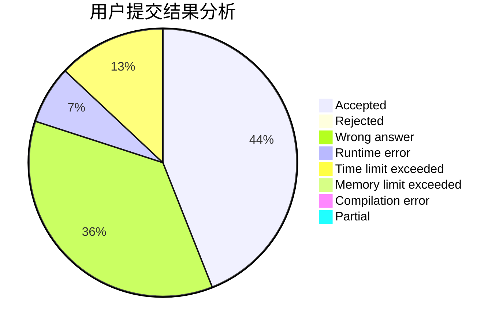
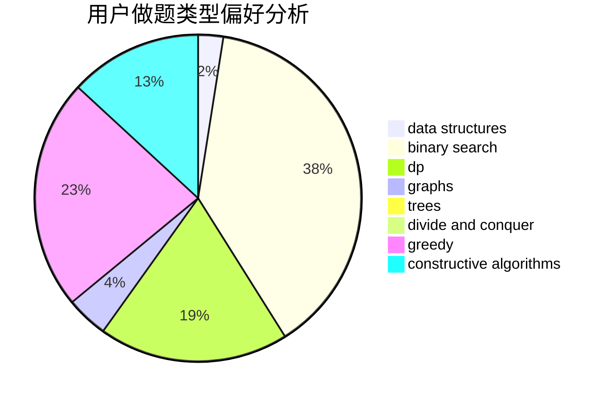
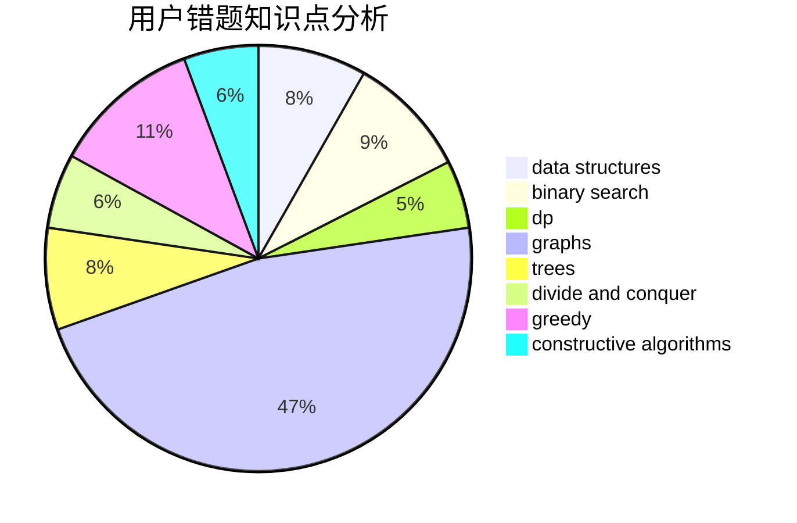

# PaiGuLong
<!-- tabs:start -->
#### **用户提交结果分析**

#### **用户做题类型偏好分析**

#### **用户错题知识点分析**

<!-- tabs:end -->
# 推荐题目
[Mislove Has Lost an Array](http://codeforces.com/problemset/problem/1204/B)		greedy,
                        math		  
[Spanning Tree with Maximum Degree](http://codeforces.com/problemset/problem/1133/F1)		graphs		  
[Football Championship](http://codeforces.com/problemset/problem/200/C)		brute force,
                        implementation		  
[Fedor Runs for President](http://codeforces.com/problemset/problem/1179/D)		data structures,
                        dp,
                        trees		  
[Restoring the Expression](http://codeforces.com/problemset/problem/898/F)		brute force,
                        hashing,
                        math		  
[Digital Root](http://codeforces.com/problemset/problem/10/C)		number theory		  
[Subarray Sorting](http://codeforces.com/problemset/problem/1187/D)		data structures,
                        sortings		  
[Captain Marmot](http://codeforces.com/problemset/problem/474/C)		brute force,
                        geometry		  
[Hard Work](http://codeforces.com/problemset/problem/61/B)		strings		  
[Clothes](http://codeforces.com/problemset/problem/102/A)		brute force		  
<!-- tabs:start -->
#### **data structures**
[Mislove Has Lost an Array](http://codeforces.com/problemset/problem/1179/D)		data structures,
                        dp,
                        trees		  
[Spanning Tree with Maximum Degree](http://codeforces.com/problemset/problem/1187/D)		data structures,
                        sortings		  
[Football Championship](http://codeforces.com/problemset/problem/403/E)		data structures,
                        implementation,
                        trees		  
[Fedor Runs for President](http://codeforces.com/problemset/problem/1195/F)		data structures,
                        geometry,
                        math,
                        sortings		  
[Restoring the Expression](http://codeforces.com/problemset/problem/1492/C)		binary search,
                        data structures,
                        dp,
                        greedy,
                        two pointers		  
[Digital Root](http://codeforces.com/problemset/problem/1490/G)		binary search,
                        data structures,
                        math		  
[Subarray Sorting](http://codeforces.com/problemset/problem/1479/D)		binary search,
                        bitmasks,
                        brute force,
                        data structures,
                        probabilities,
                        trees		  
[Captain Marmot](http://codeforces.com/problemset/problem/1497/A)		brute force,
                        data structures,
                        greedy,
                        sortings		  
[Hard Work](http://codeforces.com/problemset/problem/1491/C)		brute force,
                        data structures,
                        dp,
                        greedy,
                        implementation		  
[Clothes](http://codeforces.com/problemset/problem/1492/B)		data structures,
                        greedy,
                        math		  
#### **binary search**
[Mislove Has Lost an Array](https://codeforces.com/contest/966/problem/A)		binary search		  
[Spanning Tree with Maximum Degree](http://codeforces.com/problemset/problem/555/D)		binary search,
                        implementation,
                        math		  
[Football Championship](https://codeforces.com/contest/737/problem/A)		binary search,
                        greedy,
                        sortings		  
[Fedor Runs for President](http://codeforces.com/problemset/problem/1492/C)		binary search,
                        data structures,
                        dp,
                        greedy,
                        two pointers		  
[Restoring the Expression](http://codeforces.com/problemset/problem/1463/D)		binary search,
                        constructive algorithms,
                        greedy,
                        two pointers		  
[Digital Root](http://codeforces.com/problemset/problem/1490/G)		binary search,
                        data structures,
                        math		  
[Subarray Sorting](http://codeforces.com/problemset/problem/1479/D)		binary search,
                        bitmasks,
                        brute force,
                        data structures,
                        probabilities,
                        trees		  
[Captain Marmot](http://codeforces.com/problemset/problem/1436/E)		binary search,
                        data structures,
                        two pointers		  
[Hard Work](http://codeforces.com/problemset/problem/1461/D)		binary search,
                        brute force,
                        data structures,
                        divide and conquer,
                        implementation,
                        sortings		  
[Clothes](http://codeforces.com/problemset/problem/1493/C)		binary search,
                        brute force,
                        constructive algorithms,
                        greedy,
                        strings		  
#### **dp**
[Mislove Has Lost an Array](http://codeforces.com/problemset/problem/1179/D)		data structures,
                        dp,
                        trees		  
[Spanning Tree with Maximum Degree](http://codeforces.com/problemset/problem/436/D)		dp		  
[Football Championship](http://codeforces.com/problemset/problem/178/F2)		dp,
                        sortings,
                        strings		  
[Fedor Runs for President](http://codeforces.com/problemset/problem/839/C)		dfs and similar,
                        dp,
                        graphs,
                        probabilities,
                        trees		  
[Restoring the Expression](http://codeforces.com/problemset/problem/1492/C)		binary search,
                        data structures,
                        dp,
                        greedy,
                        two pointers		  
[Digital Root](https://codeforces.com/contest/1457/problem/C)		brute force,
                        dp,
                        implementation		  
[Subarray Sorting](http://codeforces.com/problemset/problem/1491/C)		brute force,
                        data structures,
                        dp,
                        greedy,
                        implementation		  
[Captain Marmot](http://codeforces.com/problemset/problem/1437/C)		dp,
                        flows,
                        graph matchings,
                        greedy,
                        math,
                        sortings		  
[Hard Work](http://codeforces.com/problemset/problem/1499/B)		brute force,
                        dp,
                        greedy,
                        implementation		  
[Clothes](http://codeforces.com/problemset/problem/1491/D)		bitmasks,
                        constructive algorithms,
                        dp,
                        greedy,
                        math		  
#### **graph**
[Mislove Has Lost an Array](http://codeforces.com/problemset/problem/1133/F1)		graphs		  
[Spanning Tree with Maximum Degree](https://codeforces.com/contest/1071/problem/D)		brute force,
                        graphs,
                        math		  
[Football Championship](http://codeforces.com/problemset/problem/839/E)		brute force,
                        graphs,
                        math,
                        meet-in-the-middle		  
[Fedor Runs for President](http://codeforces.com/problemset/problem/1510/B)		flows,
                        graph matchings,
                        graphs		  
[Restoring the Expression](http://codeforces.com/problemset/problem/839/C)		dfs and similar,
                        dp,
                        graphs,
                        probabilities,
                        trees		  
[Digital Root](http://codeforces.com/problemset/problem/387/D)		graph matchings		  
[Subarray Sorting](http://codeforces.com/problemset/problem/1487/C)		brute force,
                        constructive algorithms,
                        dfs and similar,
                        graphs,
                        greedy,
                        implementation,
                        math		  
[Captain Marmot](http://codeforces.com/problemset/problem/1437/C)		dp,
                        flows,
                        graph matchings,
                        greedy,
                        math,
                        sortings		  
[Hard Work](http://codeforces.com/problemset/problem/1470/D)		constructive algorithms,
                        dfs and similar,
                        graph matchings,
                        graphs,
                        greedy		  
[Clothes](http://codeforces.com/problemset/problem/1476/C)		dp,
                        graphs,
                        greedy		  
#### **trees**
[Mislove Has Lost an Array](http://codeforces.com/problemset/problem/1179/D)		data structures,
                        dp,
                        trees		  
[Spanning Tree with Maximum Degree](http://codeforces.com/problemset/problem/403/E)		data structures,
                        implementation,
                        trees		  
[Football Championship](http://codeforces.com/problemset/problem/839/C)		dfs and similar,
                        dp,
                        graphs,
                        probabilities,
                        trees		  
[Fedor Runs for President](http://codeforces.com/problemset/problem/1479/D)		binary search,
                        bitmasks,
                        brute force,
                        data structures,
                        probabilities,
                        trees		  
[Restoring the Expression](http://codeforces.com/problemset/problem/1511/C)		brute force,
                        data structures,
                        implementation,
                        trees		  
[Digital Root](http://codeforces.com/problemset/problem/1499/F)		combinatorics,
                        dfs and similar,
                        dp,
                        trees		  
[Subarray Sorting](http://codeforces.com/problemset/problem/1491/E)		brute force,
                        dfs and similar,
                        divide and conquer,
                        number theory,
                        trees		  
[Captain Marmot](http://codeforces.com/problemset/problem/1466/D)		data structures,
                        greedy,
                        sortings,
                        trees		  
[Hard Work](http://codeforces.com/problemset/problem/1495/D)		combinatorics,
                        dfs and similar,
                        graphs,
                        math,
                        shortest paths,
                        trees		  
[Clothes](http://codeforces.com/problemset/problem/1303/G)		data structures,
                        divide and conquer,
                        geometry,
                        trees		  
#### **divide and conquer**
[Mislove Has Lost an Array](http://codeforces.com/problemset/problem/1461/D)		binary search,
                        brute force,
                        data structures,
                        divide and conquer,
                        implementation,
                        sortings		  
[Spanning Tree with Maximum Degree](http://codeforces.com/problemset/problem/1466/G)		combinatorics,
                        divide and conquer,
                        hashing,
                        math,
                        string suffix structures,
                        strings		  
[Football Championship](http://codeforces.com/problemset/problem/1490/D)		dfs and similar,
                        divide and conquer,
                        implementation		  
[Fedor Runs for President](https://codeforces.com/contest/1483/problem/C)		data structures,
                        divide and conquer,
                        dp		  
[Restoring the Expression](http://codeforces.com/problemset/problem/1491/E)		brute force,
                        dfs and similar,
                        divide and conquer,
                        number theory,
                        trees		  
[Digital Root](http://codeforces.com/problemset/problem/1303/G)		data structures,
                        divide and conquer,
                        geometry,
                        trees		  
[Subarray Sorting](http://codeforces.com/problemset/problem/1494/D)		constructive algorithms,
                        data structures,
                        dfs and similar,
                        divide and conquer,
                        dsu,
                        greedy,
                        sortings,
                        trees		  
[Captain Marmot](http://codeforces.com/problemset/problem/1482/E)		data structures,
                        divide and conquer,
                        dp		  
[Hard Work](http://codeforces.com/problemset/problem/566/C)		dfs and similar,
                        divide and conquer,
                        trees		  
[Clothes](http://codeforces.com/problemset/problem/1428/F)		binary search,
                        data structures,
                        divide and conquer,
                        dp,
                        two pointers		  
#### **greedy**
[Mislove Has Lost an Array](http://codeforces.com/problemset/problem/1204/B)		greedy,
                        math		  
[Spanning Tree with Maximum Degree](http://codeforces.com/problemset/problem/1139/B)		greedy,
                        implementation		  
[Football Championship](http://codeforces.com/problemset/problem/1431/D)		*special problem,
                        greedy		  
[Fedor Runs for President](http://codeforces.com/problemset/problem/862/A)		greedy,
                        implementation		  
[Restoring the Expression](https://codeforces.com/contest/737/problem/A)		binary search,
                        greedy,
                        sortings		  
[Digital Root](https://codeforces.com/contest/1173/problem/C)		greedy,
                        implementation		  
[Subarray Sorting](http://codeforces.com/problemset/problem/1209/C)		constructive algorithms,
                        greedy,
                        implementation		  
[Captain Marmot](http://codeforces.com/problemset/problem/1195/A)		greedy,
                        math		  
[Hard Work](http://codeforces.com/problemset/problem/1492/C)		binary search,
                        data structures,
                        dp,
                        greedy,
                        two pointers		  
[Clothes](https://codeforces.com/contest/1496/problem/C)		geometry,
                        greedy,
                        math,
                        sortings		  
#### **constructive algorithms**
[Mislove Has Lost an Array](http://codeforces.com/problemset/problem/1179/B)		constructive algorithms		  
[Spanning Tree with Maximum Degree](http://codeforces.com/problemset/problem/689/A)		brute force,
                        constructive algorithms,
                        implementation		  
[Football Championship](http://codeforces.com/problemset/problem/1209/C)		constructive algorithms,
                        greedy,
                        implementation		  
[Fedor Runs for President](http://codeforces.com/problemset/problem/1493/A)		constructive algorithms,
                        greedy		  
[Restoring the Expression](http://codeforces.com/problemset/problem/1463/D)		binary search,
                        constructive algorithms,
                        greedy,
                        two pointers		  
[Digital Root](https://codeforces.com/contest/1456/problem/B)		bitmasks,
                        brute force,
                        constructive algorithms		  
[Subarray Sorting](http://codeforces.com/problemset/problem/1492/D)		bitmasks,
                        constructive algorithms,
                        greedy,
                        math		  
[Captain Marmot](https://codeforces.com/contest/1504/problem/D)		constructive algorithms,
                        games,
                        interactive		  
[Hard Work](https://codeforces.com/contest/1483/problem/A)		brute force,
                        constructive algorithms,
                        greedy,
                        implementation		  
[Clothes](https://codeforces.com/contest/1457/problem/D)		bitmasks,
                        brute force,
                        constructive algorithms		  
#### **sortings**
[Mislove Has Lost an Array](http://codeforces.com/problemset/problem/1187/D)		data structures,
                        sortings		  
[Spanning Tree with Maximum Degree](http://codeforces.com/problemset/problem/1155/A)		implementation,
                        sortings,
                        strings		  
[Football Championship](http://codeforces.com/problemset/problem/178/F2)		dp,
                        sortings,
                        strings		  
[Fedor Runs for President](https://codeforces.com/contest/737/problem/A)		binary search,
                        greedy,
                        sortings		  
[Restoring the Expression](http://codeforces.com/problemset/problem/1195/F)		data structures,
                        geometry,
                        math,
                        sortings		  
[Digital Root](https://codeforces.com/contest/1496/problem/C)		geometry,
                        greedy,
                        math,
                        sortings		  
[Subarray Sorting](http://codeforces.com/problemset/problem/1495/A)		geometry,
                        greedy,
                        math,
                        sortings		  
[Captain Marmot](http://codeforces.com/problemset/problem/1497/A)		brute force,
                        data structures,
                        greedy,
                        sortings		  
[Hard Work](http://codeforces.com/problemset/problem/1427/A)		math,
                        sortings		  
[Clothes](http://codeforces.com/problemset/problem/1461/D)		binary search,
                        brute force,
                        data structures,
                        divide and conquer,
                        implementation,
                        sortings		  
<!-- tabs:end -->
