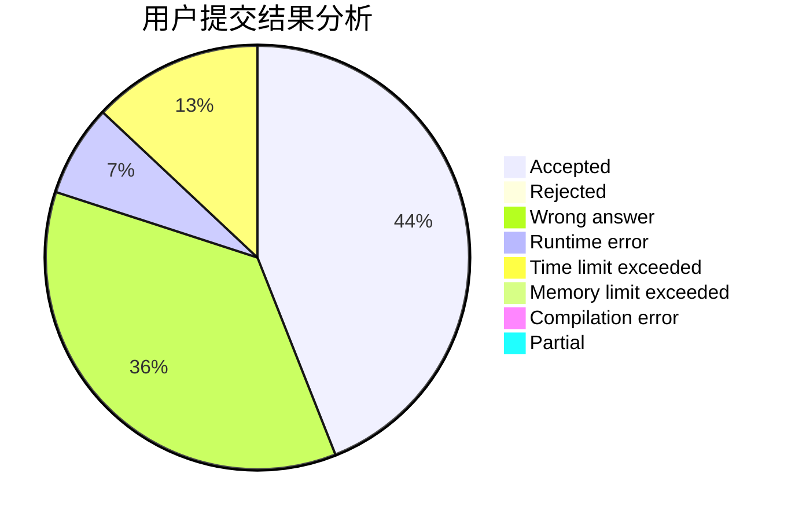
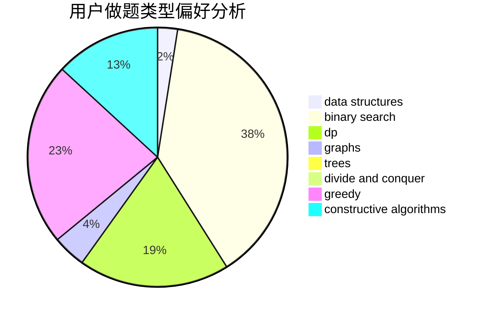
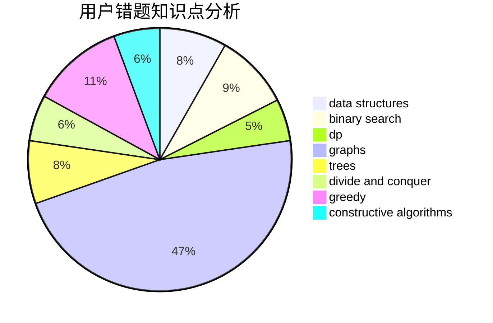

# PaiGuLong

<!-- tabs:start -->

#### **用户提交结果分析**

#### **用户做题类型偏好分析**

#### **用户错题知识点分析**

<!-- tabs:end -->
# 推荐题目
[200C](https://codeforces.com/contest/200/problem/C)		brute force,
                        implementation		  
[10C](https://codeforces.com/contest/10/problem/C)		number theory		  
[102A](https://codeforces.com/contest/102/problem/A)		brute force		  
[171H](https://codeforces.com/contest/171/problem/H)		*special problem,
                        implementation		  
[1139B](https://codeforces.com/contest/1139/problem/B)		greedy,
                        implementation		  
[1179D](https://codeforces.com/contest/1179/problem/D)		data structures,
                        dp,
                        trees		  
[403E](https://codeforces.com/contest/403/problem/E)		data structures,
                        implementation,
                        trees		  
[966A](https://codeforces.com/contest/966/problem/A)		dsu,graphs,sortings,trees		  
[898F](https://codeforces.com/contest/898/problem/F)		brute force,
                        hashing,
                        math		  
[1130C](https://codeforces.com/contest/1130/problem/C)		brute force,
                        dfs and similar,
                        dsu		  
