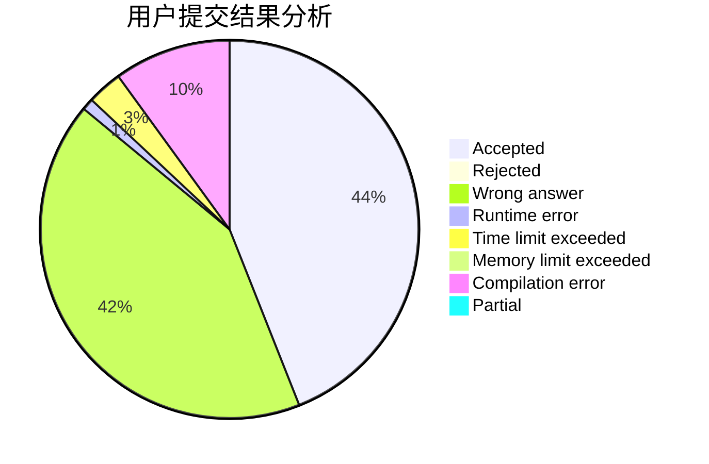
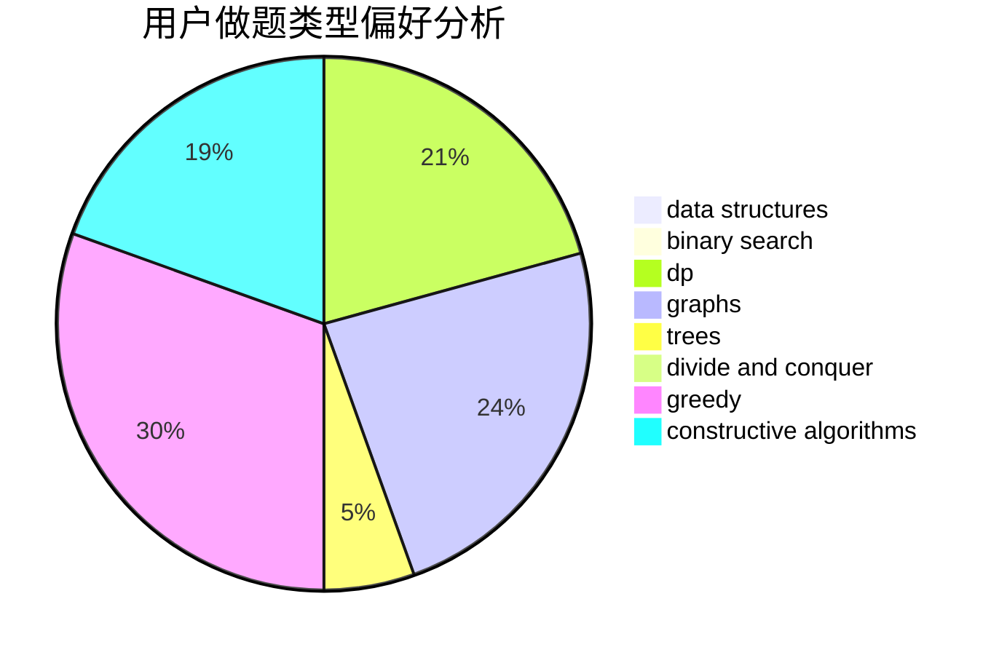

# Paladnix

<!-- tabs:start -->

#### **用户提交结果分析**

#### **用户做题类型偏好分析**

#### **用户错题知识点分析**

<!-- tabs:end -->
# 推荐题目
[638C](https://codeforces.com/contest/638/problem/C)		*special problem,
                        dfs and similar,
                        graphs,
                        greedy,
                        trees		  
[351C](https://codeforces.com/contest/351/problem/C)		dp,
                        matrices		  
[1276E](https://codeforces.com/contest/1276/problem/E)		constructive algorithms		  
[1250I](https://codeforces.com/contest/1250/problem/I)		binary search,
                        brute force,
                        greedy,
                        shortest paths		  
[552D](https://codeforces.com/contest/552/problem/D)		brute force,
                        combinatorics,
                        data structures,
                        geometry,
                        math,
                        sortings		  
[464A](https://codeforces.com/contest/464/problem/A)		greedy,
                        strings		  
[1031C](https://codeforces.com/contest/1031/problem/C)		greedy		  
[106B](https://codeforces.com/contest/106/problem/B)		brute force,
                        implementation		  
[630C](https://codeforces.com/contest/630/problem/C)		combinatorics,
                        math		  
[863E](https://codeforces.com/contest/863/problem/E)		data structures,
                        sortings		  
