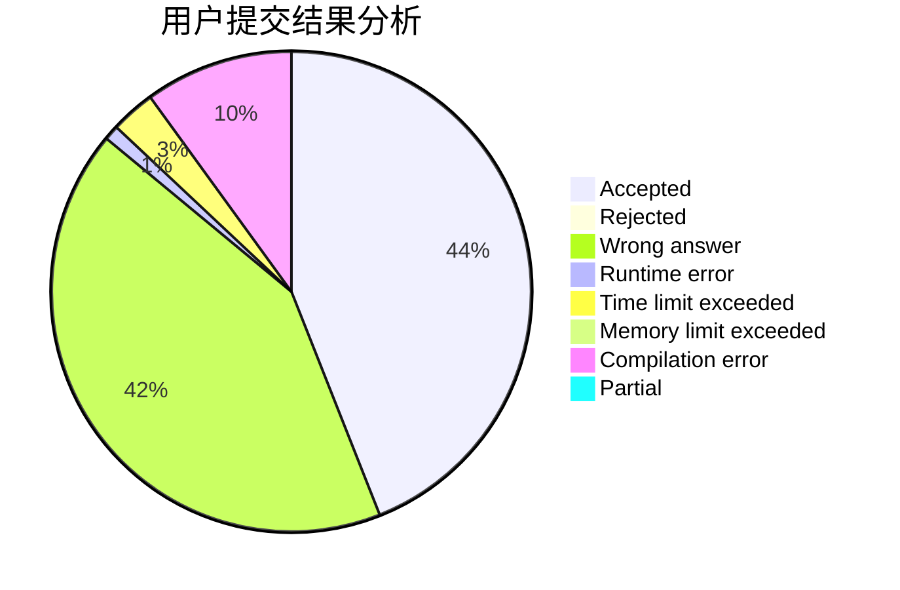
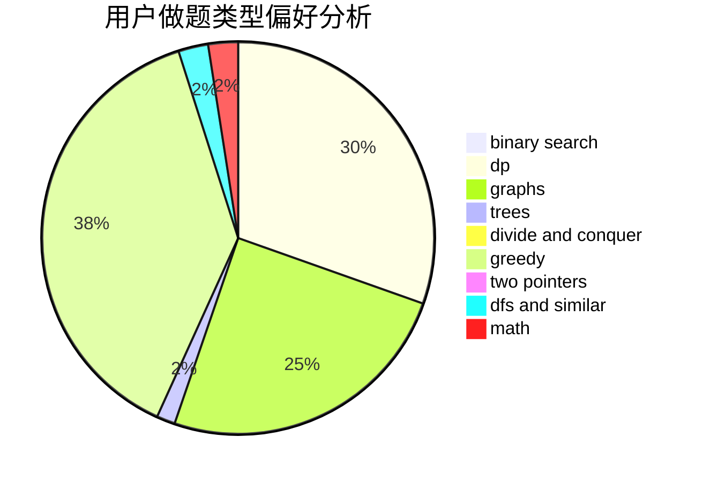

# Paladnix

<!-- tabs:start -->

#### **用户提交结果分析**

#### **用户做题类型偏好分析**

<!-- tabs:end -->
# 推荐题目
[668C](https://codeforces.com/contest/668/problem/C)
[377E](https://codeforces.com/contest/377/problem/E)
[1283A](https://codeforces.com/contest/1283/problem/A)
[1255A](https://codeforces.com/contest/1255/problem/A)
[578A](https://codeforces.com/contest/578/problem/A)
[483E](https://codeforces.com/contest/483/problem/E)
[1032E](https://codeforces.com/contest/1032/problem/E)
[1070B](https://codeforces.com/contest/1070/problem/B)
[660A](https://codeforces.com/contest/660/problem/A)
[883G](https://codeforces.com/contest/883/problem/G)
