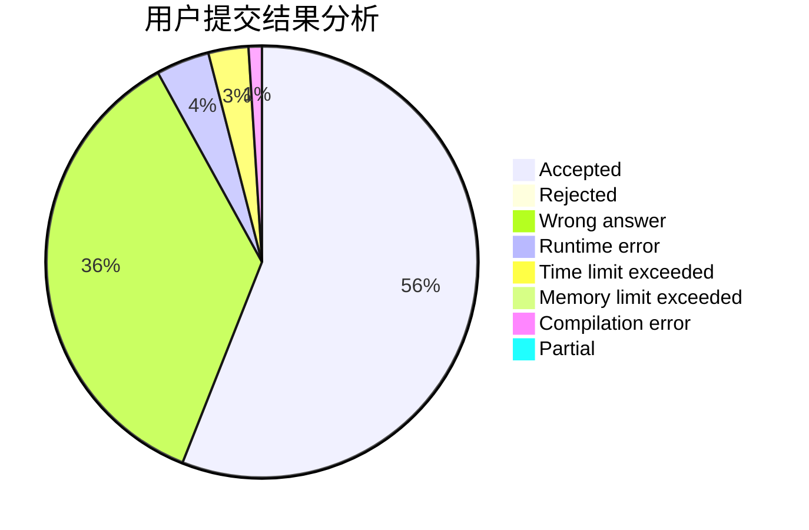
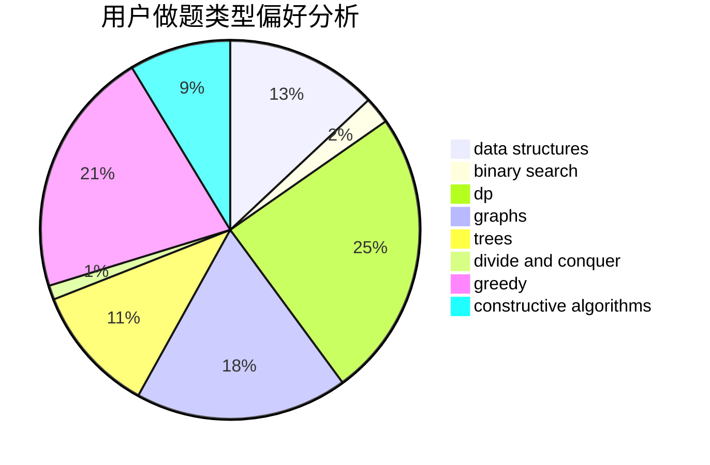
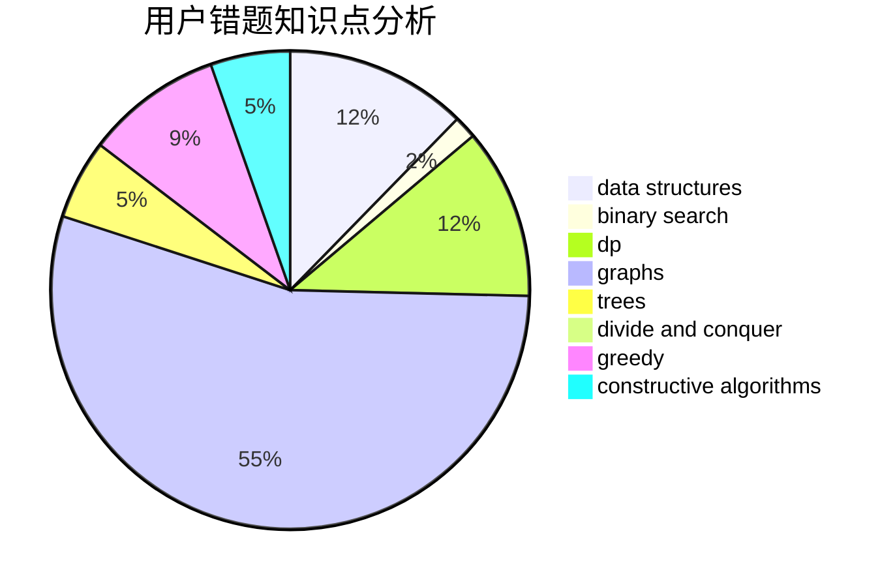

# Pan_H

<!-- tabs:start -->

#### **用户提交结果分析**

#### **用户做题类型偏好分析**

#### **用户错题知识点分析**

<!-- tabs:end -->
# 推荐题目
[615D](https://codeforces.com/contest/615/problem/D)		math,
                        number theory		  
[243A](https://codeforces.com/contest/243/problem/A)		bitmasks		  
[318C](https://codeforces.com/contest/318/problem/C)		dsu,graphs,sortings,trees		  
[1197E](https://codeforces.com/contest/1197/problem/E)		binary search,
                        combinatorics,
                        data structures,
                        dp,
                        shortest paths,
                        sortings		  
[796D](https://codeforces.com/contest/796/problem/D)		constructive algorithms,
                        dfs and similar,
                        dp,
                        graphs,
                        shortest paths,
                        trees		  
[1488E](https://codeforces.com/contest/1488/problem/E)		*special problem,
                        data structures,
                        dp		  
[320B](https://codeforces.com/contest/320/problem/B)		dfs and similar,
                        graphs		  
[750E](https://codeforces.com/contest/750/problem/E)		data structures,
                        divide and conquer,
                        dp,
                        matrices		  
[437A](https://codeforces.com/contest/437/problem/A)		implementation		  
[1183H](https://codeforces.com/contest/1183/problem/H)		dp,
                        strings		  
