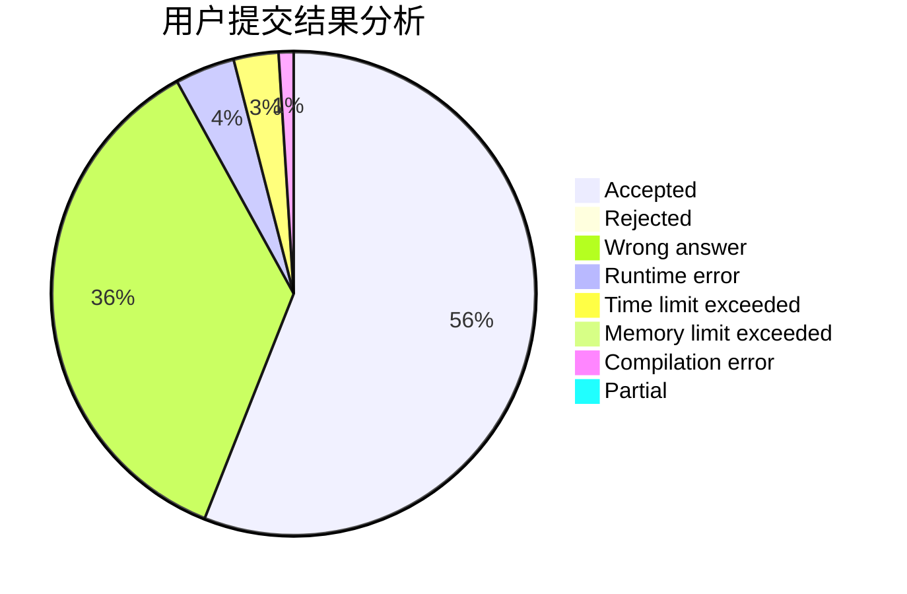
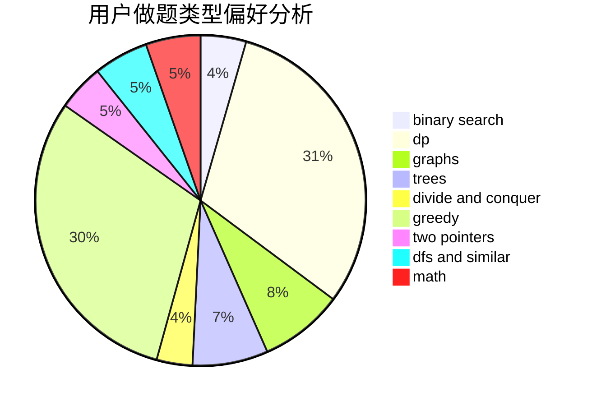

# Pan_H

<!-- tabs:start -->

#### **用户提交结果分析**

#### **用户做题类型偏好分析**

<!-- tabs:end -->
# 推荐题目
[615D](https://codeforces.com/contest/615/problem/D)
[243A](https://codeforces.com/contest/243/problem/A)
[318C](https://codeforces.com/contest/318/problem/C)
[1197E](https://codeforces.com/contest/1197/problem/E)
[796D](https://codeforces.com/contest/796/problem/D)
[1488E](https://codeforces.com/contest/1488/problem/E)
[320B](https://codeforces.com/contest/320/problem/B)
[750E](https://codeforces.com/contest/750/problem/E)
[437A](https://codeforces.com/contest/437/problem/A)
[1183H](https://codeforces.com/contest/1183/problem/H)
