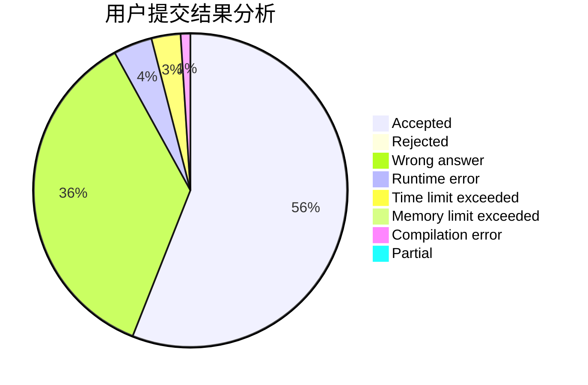
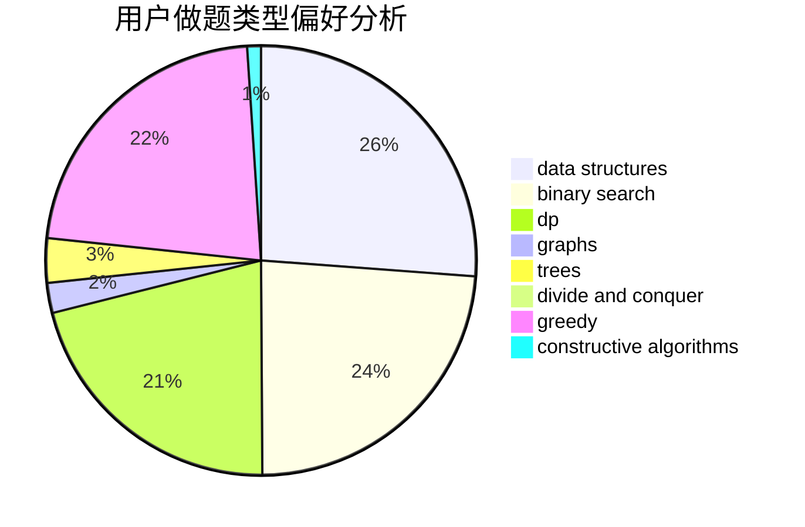
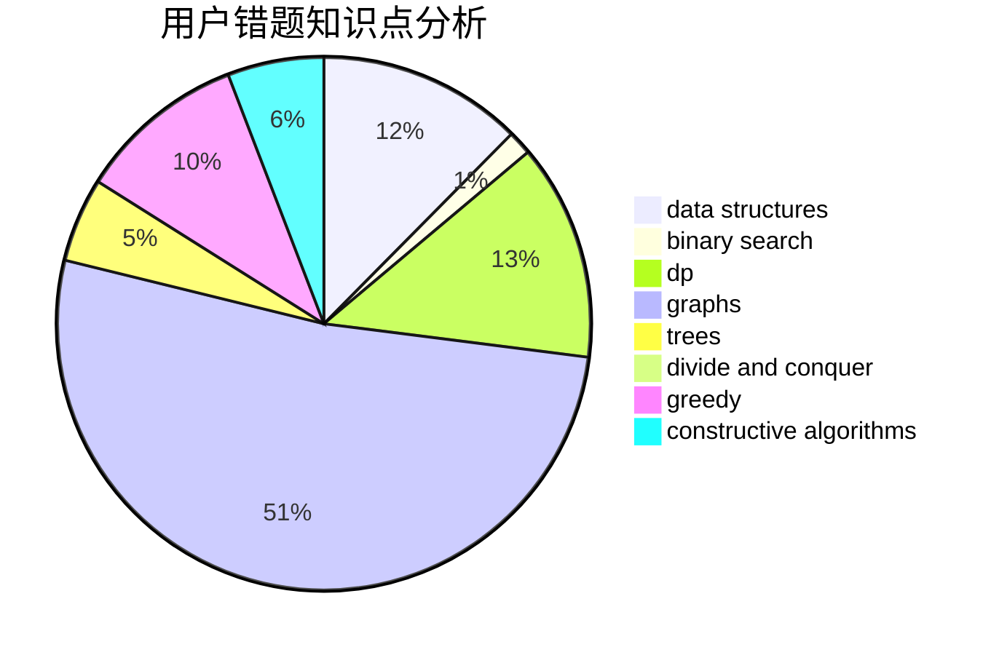

# Pan_H

<!-- tabs:start -->

#### **用户提交结果分析**

#### **用户做题类型偏好分析**

#### **用户错题知识点分析**

<!-- tabs:end -->
# 推荐题目
[598A](https://codeforces.com/contest/598/problem/A)		math		  
[224A](https://codeforces.com/contest/224/problem/A)		brute force,
                        geometry,
                        math		  
[300A](https://codeforces.com/contest/300/problem/A)		brute force,
                        constructive algorithms,
                        implementation		  
[1191F](https://codeforces.com/contest/1191/problem/F)		dsu,graphs,sortings,trees		  
[778C](https://codeforces.com/contest/778/problem/C)		brute force,
                        dfs and similar,
                        dsu,
                        hashing,
                        strings,
                        trees		  
[1480A](https://codeforces.com/contest/1480/problem/A)		games,
                        greedy,
                        strings		  
[301D](https://codeforces.com/contest/301/problem/D)		data structures		  
[732F](https://codeforces.com/contest/732/problem/F)		dfs and similar,
                        graphs		  
[409G](https://codeforces.com/contest/409/problem/G)		*special problem,
                        geometry		  
[1181C](https://codeforces.com/contest/1181/problem/C)		brute force,
                        combinatorics,
                        dp,
                        implementation		  
