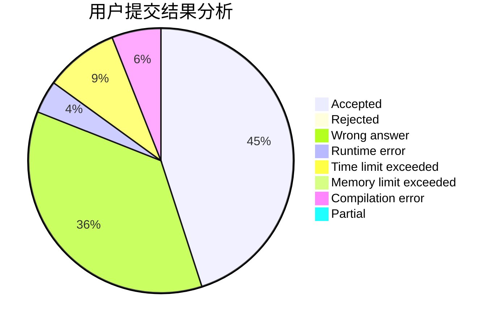
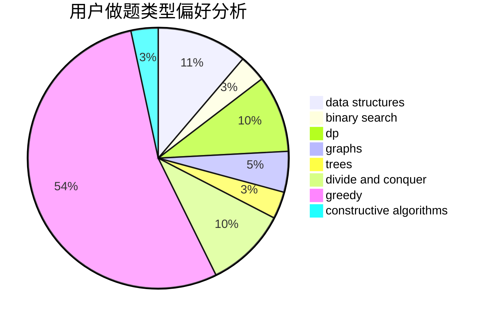

# Panelatta

<!-- tabs:start -->

#### **用户提交结果分析**

#### **用户做题类型偏好分析**

#### **用户错题知识点分析**

<!-- tabs:end -->
# 推荐题目
[1463D](https://codeforces.com/contest/1463/problem/D)		binary search,
                        constructive algorithms,
                        greedy,
                        two pointers		  
[1213C](https://codeforces.com/contest/1213/problem/C)		math		  
[1078A](https://codeforces.com/contest/1078/problem/A)		dsu,graphs,sortings,trees		  
[721A](https://codeforces.com/contest/721/problem/A)		implementation		  
[1216A](https://codeforces.com/contest/1216/problem/A)		strings		  
[84A](https://codeforces.com/contest/84/problem/A)		math,
                        number theory		  
[837F](https://codeforces.com/contest/837/problem/F)		binary search,
                        brute force,
                        combinatorics,
                        math,
                        matrices		  
[662B](https://codeforces.com/contest/662/problem/B)		dfs and similar,
                        graphs		  
[1152A](https://codeforces.com/contest/1152/problem/A)		greedy,
                        implementation,
                        math		  
[1367D](https://codeforces.com/contest/1367/problem/D)		constructive algorithms,
                        greedy,
                        implementation,
                        sortings		  
