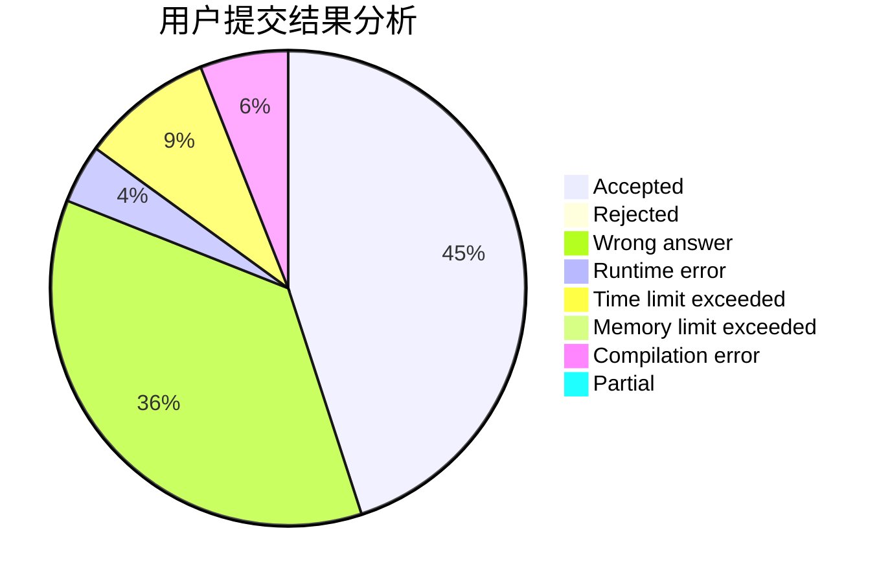
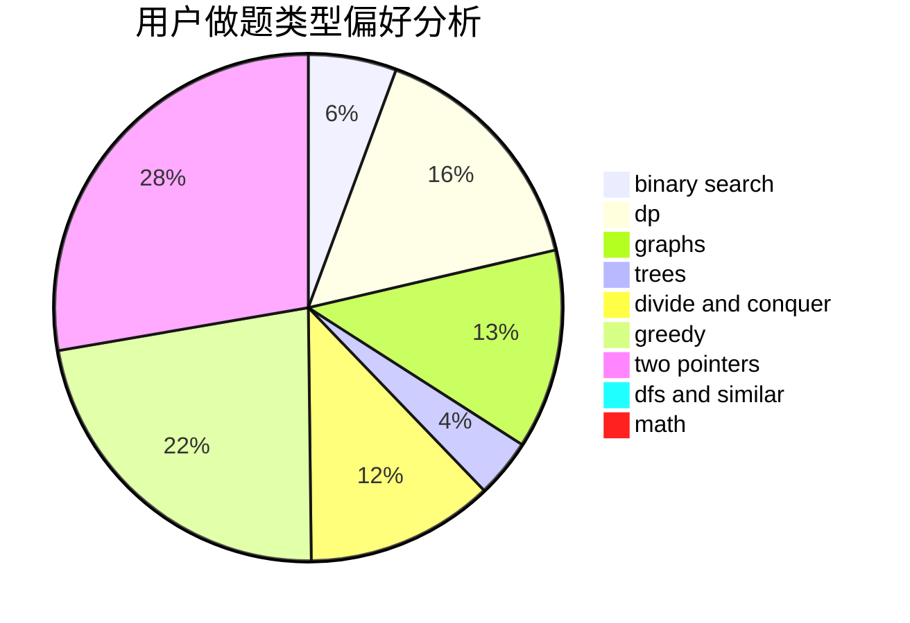

# Panelatta

<!-- tabs:start -->

#### **用户提交结果分析**

#### **用户做题类型偏好分析**

<!-- tabs:end -->
# 推荐题目
[1470E](https://codeforces.com/contest/1470/problem/E)
[1217E](https://codeforces.com/contest/1217/problem/E)
[1078D](https://codeforces.com/contest/1078/problem/D)
[737F](https://codeforces.com/contest/737/problem/F)
[1221E](https://codeforces.com/contest/1221/problem/E)
[868E](https://codeforces.com/contest/868/problem/E)
[855C](https://codeforces.com/contest/855/problem/C)
[682B](https://codeforces.com/contest/682/problem/B)
[1154A](https://codeforces.com/contest/1154/problem/A)
[1374A](https://codeforces.com/contest/1374/problem/A)
