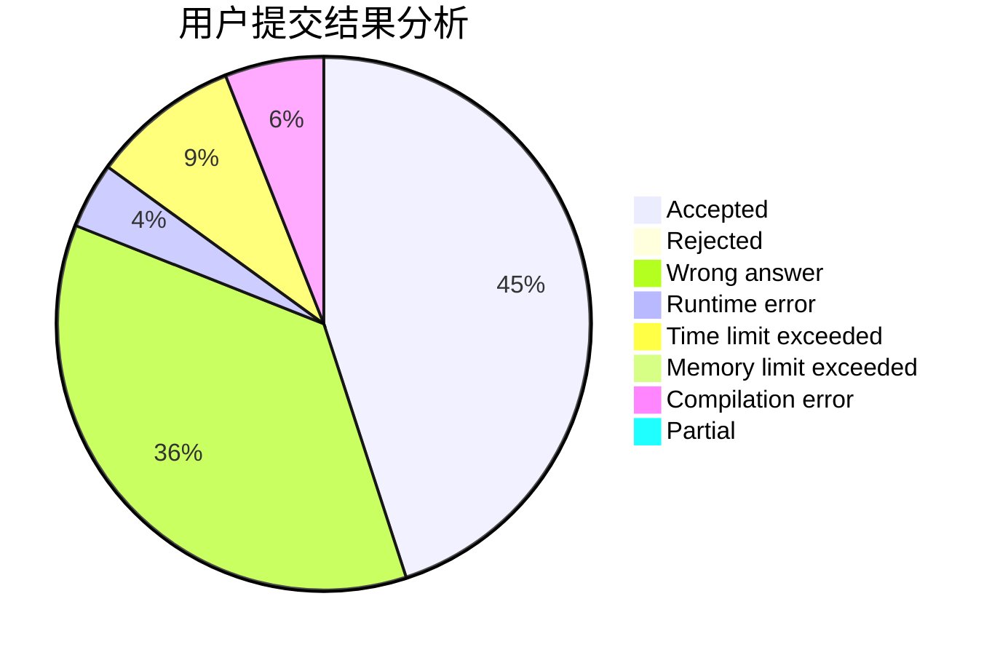
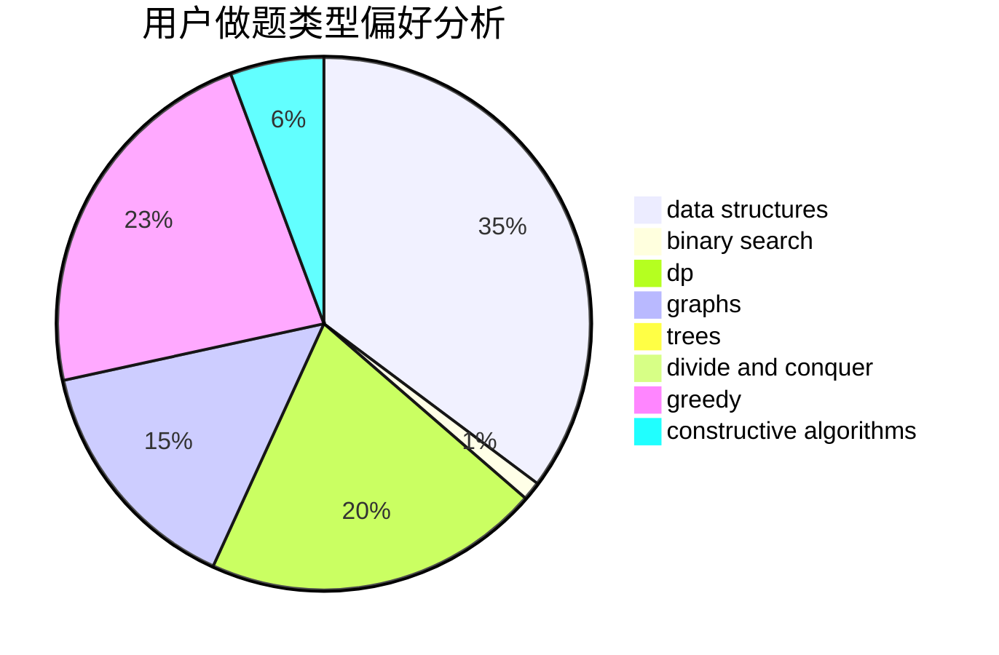

# Panelatta

<!-- tabs:start -->

#### **用户提交结果分析**

#### **用户做题类型偏好分析**

#### **用户错题知识点分析**

<!-- tabs:end -->
# 推荐题目
[1470E](https://codeforces.com/contest/1470/problem/E)		binary search,
                        combinatorics,
                        data structures,
                        dp,
                        graphs,
                        implementation,
                        two pointers		  
[1217E](https://codeforces.com/contest/1217/problem/E)		data structures,
                        greedy,
                        implementation,
                        math		  
[1078D](https://codeforces.com/contest/1078/problem/D)		dsu,graphs,sortings,trees		  
[737F](https://codeforces.com/contest/737/problem/F)		constructive algorithms,
                        math		  
[1221E](https://codeforces.com/contest/1221/problem/E)		games		  
[868E](https://codeforces.com/contest/868/problem/E)		dp,
                        graphs,
                        trees		  
[855C](https://codeforces.com/contest/855/problem/C)		dp,
                        trees		  
[682B](https://codeforces.com/contest/682/problem/B)		sortings		  
[1154A](https://codeforces.com/contest/1154/problem/A)		math		  
[1374A](https://codeforces.com/contest/1374/problem/A)		math		  
