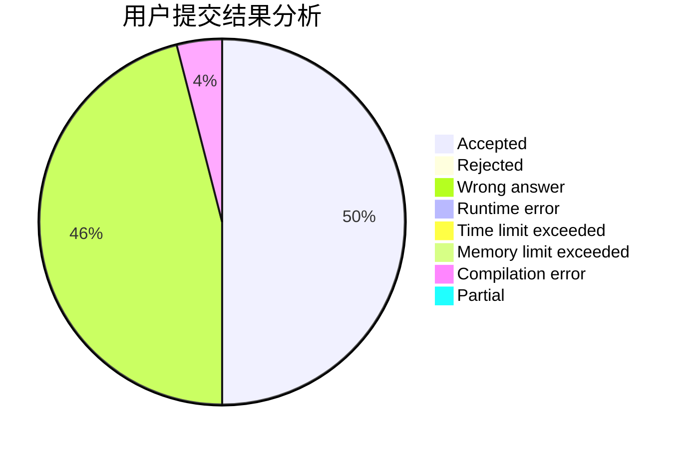
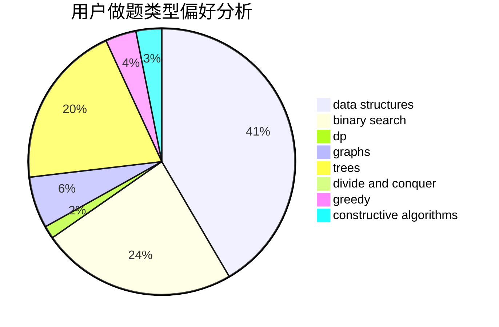

# Paralysis

<!-- tabs:start -->

#### **用户提交结果分析**

#### **用户做题类型偏好分析**

#### **用户错题知识点分析**

<!-- tabs:end -->
# 推荐题目
[363D](https://codeforces.com/contest/363/problem/D)		binary search,
                        greedy		  
[841D](https://codeforces.com/contest/841/problem/D)		dsu,graphs,sortings,trees		  
[364C](https://codeforces.com/contest/364/problem/C)		brute force,
                        number theory		  
[526B](https://codeforces.com/contest/526/problem/B)		dfs and similar,
                        greedy,
                        implementation		  
[1481E](https://codeforces.com/contest/1481/problem/E)		data structures,
                        dp,
                        greedy		  
[768D](https://codeforces.com/contest/768/problem/D)		dp,
                        math,
                        probabilities		  
[1033F](https://codeforces.com/contest/1033/problem/F)		bitmasks,
                        brute force,
                        fft,
                        math		  
[122C](https://codeforces.com/contest/122/problem/C)		dsu,graphs,sortings,trees		  
[1509C](https://codeforces.com/contest/1509/problem/C)		dp,
                        greedy		  
[367E](https://codeforces.com/contest/367/problem/E)		combinatorics,
                        dp		  
