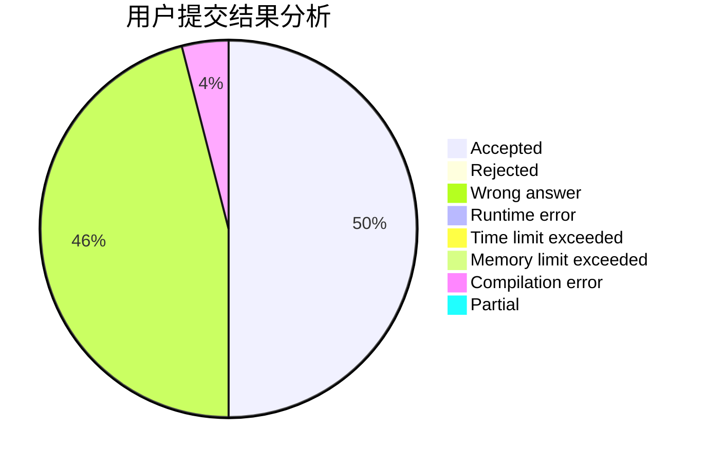
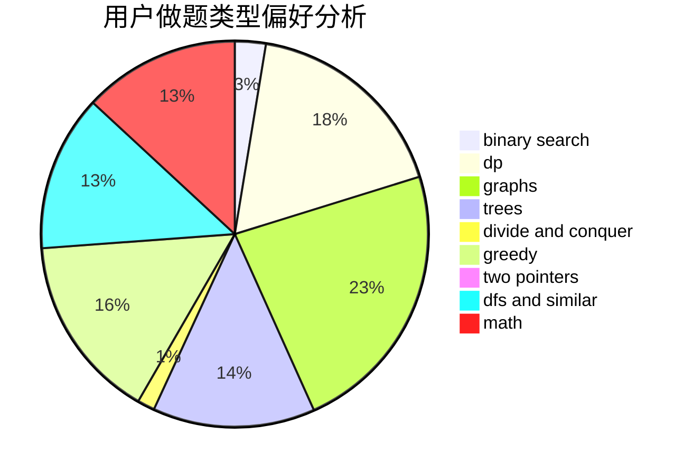

# Paralysis

<!-- tabs:start -->

#### **用户提交结果分析**

#### **用户做题类型偏好分析**

<!-- tabs:end -->
# 推荐题目
[38C](https://codeforces.com/contest/38/problem/C)
[860D](https://codeforces.com/contest/860/problem/D)
[3912](https://codeforces.com/contest/391/problem/2)
[550B](https://codeforces.com/contest/550/problem/B)
[1489G](https://codeforces.com/contest/1489/problem/G)
[788C](https://codeforces.com/contest/788/problem/C)
[1034B](https://codeforces.com/contest/1034/problem/B)
[1238D](https://codeforces.com/contest/1238/problem/D)
[160A](https://codeforces.com/contest/160/problem/A)
[398E](https://codeforces.com/contest/398/problem/E)
