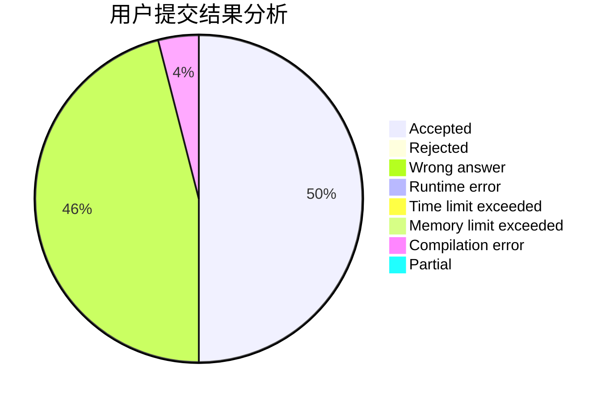
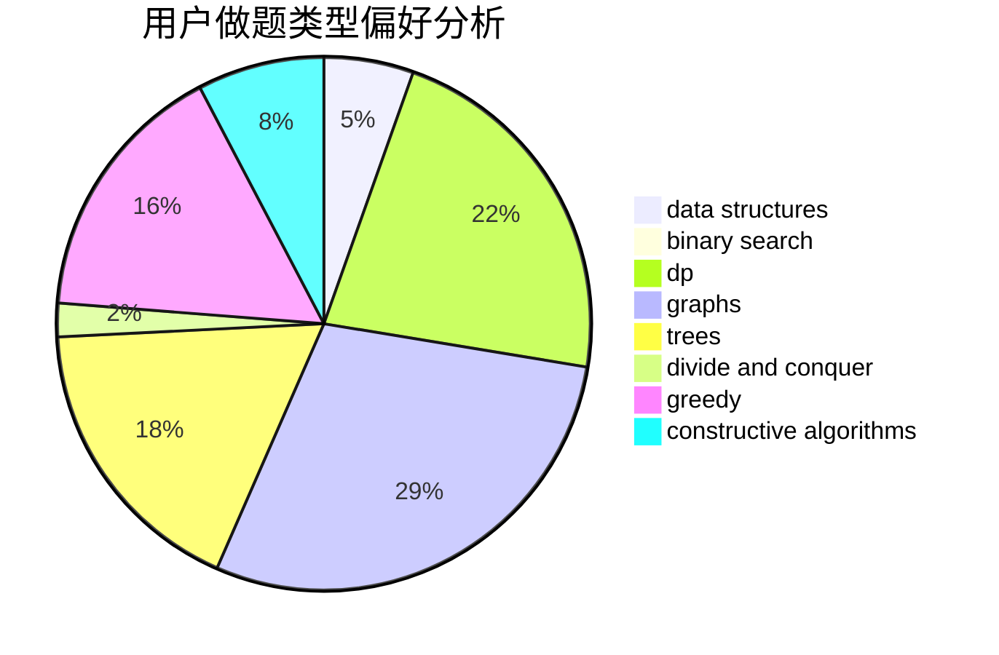

# Paralysis

<!-- tabs:start -->

#### **用户提交结果分析**

#### **用户做题类型偏好分析**

#### **用户错题知识点分析**

<!-- tabs:end -->
# 推荐题目
[38C](https://codeforces.com/contest/38/problem/C)		brute force		  
[860D](https://codeforces.com/contest/860/problem/D)		dsu,graphs,sortings,trees		  
[3912](https://codeforces.com/contest/391/problem/2)		dsu,graphs,sortings,trees		  
[550B](https://codeforces.com/contest/550/problem/B)		bitmasks,
                        brute force		  
[1489G](https://codeforces.com/contest/1489/problem/G)		dsu,graphs,sortings,trees		  
[788C](https://codeforces.com/contest/788/problem/C)		dfs and similar,
                        graphs,
                        shortest paths		  
[1034B](https://codeforces.com/contest/1034/problem/B)		brute force,
                        constructive algorithms,
                        flows,
                        graph matchings		  
[1238D](https://codeforces.com/contest/1238/problem/D)		binary search,
                        combinatorics,
                        dp,
                        strings		  
[160A](https://codeforces.com/contest/160/problem/A)		greedy,
                        sortings		  
[398E](https://codeforces.com/contest/398/problem/E)		nan		  
