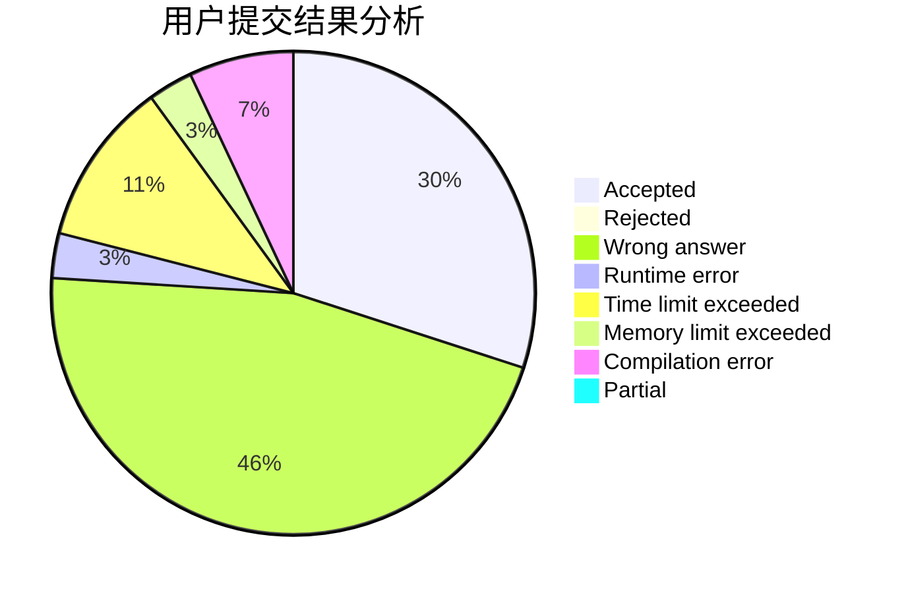
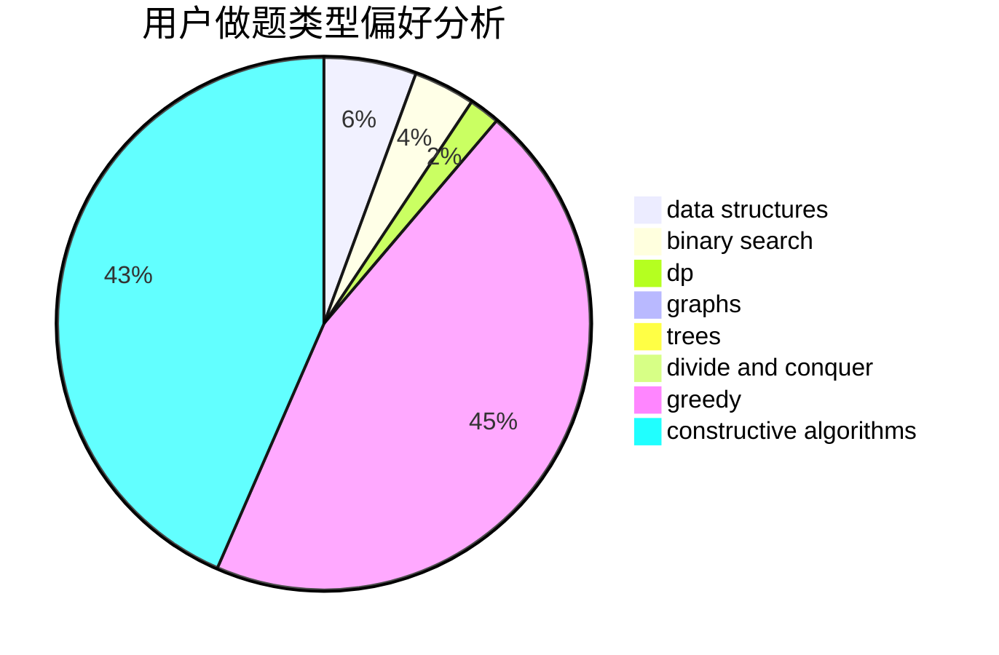

# Paranoid18

<!-- tabs:start -->

#### **用户提交结果分析**

#### **用户做题类型偏好分析**

#### **用户错题知识点分析**

<!-- tabs:end -->
# 推荐题目
[977C](https://codeforces.com/contest/977/problem/C)		sortings		  
[461B](https://codeforces.com/contest/461/problem/B)		dfs and similar,
                        dp,
                        trees		  
[1470E](https://codeforces.com/contest/1470/problem/E)		binary search,
                        combinatorics,
                        data structures,
                        dp,
                        graphs,
                        implementation,
                        two pointers		  
[1162C](https://codeforces.com/contest/1162/problem/C)		dsu,graphs,sortings,trees		  
[1202F](https://codeforces.com/contest/1202/problem/F)		binary search,
                        implementation,
                        math		  
[952A](https://codeforces.com/contest/952/problem/A)		math		  
[765B](https://codeforces.com/contest/765/problem/B)		greedy,
                        implementation,
                        strings		  
[418C](https://codeforces.com/contest/418/problem/C)		dsu,graphs,sortings,trees		  
[30A](https://codeforces.com/contest/30/problem/A)		brute force,
                        math		  
[173A](https://codeforces.com/contest/173/problem/A)		implementation,
                        math		  
