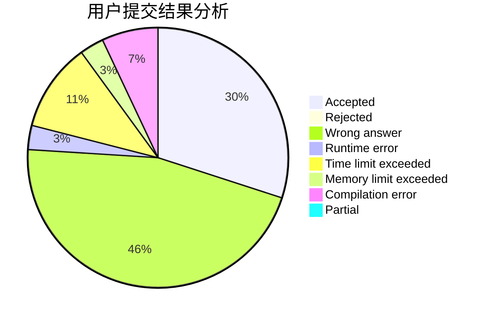
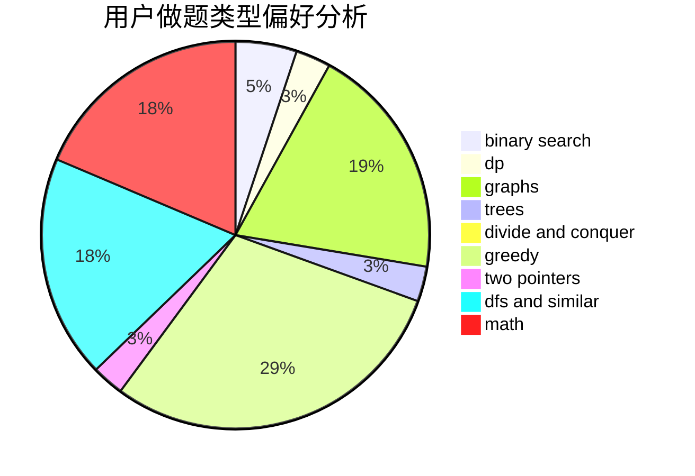

# Paranoid18

<!-- tabs:start -->

#### **用户提交结果分析**

#### **用户做题类型偏好分析**

<!-- tabs:end -->
# 推荐题目
[977C](https://codeforces.com/contest/977/problem/C)
[461B](https://codeforces.com/contest/461/problem/B)
[1470E](https://codeforces.com/contest/1470/problem/E)
[1162C](https://codeforces.com/contest/1162/problem/C)
[1202F](https://codeforces.com/contest/1202/problem/F)
[952A](https://codeforces.com/contest/952/problem/A)
[765B](https://codeforces.com/contest/765/problem/B)
[418C](https://codeforces.com/contest/418/problem/C)
[30A](https://codeforces.com/contest/30/problem/A)
[173A](https://codeforces.com/contest/173/problem/A)
