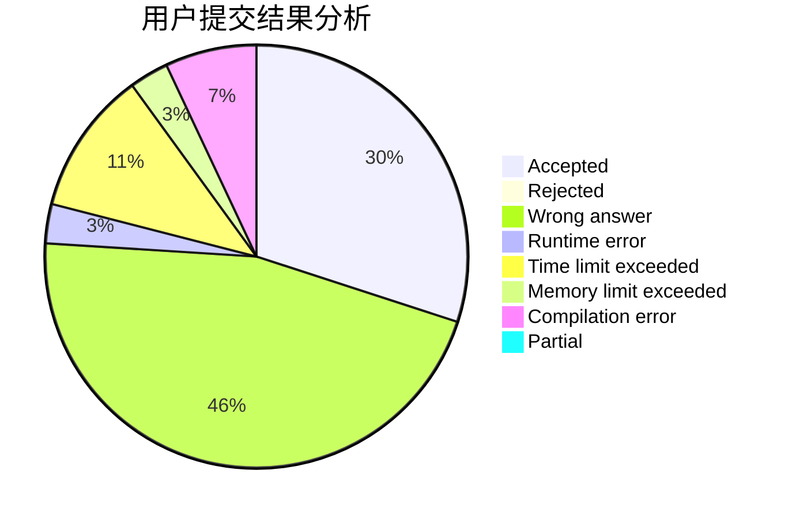
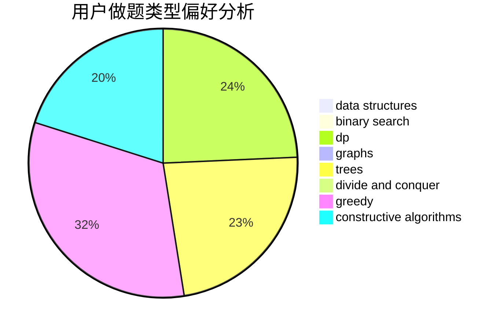

# Paranoid18

<!-- tabs:start -->

#### **用户提交结果分析**

#### **用户做题类型偏好分析**

#### **用户错题知识点分析**

<!-- tabs:end -->
# 推荐题目
[955C](https://codeforces.com/contest/955/problem/C)		binary search,
                        math,
                        number theory		  
[43A](https://codeforces.com/contest/43/problem/A)		strings		  
[1463D](https://codeforces.com/contest/1463/problem/D)		binary search,
                        constructive algorithms,
                        greedy,
                        two pointers		  
[1159D](https://codeforces.com/contest/1159/problem/D)		dsu,graphs,sortings,trees		  
[1199B](https://codeforces.com/contest/1199/problem/B)		geometry,
                        math		  
[931A](https://codeforces.com/contest/931/problem/A)		brute force,
                        greedy,
                        implementation,
                        math		  
[745C](https://codeforces.com/contest/745/problem/C)		dsu,graphs,sortings,trees		  
[389A](https://codeforces.com/contest/389/problem/A)		greedy,
                        math		  
[293C](https://codeforces.com/contest/293/problem/C)		brute force,
                        math,
                        number theory		  
[1513C](https://codeforces.com/contest/1513/problem/C)		dp,
                        matrices		  
