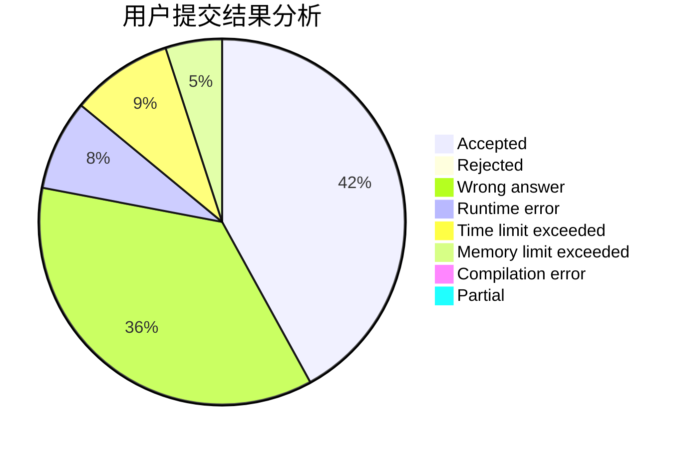
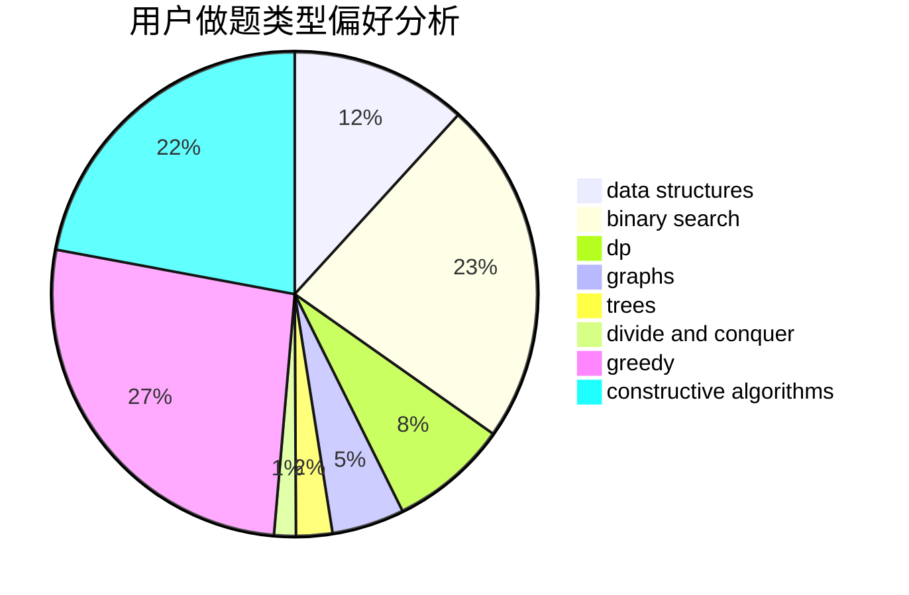
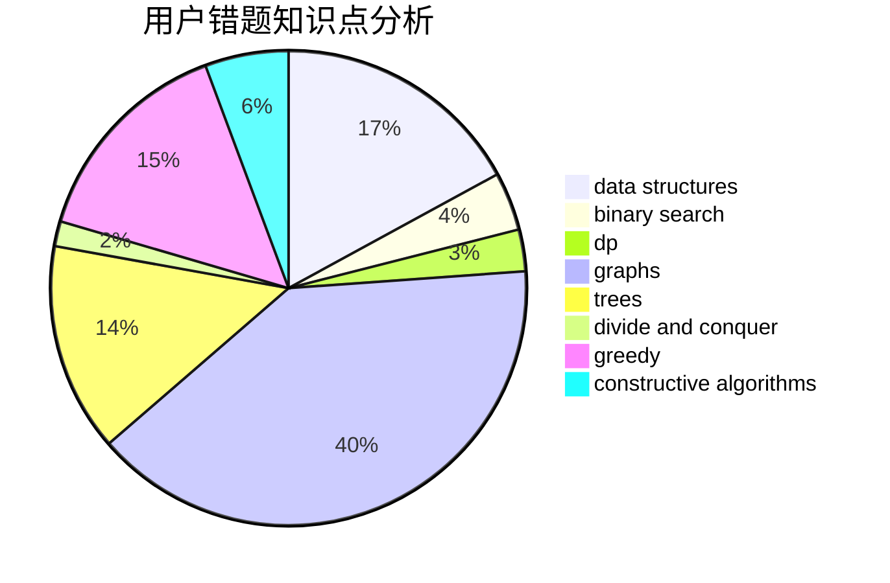

# AC-Automation

<!-- tabs:start -->

#### **用户提交结果分析**

#### **用户做题类型偏好分析**

#### **用户错题知识点分析**

<!-- tabs:end -->
# 推荐题目
[1472A](https://codeforces.com/contest/1472/problem/A)		greedy,
                        math		  
[1471D](https://codeforces.com/contest/1471/problem/D)		dsu,graphs,sortings,trees		  
[1015A](https://codeforces.com/contest/1015/problem/A)		implementation		  
[1113A](https://codeforces.com/contest/1113/problem/A)		dp,
                        greedy,
                        math		  
[1350D](https://codeforces.com/contest/1350/problem/D)		dsu,graphs,sortings,trees		  
[1161D](https://codeforces.com/contest/1161/problem/D)		dsu,graphs,sortings,trees		  
[1236E](https://codeforces.com/contest/1236/problem/E)		binary search,
                        data structures,
                        dp,
                        dsu		  
[1164S](https://codeforces.com/contest/1164/problem/S)		dsu,graphs,sortings,trees		  
[1270H](https://codeforces.com/contest/1270/problem/H)		data structures		  
[1450H2](https://codeforces.com/contest/1450H/problem/2)		combinatorics,
                        implementation,
                        math		  
