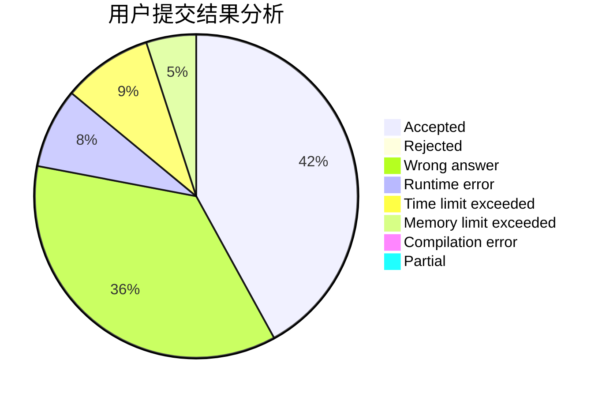
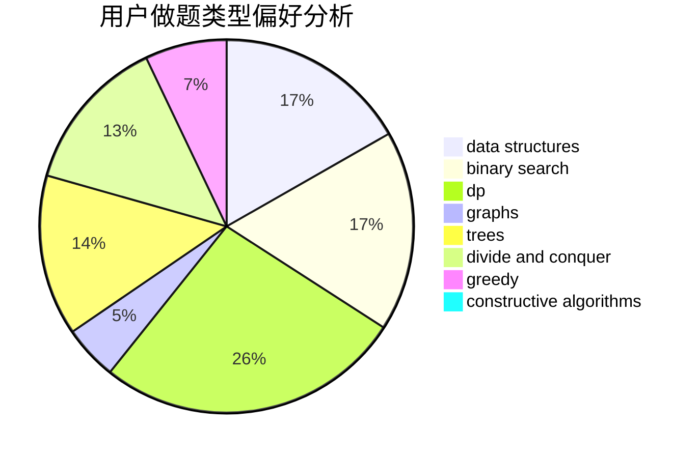
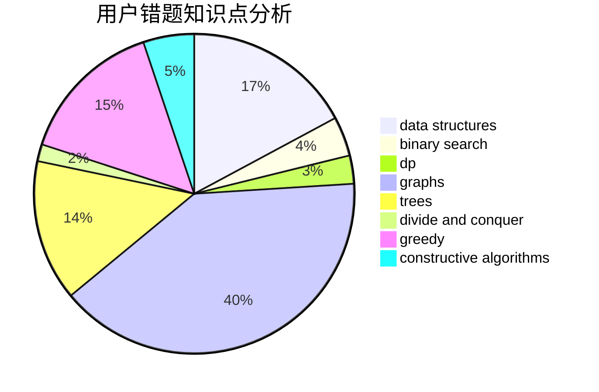

# AC-Automation

<!-- tabs:start -->

#### **用户提交结果分析**

#### **用户做题类型偏好分析**

#### **用户错题知识点分析**

<!-- tabs:end -->
# 推荐题目
[1480A](https://codeforces.com/contest/1480/problem/A)		games,
                        greedy,
                        strings		  
[147B](https://codeforces.com/contest/147/problem/B)		binary search,
                        graphs,
                        matrices		  
[1015B](https://codeforces.com/contest/1015/problem/B)		implementation		  
[1113D](https://codeforces.com/contest/1113/problem/D)		dsu,graphs,sortings,trees		  
[13577](https://codeforces.com/contest/1357/problem/7)		dsu,graphs,sortings,trees		  
[1164F](https://codeforces.com/contest/1164/problem/F)		dsu,graphs,sortings,trees		  
[1241B](https://codeforces.com/contest/1241/problem/B)		dsu,graphs,sortings,trees		  
[1167B](https://codeforces.com/contest/1167/problem/B)		brute force,
                        divide and conquer,
                        interactive,
                        math		  
[1280A](https://codeforces.com/contest/1280/problem/A)		implementation,
                        math		  
[1459F](https://codeforces.com/contest/1459/problem/F)		dsu,graphs,sortings,trees		  
