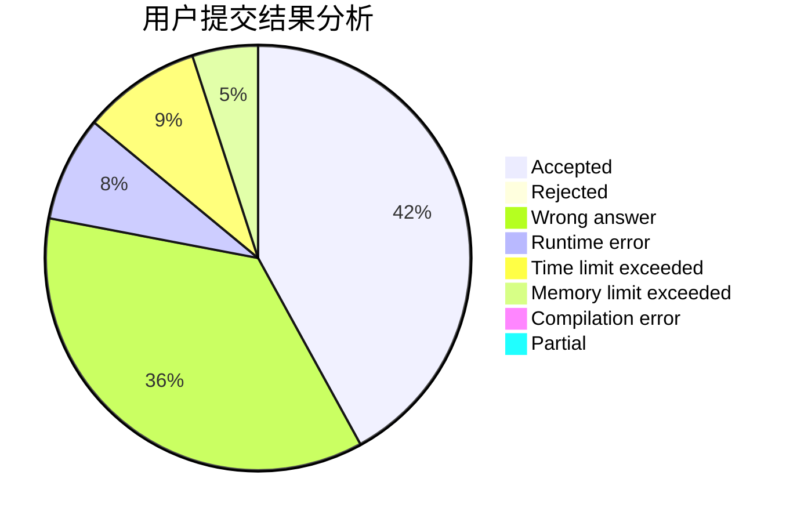
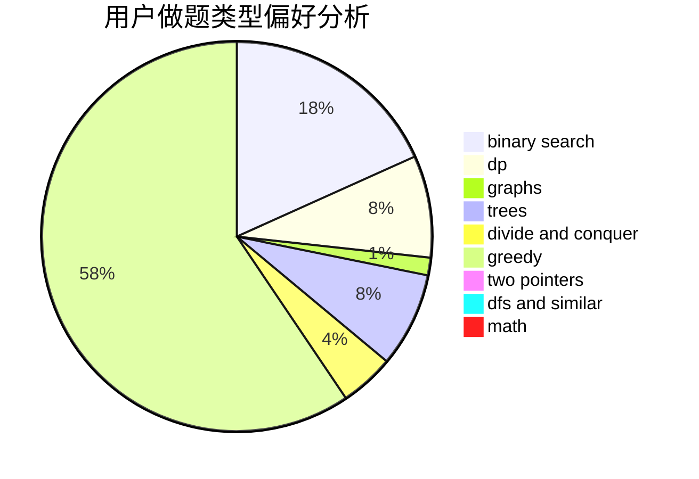

# AC-Automation

<!-- tabs:start -->

#### **用户提交结果分析**

#### **用户做题类型偏好分析**

<!-- tabs:end -->
# 推荐题目
[1480A](https://codeforces.com/contest/1480/problem/A)
[147B](https://codeforces.com/contest/147/problem/B)
[1015B](https://codeforces.com/contest/1015/problem/B)
[1113D](https://codeforces.com/contest/1113/problem/D)
[13577](https://codeforces.com/contest/1357/problem/7)
[1164F](https://codeforces.com/contest/1164/problem/F)
[1241B](https://codeforces.com/contest/1241/problem/B)
[1167B](https://codeforces.com/contest/1167/problem/B)
[1280A](https://codeforces.com/contest/1280/problem/A)
[1459F](https://codeforces.com/contest/1459/problem/F)
