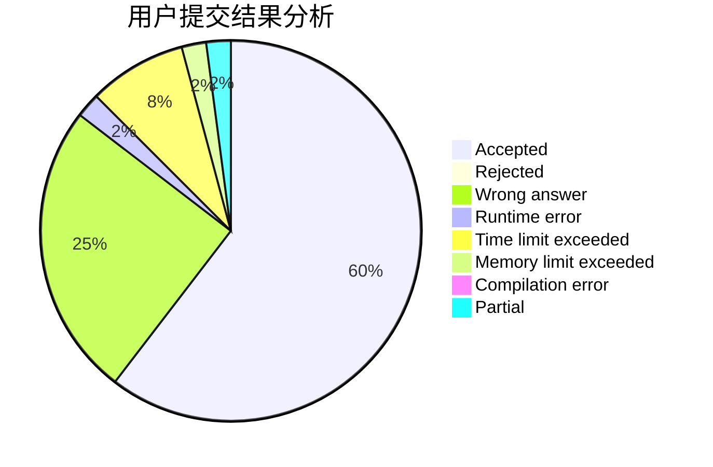
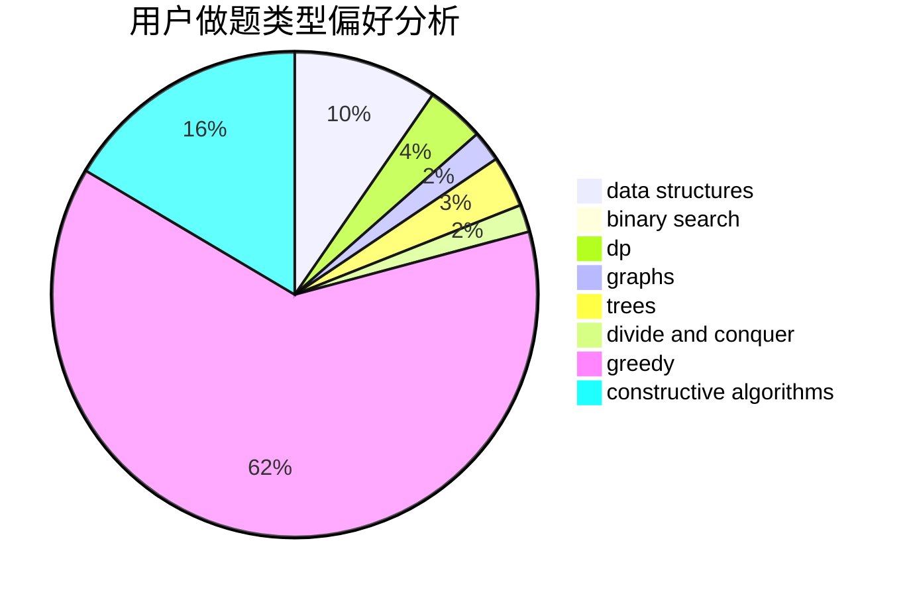
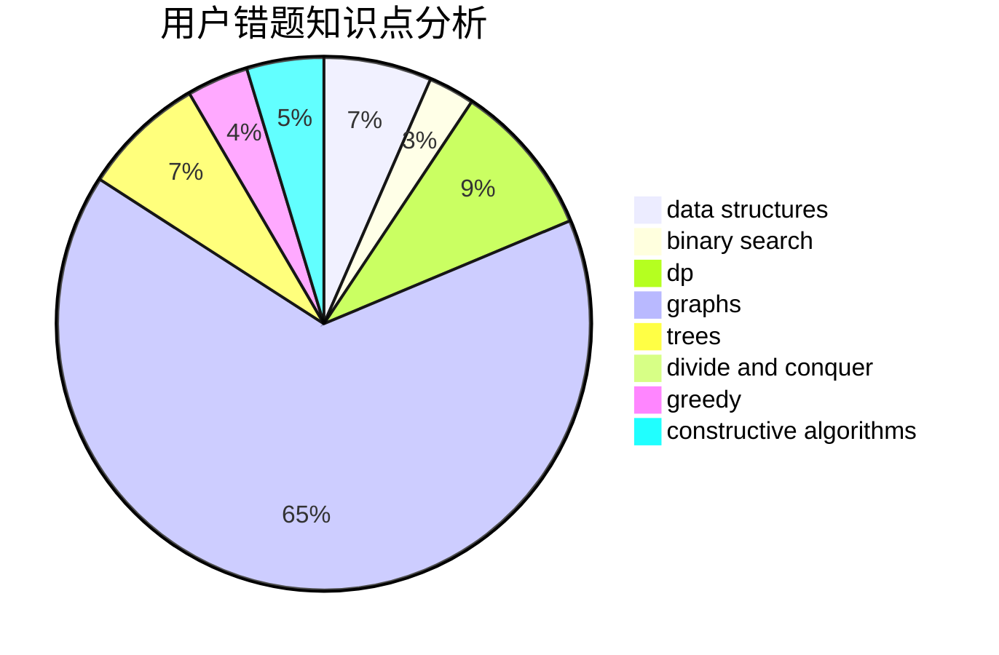

# Paulliant
<!-- tabs:start -->
#### **用户提交结果分析**

#### **用户做题类型偏好分析**

#### **用户错题知识点分析**

<!-- tabs:end -->
# 推荐题目
[Duff in the Army](http://codeforces.com/problemset/problem/587/C)		data structures,
                        trees		  
[Eating Soup](http://codeforces.com/problemset/problem/1163/A)		greedy,
                        math		  
[Arthur and Table](http://codeforces.com/problemset/problem/557/C)		brute force,
                        data structures,
                        dp,
                        greedy,
                        math,
                        sortings		  
[Gourmet Cat](http://codeforces.com/problemset/problem/1154/C)		implementation,
                        math		  
[Island Puzzle](http://codeforces.com/problemset/problem/627/F)		dfs and similar,
                        dsu,
                        graphs,
                        trees		  
[Pluses everywhere](https://codeforces.com/contest/521/problem/C)		combinatorics,
                        dp,
                        math,
                        number theory		  
[Suspects](https://codeforces.com/contest/157/problem/D)		constructive algorithms,
                        data structures,
                        implementation		  
[I_love_\%username\%](http://codeforces.com/problemset/problem/155/A)		brute force		  
[Riverside Curio](https://codeforces.com/contest/957/problem/D)		data structures,
                        dp,
                        greedy		  
[Try and Catch](http://codeforces.com/problemset/problem/195/C)		expression parsing,
                        implementation		  
<!-- tabs:start -->
#### **data structures**
[Duff in the Army](http://codeforces.com/problemset/problem/587/C)		data structures,
                        trees		  
[Eating Soup](http://codeforces.com/problemset/problem/557/C)		brute force,
                        data structures,
                        dp,
                        greedy,
                        math,
                        sortings		  
[Arthur and Table](https://codeforces.com/contest/157/problem/D)		constructive algorithms,
                        data structures,
                        implementation		  
[Gourmet Cat](https://codeforces.com/contest/957/problem/D)		data structures,
                        dp,
                        greedy		  
[Island Puzzle](http://codeforces.com/problemset/problem/1427/F)		data structures,
                        greedy,
                        trees		  
[Pluses everywhere](http://codeforces.com/problemset/problem/513/D2)		constructive algorithms,
                        data structures		  
[Suspects](https://codeforces.com/contest/1291/problem/D)		binary search,
                        constructive algorithms,
                        data structures,
                        strings,
                        two pointers		  
[I_love_\%username\%](http://codeforces.com/problemset/problem/1481/E)		data structures,
                        dp,
                        greedy		  
[Riverside Curio](http://codeforces.com/problemset/problem/1492/C)		binary search,
                        data structures,
                        dp,
                        greedy,
                        two pointers		  
[Try and Catch](http://codeforces.com/problemset/problem/1490/G)		binary search,
                        data structures,
                        math		  
#### **binary search**
[Duff in the Army](http://codeforces.com/problemset/problem/75/C)		binary search,
                        number theory		  
[Eating Soup](http://codeforces.com/problemset/problem/525/E)		binary search,
                        bitmasks,
                        brute force,
                        dp,
                        math,
                        meet-in-the-middle		  
[Arthur and Table](http://codeforces.com/problemset/problem/978/C)		binary search,
                        implementation,
                        two pointers		  
[Gourmet Cat](http://codeforces.com/problemset/problem/1462/E1)		binary search,
                        combinatorics,
                        math,
                        sortings,
                        two pointers		  
[Island Puzzle](https://codeforces.com/contest/1509/problem/E)		binary search,
                        bitmasks,
                        combinatorics,
                        constructive algorithms,
                        implementation,
                        math		  
[Pluses everywhere](https://codeforces.com/contest/1291/problem/D)		binary search,
                        constructive algorithms,
                        data structures,
                        strings,
                        two pointers		  
[Suspects](http://codeforces.com/problemset/problem/1492/C)		binary search,
                        data structures,
                        dp,
                        greedy,
                        two pointers		  
[I_love_\%username\%](http://codeforces.com/problemset/problem/1463/D)		binary search,
                        constructive algorithms,
                        greedy,
                        two pointers		  
[Riverside Curio](http://codeforces.com/problemset/problem/1490/G)		binary search,
                        data structures,
                        math		  
[Try and Catch](http://codeforces.com/problemset/problem/1479/D)		binary search,
                        bitmasks,
                        brute force,
                        data structures,
                        probabilities,
                        trees		  
#### **dp**
[Duff in the Army](http://codeforces.com/problemset/problem/557/C)		brute force,
                        data structures,
                        dp,
                        greedy,
                        math,
                        sortings		  
[Eating Soup](https://codeforces.com/contest/521/problem/C)		combinatorics,
                        dp,
                        math,
                        number theory		  
[Arthur and Table](https://codeforces.com/contest/957/problem/D)		data structures,
                        dp,
                        greedy		  
[Gourmet Cat](http://codeforces.com/problemset/problem/348/E)		dfs and similar,
                        dp,
                        trees		  
[Island Puzzle](http://codeforces.com/problemset/problem/86/C)		dp,
                        string suffix structures,
                        trees		  
[Pluses everywhere](http://codeforces.com/problemset/problem/525/E)		binary search,
                        bitmasks,
                        brute force,
                        dp,
                        math,
                        meet-in-the-middle		  
[Suspects](https://codeforces.com/contest/1397/problem/E)		dp,
                        greedy,
                        implementation		  
[I_love_\%username\%](http://codeforces.com/problemset/problem/1481/E)		data structures,
                        dp,
                        greedy		  
[Riverside Curio](http://codeforces.com/problemset/problem/1492/C)		binary search,
                        data structures,
                        dp,
                        greedy,
                        two pointers		  
[Try and Catch](https://codeforces.com/contest/1457/problem/C)		brute force,
                        dp,
                        implementation		  
#### **graph**
[Duff in the Army](http://codeforces.com/problemset/problem/627/F)		dfs and similar,
                        dsu,
                        graphs,
                        trees		  
[Eating Soup](http://codeforces.com/problemset/problem/788/C)		dfs and similar,
                        graphs,
                        shortest paths		  
[Arthur and Table](http://codeforces.com/problemset/problem/274/D)		dfs and similar,
                        graphs,
                        greedy,
                        sortings		  
[Gourmet Cat](http://codeforces.com/problemset/problem/1470/D)		constructive algorithms,
                        dfs and similar,
                        graph matchings,
                        graphs,
                        greedy		  
[Island Puzzle](http://codeforces.com/problemset/problem/1133/F2)		constructive algorithms,
                        dfs and similar,
                        dsu,
                        graphs,
                        greedy		  
[Pluses everywhere](http://codeforces.com/problemset/problem/1487/C)		brute force,
                        constructive algorithms,
                        dfs and similar,
                        graphs,
                        greedy,
                        implementation,
                        math		  
[Suspects](http://codeforces.com/problemset/problem/1437/C)		dp,
                        flows,
                        graph matchings,
                        greedy,
                        math,
                        sortings		  
[I_love_\%username\%](http://codeforces.com/problemset/problem/1470/D)		constructive algorithms,
                        dfs and similar,
                        graph matchings,
                        graphs,
                        greedy		  
[Riverside Curio](http://codeforces.com/problemset/problem/1476/C)		dp,
                        graphs,
                        greedy		  
[Try and Catch](http://codeforces.com/problemset/problem/1304/D)		constructive algorithms,
                        graphs,
                        greedy,
                        two pointers		  
#### **trees**
[Duff in the Army](http://codeforces.com/problemset/problem/587/C)		data structures,
                        trees		  
[Eating Soup](http://codeforces.com/problemset/problem/627/F)		dfs and similar,
                        dsu,
                        graphs,
                        trees		  
[Arthur and Table](http://codeforces.com/problemset/problem/348/E)		dfs and similar,
                        dp,
                        trees		  
[Gourmet Cat](http://codeforces.com/problemset/problem/86/C)		dp,
                        string suffix structures,
                        trees		  
[Island Puzzle](http://codeforces.com/problemset/problem/1427/F)		data structures,
                        greedy,
                        trees		  
[Pluses everywhere](http://codeforces.com/problemset/problem/526/G)		greedy,
                        trees		  
[Suspects](http://codeforces.com/problemset/problem/1388/C)		dfs and similar,
                        greedy,
                        math,
                        trees		  
[I_love_\%username\%](http://codeforces.com/problemset/problem/1479/D)		binary search,
                        bitmasks,
                        brute force,
                        data structures,
                        probabilities,
                        trees		  
[Riverside Curio](http://codeforces.com/problemset/problem/1511/C)		brute force,
                        data structures,
                        implementation,
                        trees		  
[Try and Catch](http://codeforces.com/problemset/problem/1499/F)		combinatorics,
                        dfs and similar,
                        dp,
                        trees		  
#### **divide and conquer**
[Duff in the Army](http://codeforces.com/problemset/problem/1461/D)		binary search,
                        brute force,
                        data structures,
                        divide and conquer,
                        implementation,
                        sortings		  
[Eating Soup](http://codeforces.com/problemset/problem/1466/G)		combinatorics,
                        divide and conquer,
                        hashing,
                        math,
                        string suffix structures,
                        strings		  
[Arthur and Table](http://codeforces.com/problemset/problem/1490/D)		dfs and similar,
                        divide and conquer,
                        implementation		  
[Gourmet Cat](https://codeforces.com/contest/1483/problem/C)		data structures,
                        divide and conquer,
                        dp		  
[Island Puzzle](http://codeforces.com/problemset/problem/1491/E)		brute force,
                        dfs and similar,
                        divide and conquer,
                        number theory,
                        trees		  
[Pluses everywhere](http://codeforces.com/problemset/problem/1303/G)		data structures,
                        divide and conquer,
                        geometry,
                        trees		  
[Suspects](http://codeforces.com/problemset/problem/1494/D)		constructive algorithms,
                        data structures,
                        dfs and similar,
                        divide and conquer,
                        dsu,
                        greedy,
                        sortings,
                        trees		  
[I_love_\%username\%](http://codeforces.com/problemset/problem/1482/E)		data structures,
                        divide and conquer,
                        dp		  
[Riverside Curio](http://codeforces.com/problemset/problem/566/C)		dfs and similar,
                        divide and conquer,
                        trees		  
[Try and Catch](http://codeforces.com/problemset/problem/1428/F)		binary search,
                        data structures,
                        divide and conquer,
                        dp,
                        two pointers		  
#### **greedy**
[Duff in the Army](http://codeforces.com/problemset/problem/1163/A)		greedy,
                        math		  
[Eating Soup](http://codeforces.com/problemset/problem/557/C)		brute force,
                        data structures,
                        dp,
                        greedy,
                        math,
                        sortings		  
[Arthur and Table](https://codeforces.com/contest/957/problem/D)		data structures,
                        dp,
                        greedy		  
[Gourmet Cat](http://codeforces.com/problemset/problem/486/B)		greedy,
                        hashing,
                        implementation		  
[Island Puzzle](http://codeforces.com/problemset/problem/274/D)		dfs and similar,
                        graphs,
                        greedy,
                        sortings		  
[Pluses everywhere](http://codeforces.com/problemset/problem/1218/I)		2-sat,
                        dfs and similar,
                        greedy		  
[Suspects](http://codeforces.com/problemset/problem/1427/F)		data structures,
                        greedy,
                        trees		  
[I_love_\%username\%](https://codeforces.com/contest/1265/problem/C)		greedy,
                        implementation		  
[Riverside Curio](http://codeforces.com/problemset/problem/526/G)		greedy,
                        trees		  
[Try and Catch](http://codeforces.com/problemset/problem/437/B)		bitmasks,
                        greedy,
                        implementation,
                        sortings		  
#### **constructive algorithms**
[Duff in the Army](https://codeforces.com/contest/157/problem/D)		constructive algorithms,
                        data structures,
                        implementation		  
[Eating Soup](http://codeforces.com/problemset/problem/85/A)		constructive algorithms,
                        implementation		  
[Arthur and Table](http://codeforces.com/problemset/problem/513/D2)		constructive algorithms,
                        data structures		  
[Gourmet Cat](http://codeforces.com/problemset/problem/1470/D)		constructive algorithms,
                        dfs and similar,
                        graph matchings,
                        graphs,
                        greedy		  
[Island Puzzle](https://codeforces.com/contest/1509/problem/E)		binary search,
                        bitmasks,
                        combinatorics,
                        constructive algorithms,
                        implementation,
                        math		  
[Pluses everywhere](http://codeforces.com/problemset/problem/1133/F2)		constructive algorithms,
                        dfs and similar,
                        dsu,
                        graphs,
                        greedy		  
[Suspects](https://codeforces.com/contest/1291/problem/D)		binary search,
                        constructive algorithms,
                        data structures,
                        strings,
                        two pointers		  
[I_love_\%username\%](http://codeforces.com/problemset/problem/1493/A)		constructive algorithms,
                        greedy		  
[Riverside Curio](http://codeforces.com/problemset/problem/1463/D)		binary search,
                        constructive algorithms,
                        greedy,
                        two pointers		  
[Try and Catch](https://codeforces.com/contest/1456/problem/B)		bitmasks,
                        brute force,
                        constructive algorithms		  
#### **sortings**
[Duff in the Army](http://codeforces.com/problemset/problem/557/C)		brute force,
                        data structures,
                        dp,
                        greedy,
                        math,
                        sortings		  
[Eating Soup](http://codeforces.com/problemset/problem/274/D)		dfs and similar,
                        graphs,
                        greedy,
                        sortings		  
[Arthur and Table](http://codeforces.com/problemset/problem/937/A)		implementation,
                        sortings		  
[Gourmet Cat](http://codeforces.com/problemset/problem/437/B)		bitmasks,
                        greedy,
                        implementation,
                        sortings		  
[Island Puzzle](http://codeforces.com/problemset/problem/1462/E1)		binary search,
                        combinatorics,
                        math,
                        sortings,
                        two pointers		  
[Pluses everywhere](https://codeforces.com/contest/1496/problem/C)		geometry,
                        greedy,
                        math,
                        sortings		  
[Suspects](http://codeforces.com/problemset/problem/1495/A)		geometry,
                        greedy,
                        math,
                        sortings		  
[I_love_\%username\%](http://codeforces.com/problemset/problem/1497/A)		brute force,
                        data structures,
                        greedy,
                        sortings		  
[Riverside Curio](http://codeforces.com/problemset/problem/1427/A)		math,
                        sortings		  
[Try and Catch](http://codeforces.com/problemset/problem/1461/D)		binary search,
                        brute force,
                        data structures,
                        divide and conquer,
                        implementation,
                        sortings		  
<!-- tabs:end -->
