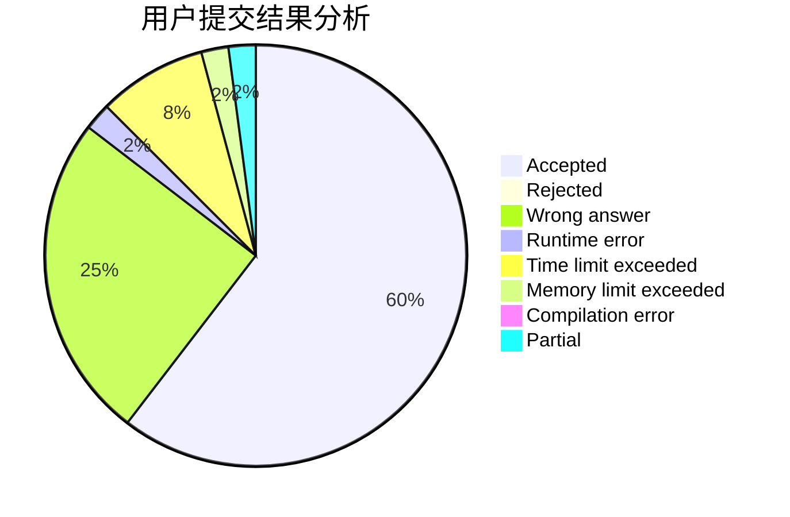
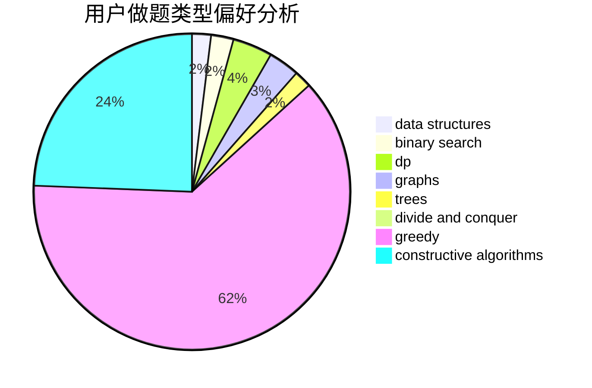
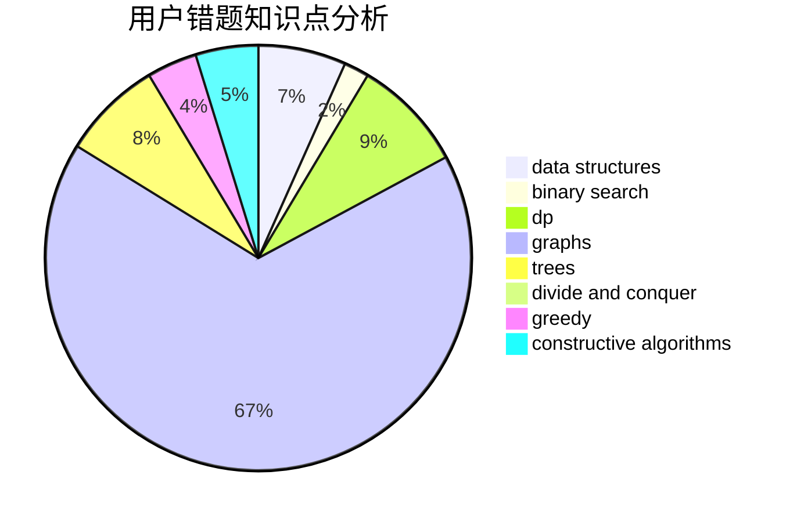

# Paulliant

<!-- tabs:start -->

#### **用户提交结果分析**

#### **用户做题类型偏好分析**

#### **用户错题知识点分析**

<!-- tabs:end -->
# 推荐题目
[14791](https://codeforces.com/contest/1479/problem/1)		dsu,graphs,sortings,trees		  
[580D](https://codeforces.com/contest/580/problem/D)		bitmasks,
                        dp		  
[607D](https://codeforces.com/contest/607/problem/D)		data structures,
                        trees		  
[992A](https://codeforces.com/contest/992/problem/A)		implementation,
                        sortings		  
[1156C](https://codeforces.com/contest/1156/problem/C)		binary search,
                        greedy,
                        sortings,
                        ternary search,
                        two pointers		  
[160C](https://codeforces.com/contest/160/problem/C)		implementation,
                        math,
                        sortings		  
[1489G](https://codeforces.com/contest/1489/problem/G)		dsu,graphs,sortings,trees		  
[551A](https://codeforces.com/contest/551/problem/A)		brute force,
                        implementation,
                        sortings		  
[1164N](https://codeforces.com/contest/1164/problem/N)		dsu,graphs,sortings,trees		  
[218C](https://codeforces.com/contest/218/problem/C)		dsu,graphs,sortings,trees		  
