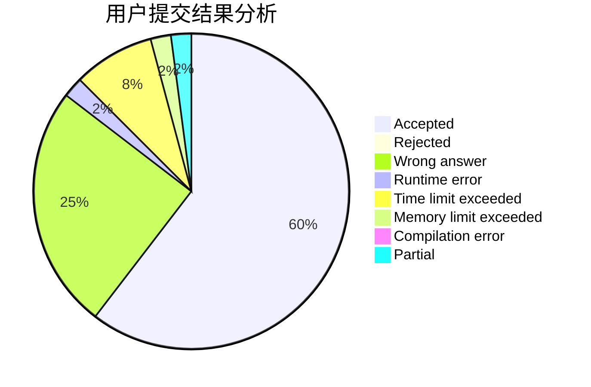
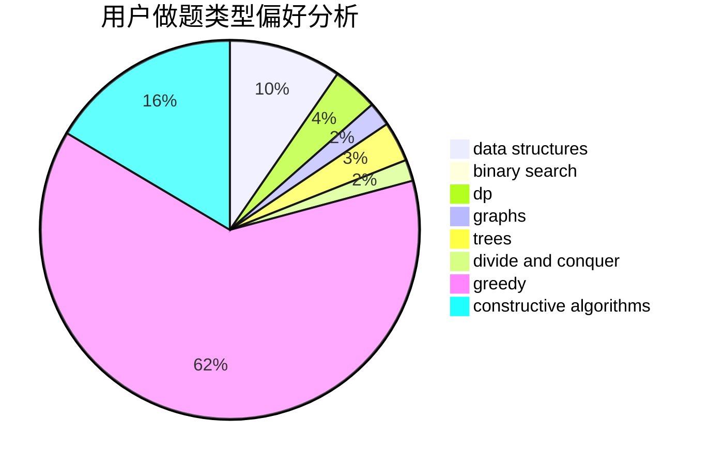
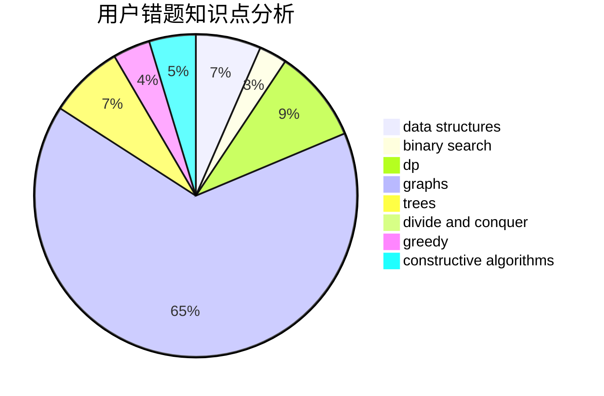

# Paulliant

<!-- tabs:start -->

#### **用户提交结果分析**

#### **用户做题类型偏好分析**

#### **用户错题知识点分析**

<!-- tabs:end -->
# 推荐题目
[1470D](https://codeforces.com/contest/1470/problem/D)		constructive algorithms,
                        dfs and similar,
                        graph matchings,
                        graphs,
                        greedy		  
[557C](https://codeforces.com/contest/557/problem/C)		brute force,
                        data structures,
                        dp,
                        greedy,
                        math,
                        sortings		  
[587C](https://codeforces.com/contest/587/problem/C)		data structures,
                        trees		  
[978C](https://codeforces.com/contest/978/problem/C)		binary search,
                        implementation,
                        two pointers		  
[1154C](https://codeforces.com/contest/1154/problem/C)		implementation,
                        math		  
[1509E](https://codeforces.com/contest/1509/problem/E)		dsu,graphs,sortings,trees		  
[1481E](https://codeforces.com/contest/1481/problem/E)		data structures,
                        dp,
                        greedy		  
[526G](https://codeforces.com/contest/526/problem/G)		greedy,
                        trees		  
[1163A](https://codeforces.com/contest/1163/problem/A)		greedy,
                        math		  
[195C](https://codeforces.com/contest/195/problem/C)		expression parsing,
                        implementation		  
