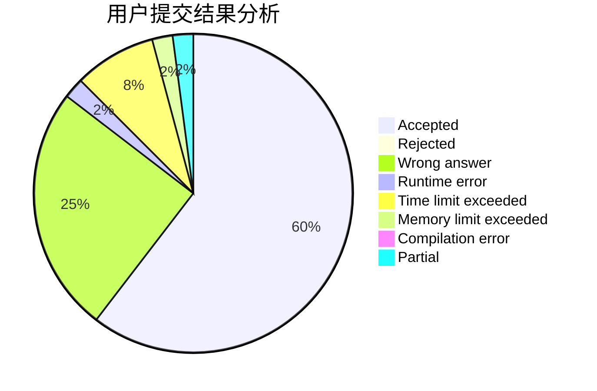
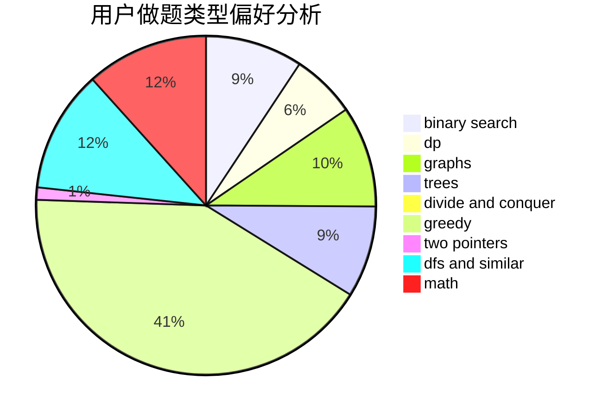

# Paulliant

<!-- tabs:start -->

#### **用户提交结果分析**

#### **用户做题类型偏好分析**

<!-- tabs:end -->
# 推荐题目
[14791](https://codeforces.com/contest/1479/problem/1)
[580D](https://codeforces.com/contest/580/problem/D)
[607D](https://codeforces.com/contest/607/problem/D)
[992A](https://codeforces.com/contest/992/problem/A)
[1156C](https://codeforces.com/contest/1156/problem/C)
[160C](https://codeforces.com/contest/160/problem/C)
[1489G](https://codeforces.com/contest/1489/problem/G)
[551A](https://codeforces.com/contest/551/problem/A)
[1164N](https://codeforces.com/contest/1164/problem/N)
[218C](https://codeforces.com/contest/218/problem/C)
