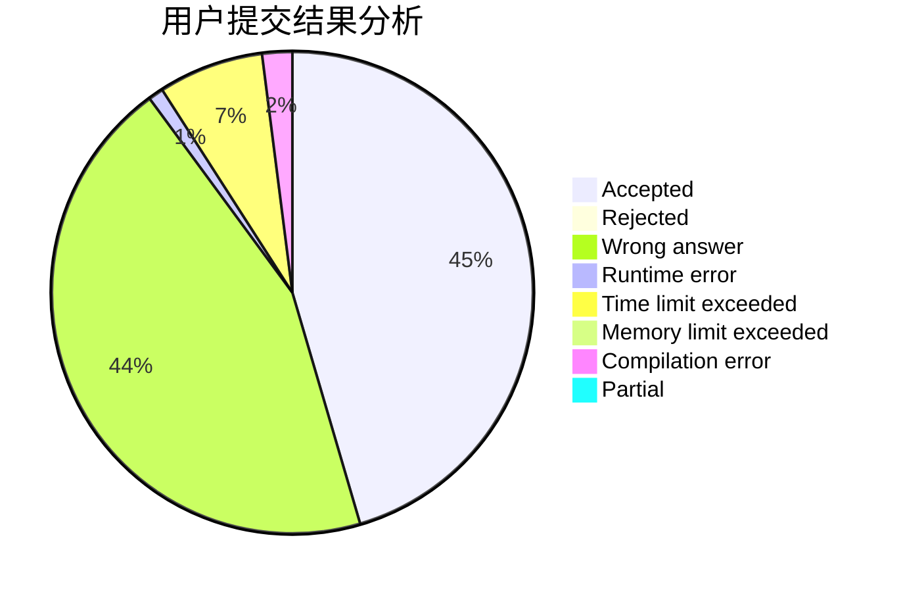
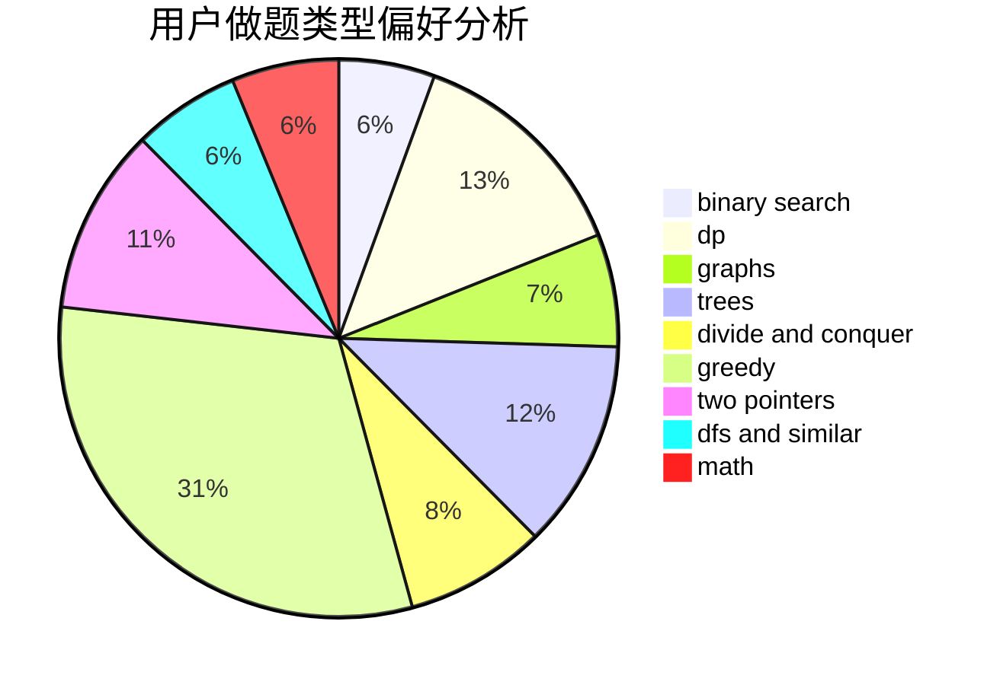

# PdrEam

<!-- tabs:start -->

#### **用户提交结果分析**

#### **用户做题类型偏好分析**

<!-- tabs:end -->
# 推荐题目
[1399F](https://codeforces.com/contest/1399/problem/F)
[109A](https://codeforces.com/contest/109/problem/A)
[198B](https://codeforces.com/contest/198/problem/B)
[939F](https://codeforces.com/contest/939/problem/F)
[229D](https://codeforces.com/contest/229/problem/D)
[817D](https://codeforces.com/contest/817/problem/D)
[401D](https://codeforces.com/contest/401/problem/D)
[351E](https://codeforces.com/contest/351/problem/E)
[1250M](https://codeforces.com/contest/1250/problem/M)
[341C](https://codeforces.com/contest/341/problem/C)
