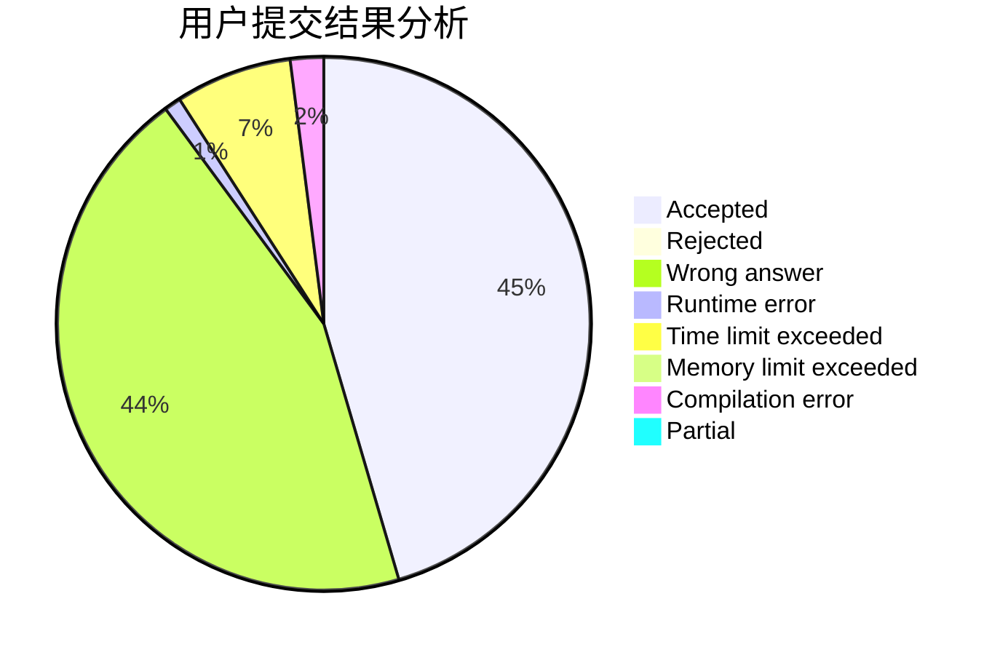
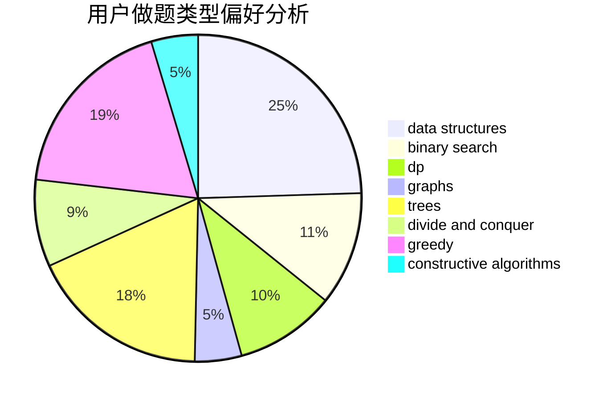
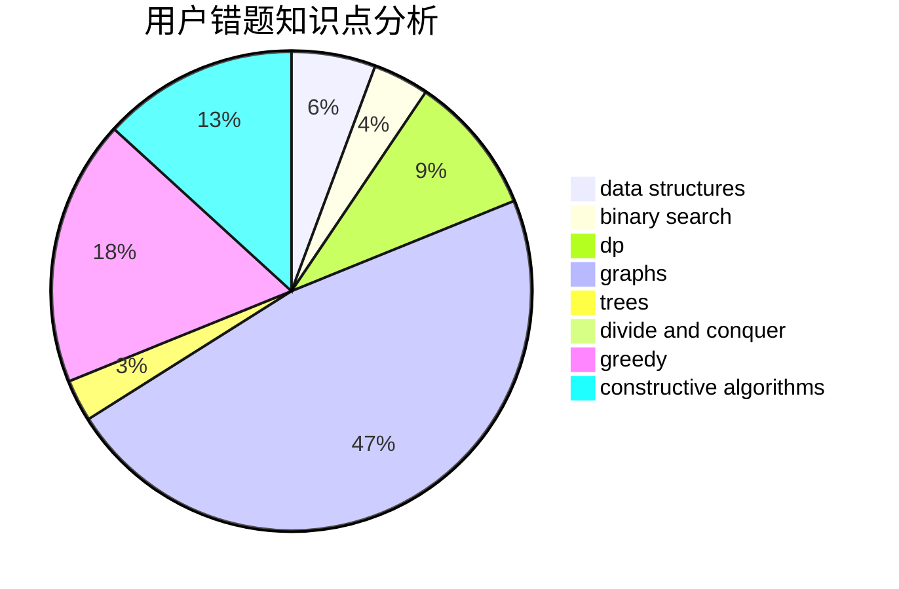

# PdrEam

<!-- tabs:start -->

#### **用户提交结果分析**

#### **用户做题类型偏好分析**

#### **用户错题知识点分析**

<!-- tabs:end -->
# 推荐题目
[1399F](https://codeforces.com/contest/1399/problem/F)		data structures,
                        dp,
                        graphs,
                        sortings		  
[109A](https://codeforces.com/contest/109/problem/A)		brute force,
                        implementation		  
[198B](https://codeforces.com/contest/198/problem/B)		shortest paths		  
[939F](https://codeforces.com/contest/939/problem/F)		data structures,
                        dp		  
[229D](https://codeforces.com/contest/229/problem/D)		dp,
                        greedy,
                        two pointers		  
[817D](https://codeforces.com/contest/817/problem/D)		data structures,
                        divide and conquer,
                        dsu,
                        sortings		  
[401D](https://codeforces.com/contest/401/problem/D)		bitmasks,
                        brute force,
                        combinatorics,
                        dp,
                        number theory		  
[351E](https://codeforces.com/contest/351/problem/E)		greedy		  
[1250M](https://codeforces.com/contest/1250/problem/M)		constructive algorithms,
                        divide and conquer		  
[341C](https://codeforces.com/contest/341/problem/C)		dsu,graphs,sortings,trees		  
