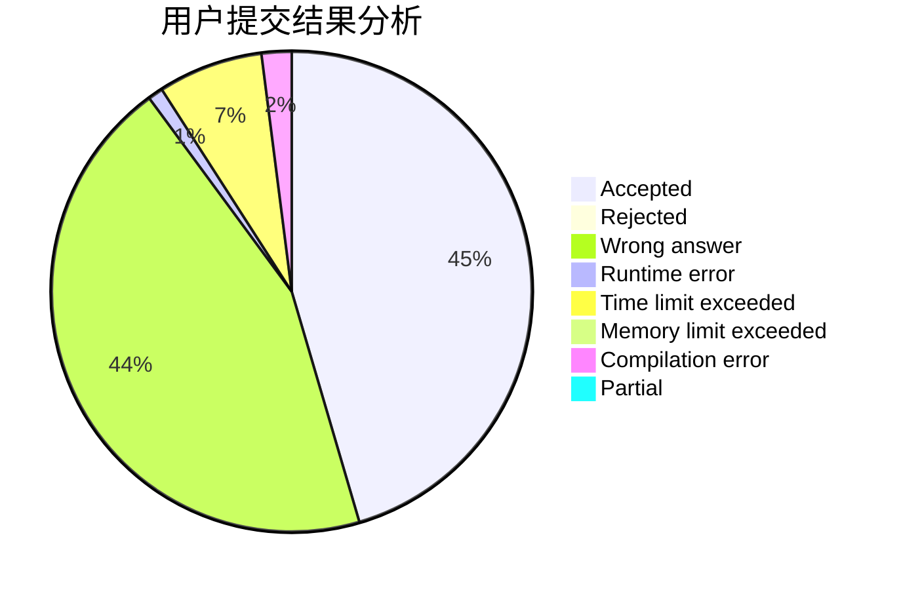
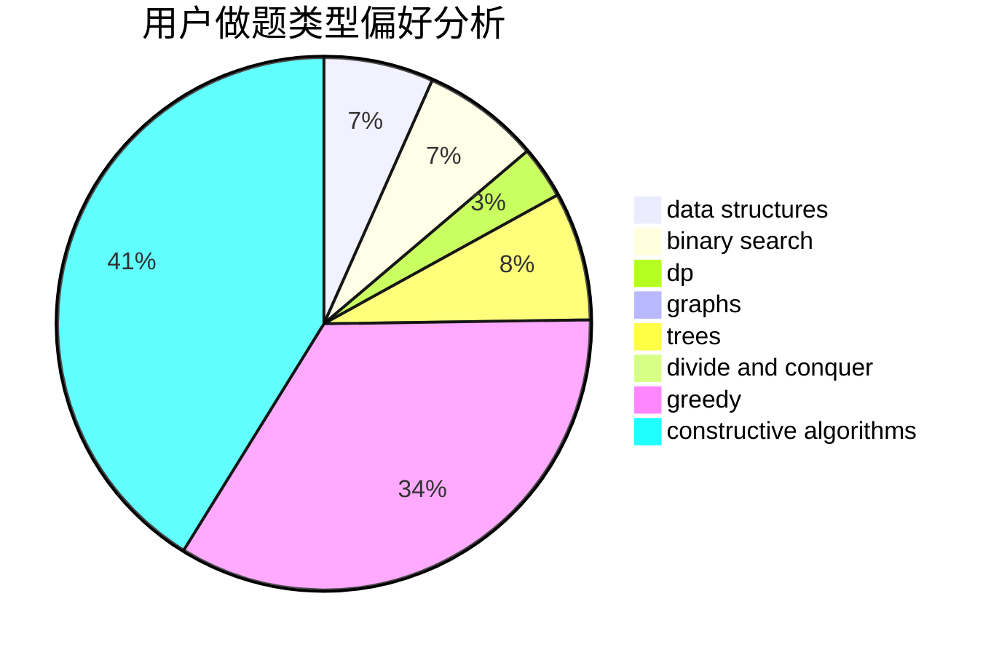
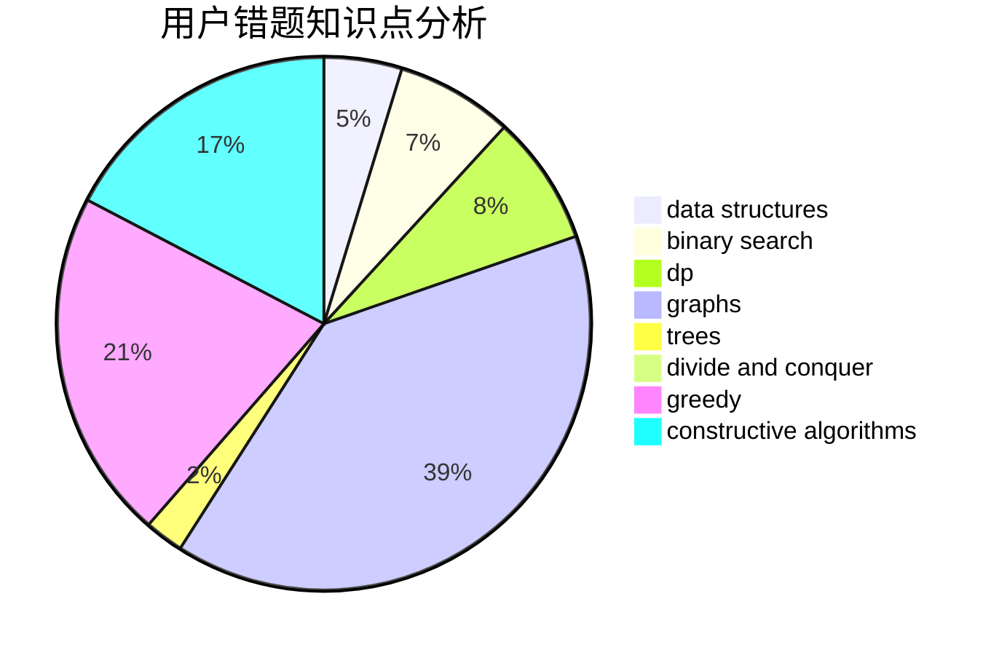

# PdrEam

<!-- tabs:start -->

#### **用户提交结果分析**

#### **用户做题类型偏好分析**

#### **用户错题知识点分析**

<!-- tabs:end -->
# 推荐题目
[1391B](https://codeforces.com/contest/1391/problem/B)		brute force,
                        greedy,
                        implementation		  
[1099D](https://codeforces.com/contest/1099/problem/D)		dsu,graphs,sortings,trees		  
[171B](https://codeforces.com/contest/171/problem/B)		*special problem,
                        combinatorics		  
[919E](https://codeforces.com/contest/919/problem/E)		chinese remainder theorem,
                        math,
                        number theory		  
[205B](https://codeforces.com/contest/205/problem/B)		brute force,
                        greedy		  
[802G](https://codeforces.com/contest/802/problem/G)		implementation,
                        strings		  
[371E](https://codeforces.com/contest/371/problem/E)		greedy,
                        math,
                        two pointers		  
[321A](https://codeforces.com/contest/321/problem/A)		binary search,
                        implementation,
                        math		  
[1246D](https://codeforces.com/contest/1246/problem/D)		dsu,graphs,sortings,trees		  
[316C2](https://codeforces.com/contest/316C/problem/2)		flows,
                        graph matchings		  
