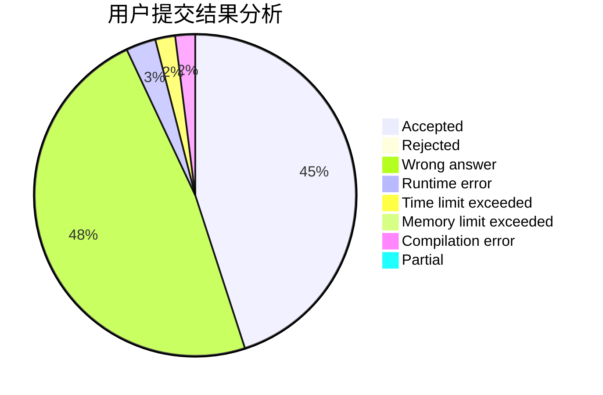
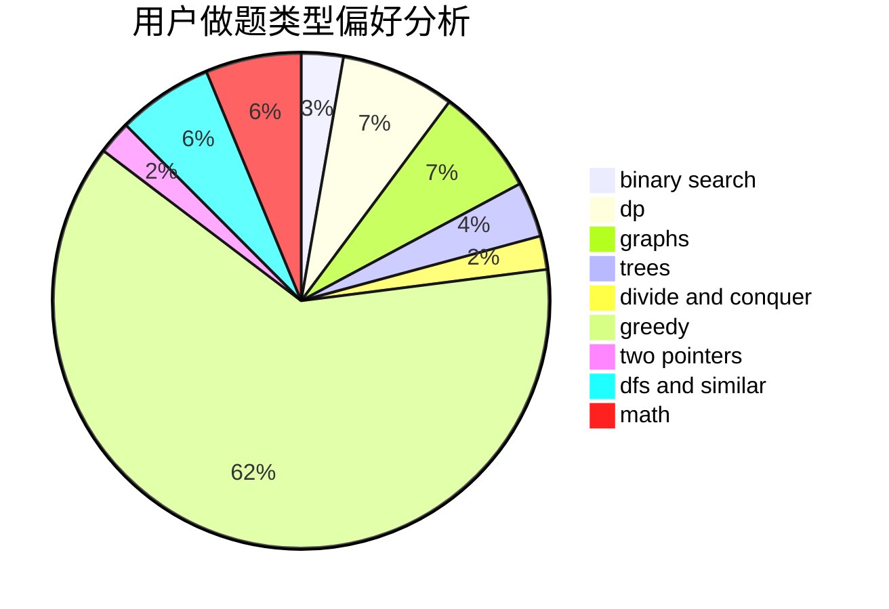

# Pe.Ph

<!-- tabs:start -->

#### **用户提交结果分析**

#### **用户做题类型偏好分析**

<!-- tabs:end -->
# 推荐题目
[1043D](https://codeforces.com/contest/1043/problem/D)
[1290C](https://codeforces.com/contest/1290/problem/C)
[816A](https://codeforces.com/contest/816/problem/A)
[70A](https://codeforces.com/contest/70/problem/A)
[1038E](https://codeforces.com/contest/1038/problem/E)
[1044D](https://codeforces.com/contest/1044/problem/D)
[908C](https://codeforces.com/contest/908/problem/C)
[515A](https://codeforces.com/contest/515/problem/A)
[317D](https://codeforces.com/contest/317/problem/D)
[803B](https://codeforces.com/contest/803/problem/B)
