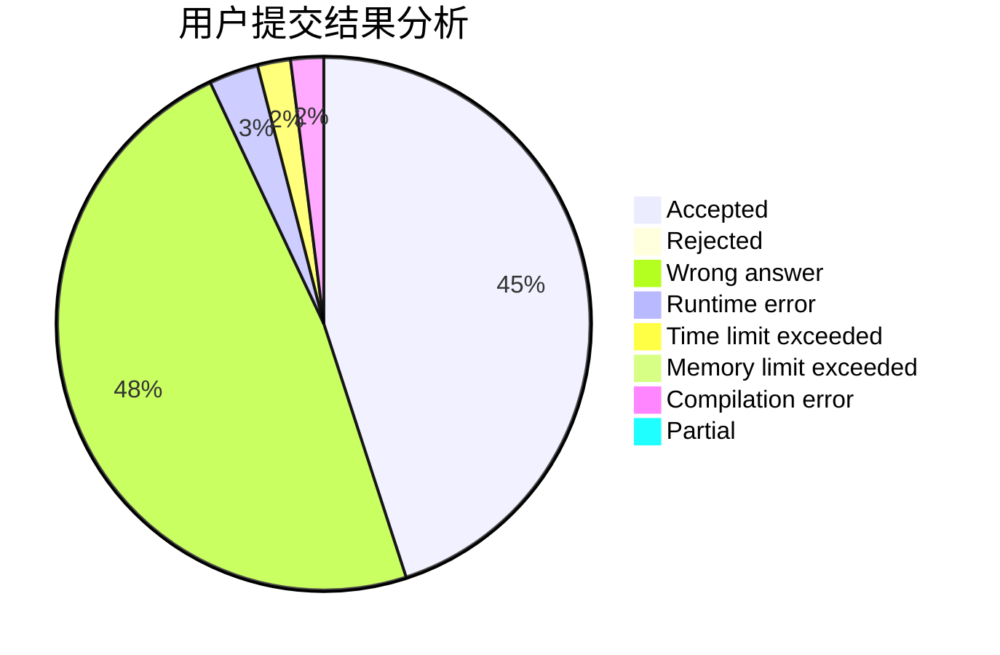
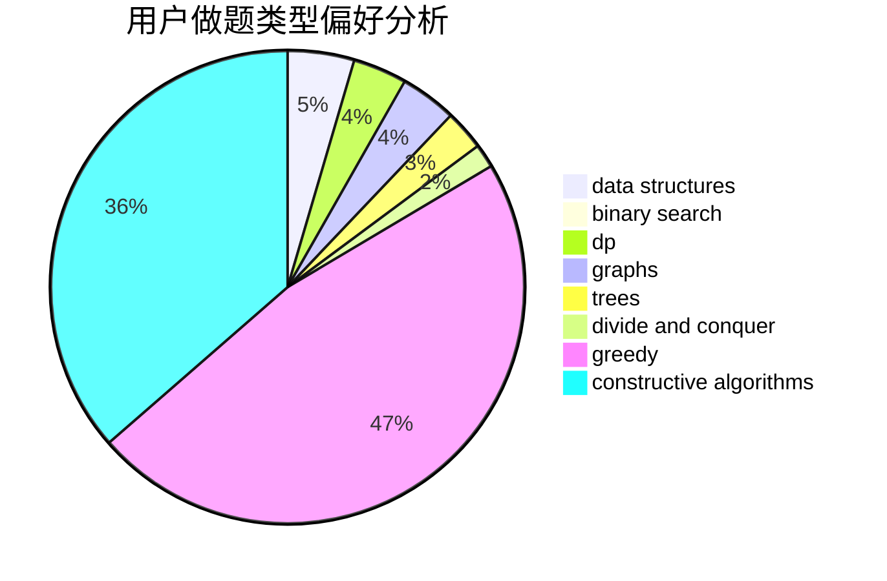
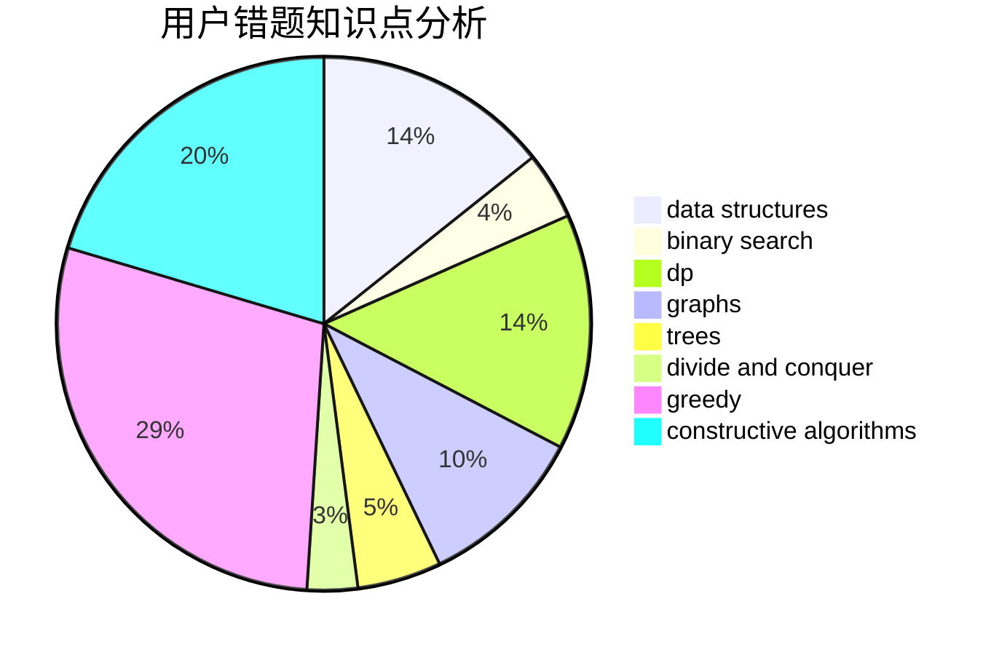

# Pe.Ph

<!-- tabs:start -->

#### **用户提交结果分析**

#### **用户做题类型偏好分析**

#### **用户错题知识点分析**

<!-- tabs:end -->
# 推荐题目
[1043D](https://codeforces.com/contest/1043/problem/D)		brute force,
                        combinatorics,
                        math,
                        meet-in-the-middle,
                        two pointers		  
[1290C](https://codeforces.com/contest/1290/problem/C)		dfs and similar,
                        dsu,
                        graphs		  
[816A](https://codeforces.com/contest/816/problem/A)		brute force,
                        implementation		  
[70A](https://codeforces.com/contest/70/problem/A)		math		  
[1038E](https://codeforces.com/contest/1038/problem/E)		bitmasks,
                        brute force,
                        dfs and similar,
                        dp,
                        graphs		  
[1044D](https://codeforces.com/contest/1044/problem/D)		data structures,
                        dsu		  
[908C](https://codeforces.com/contest/908/problem/C)		brute force,
                        geometry,
                        implementation,
                        math		  
[515A](https://codeforces.com/contest/515/problem/A)		math		  
[317D](https://codeforces.com/contest/317/problem/D)		dp,
                        games		  
[803B](https://codeforces.com/contest/803/problem/B)		constructive algorithms		  
