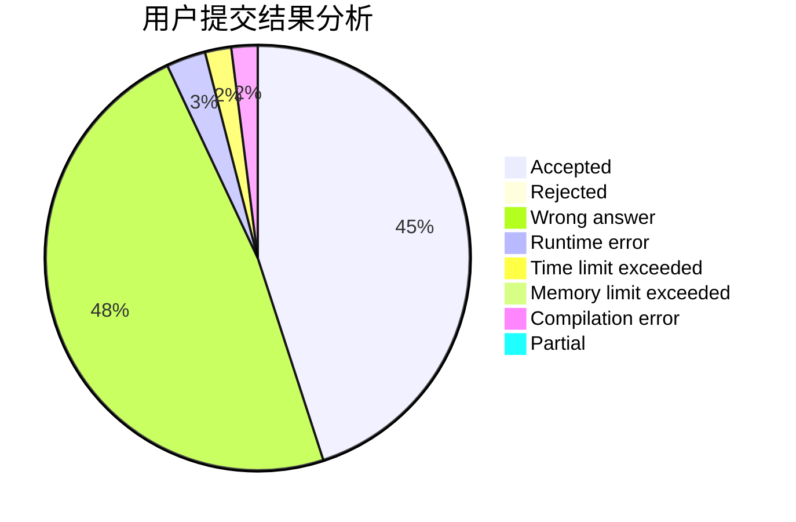
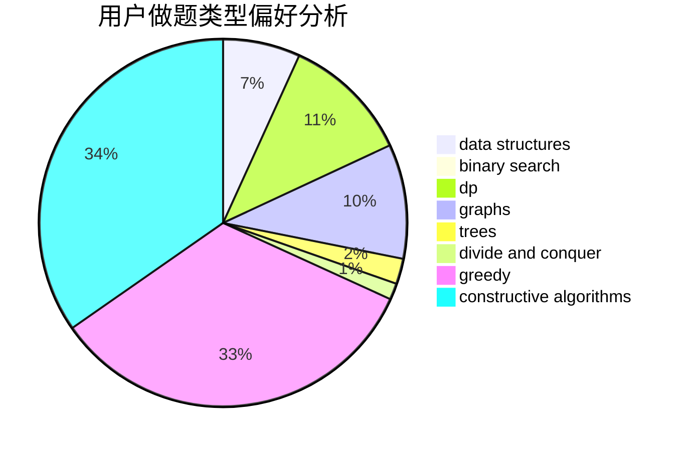
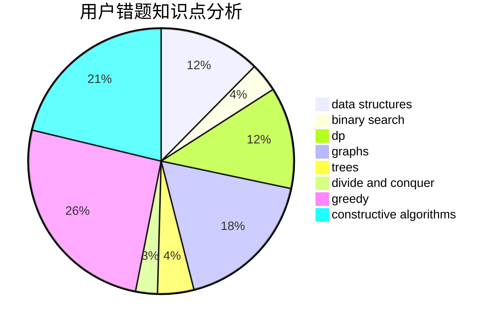

# Pe.Ph

<!-- tabs:start -->

#### **用户提交结果分析**

#### **用户做题类型偏好分析**

#### **用户错题知识点分析**

<!-- tabs:end -->
# 推荐题目
[1043A](https://codeforces.com/contest/1043/problem/A)		implementation,
                        math		  
[1283C](https://codeforces.com/contest/1283/problem/C)		constructive algorithms,
                        data structures,
                        math		  
[801A](https://codeforces.com/contest/801/problem/A)		brute force		  
[689B](https://codeforces.com/contest/689/problem/B)		dfs and similar,
                        graphs,
                        greedy,
                        shortest paths		  
[1038B](https://codeforces.com/contest/1038/problem/B)		constructive algorithms,
                        math		  
[1043G](https://codeforces.com/contest/1043/problem/G)		data structures,
                        divide and conquer,
                        hashing,
                        string suffix structures,
                        strings		  
[888E](https://codeforces.com/contest/888/problem/E)		bitmasks,
                        divide and conquer,
                        meet-in-the-middle		  
[494E](https://codeforces.com/contest/494/problem/E)		data structures,
                        games		  
[29E](https://codeforces.com/contest/29/problem/E)		graphs,
                        shortest paths		  
[787A](https://codeforces.com/contest/787/problem/A)		brute force,
                        math,
                        number theory		  
