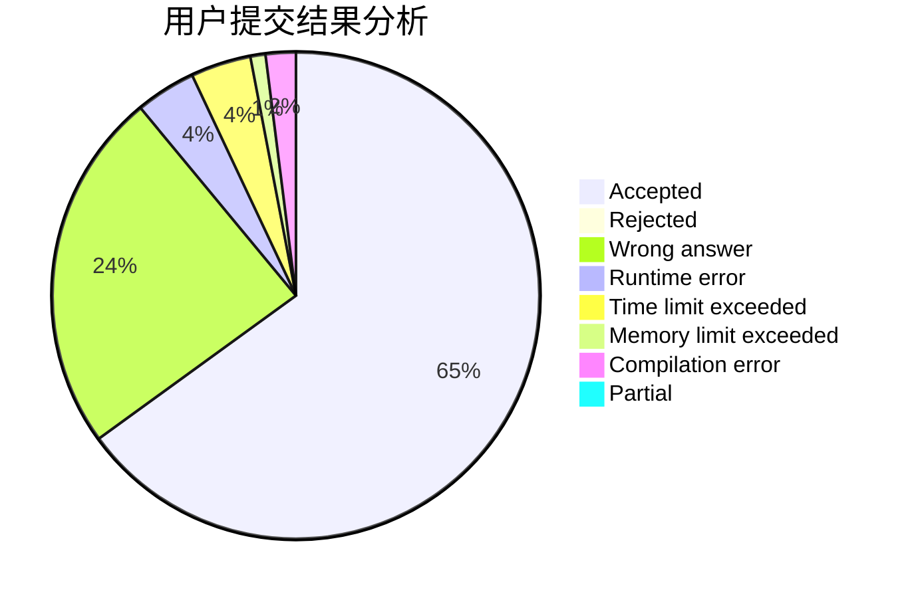
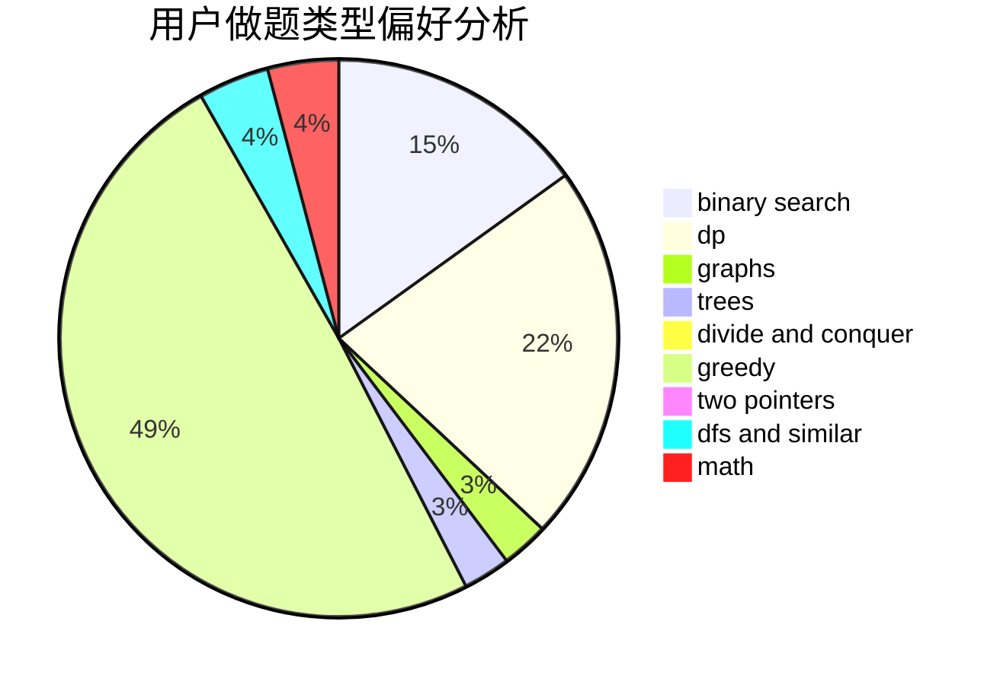

# Peanut.Tang

<!-- tabs:start -->

#### **用户提交结果分析**

#### **用户做题类型偏好分析**

<!-- tabs:end -->
# 推荐题目
[10C](https://codeforces.com/contest/10/problem/C)
[11652](https://codeforces.com/contest/1165/problem/2)
[1162D](https://codeforces.com/contest/1162/problem/D)
[1207F](https://codeforces.com/contest/1207/problem/F)
[837A](https://codeforces.com/contest/837/problem/A)
[1138F](https://codeforces.com/contest/1138/problem/F)
[545A](https://codeforces.com/contest/545/problem/A)
[199B](https://codeforces.com/contest/199/problem/B)
[1500F](https://codeforces.com/contest/1500/problem/F)
[850B](https://codeforces.com/contest/850/problem/B)
