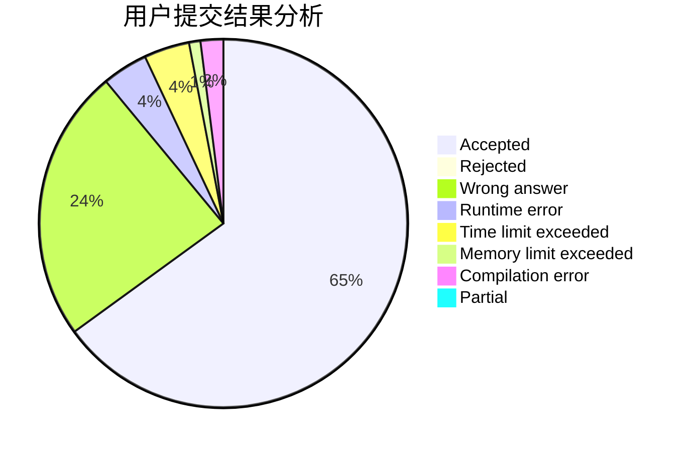
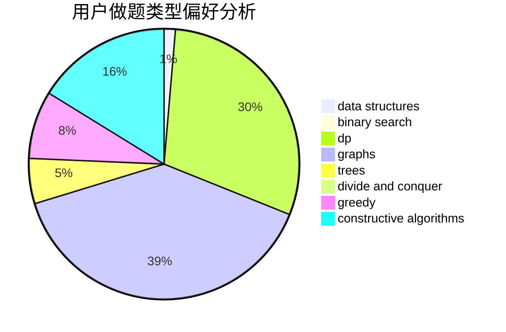
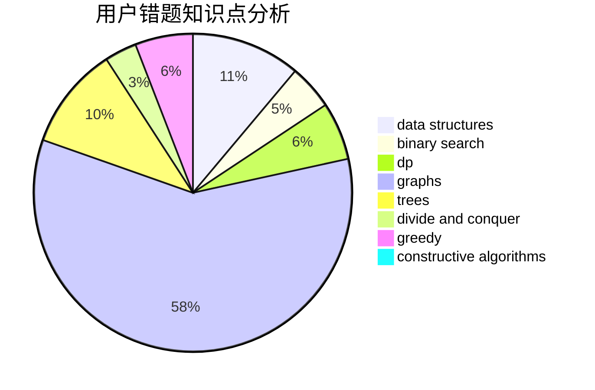

# Peanut.Tang

<!-- tabs:start -->

#### **用户提交结果分析**

#### **用户做题类型偏好分析**

#### **用户错题知识点分析**

<!-- tabs:end -->
# 推荐题目
[109A](https://codeforces.com/contest/109/problem/A)		brute force,
                        implementation		  
[1163D](https://codeforces.com/contest/1163/problem/D)		dp,
                        strings		  
[1159F](https://codeforces.com/contest/1159/problem/F)		dsu,graphs,sortings,trees		  
[1203B](https://codeforces.com/contest/1203/problem/B)		greedy,
                        math		  
[817A](https://codeforces.com/contest/817/problem/A)		implementation,
                        math,
                        number theory		  
[1136D](https://codeforces.com/contest/1136/problem/D)		greedy		  
[519E](https://codeforces.com/contest/519/problem/E)		binary search,
                        data structures,
                        dfs and similar,
                        dp,
                        trees		  
[171E](https://codeforces.com/contest/171/problem/E)		*special problem		  
[1492E](https://codeforces.com/contest/1492/problem/E)		brute force,
                        constructive algorithms,
                        dfs and similar,
                        greedy,
                        implementation		  
[831F](https://codeforces.com/contest/831/problem/F)		dsu,graphs,sortings,trees		  
