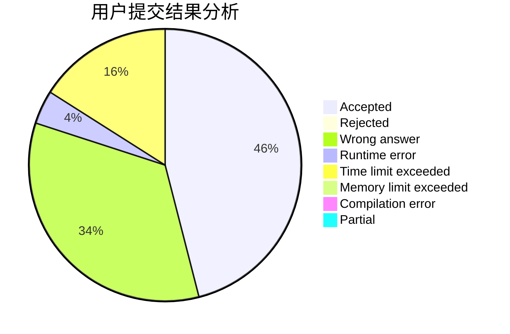
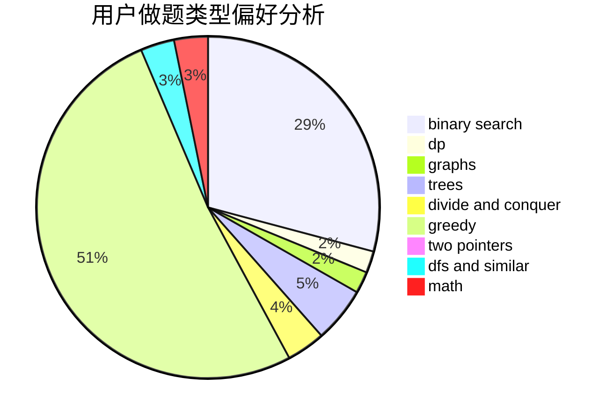

# Pecco

<!-- tabs:start -->

#### **用户提交结果分析**

#### **用户做题类型偏好分析**

<!-- tabs:end -->
# 推荐题目
[1020C](https://codeforces.com/contest/1020/problem/C)
[1329B](https://codeforces.com/contest/1329/problem/B)
[1227G](https://codeforces.com/contest/1227/problem/G)
[1020E](https://codeforces.com/contest/1020/problem/E)
[761F](https://codeforces.com/contest/761/problem/F)
[13541](https://codeforces.com/contest/1354/problem/1)
[63C](https://codeforces.com/contest/63/problem/C)
[582C](https://codeforces.com/contest/582/problem/C)
[522D](https://codeforces.com/contest/522/problem/D)
[1189E](https://codeforces.com/contest/1189/problem/E)
