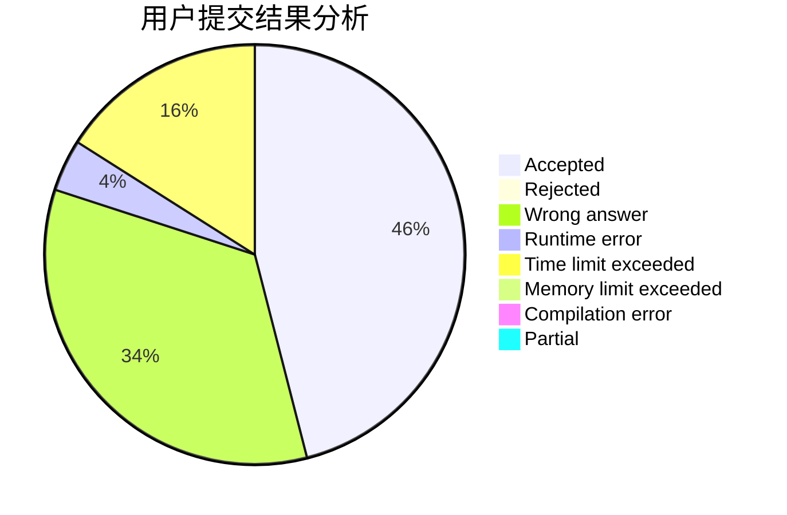
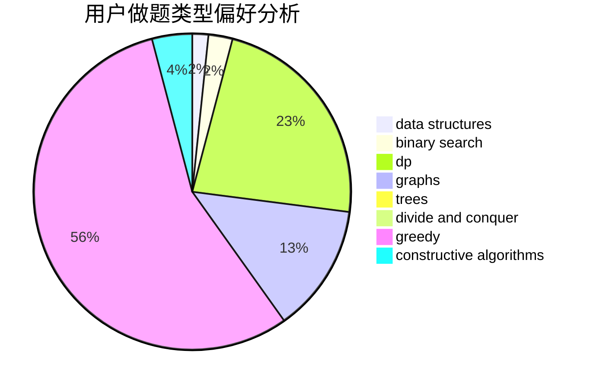
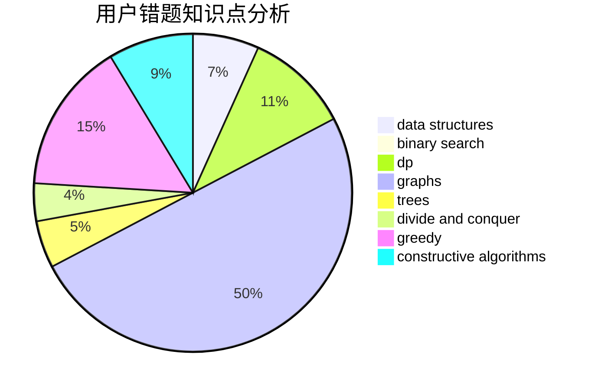

# Pecco

<!-- tabs:start -->

#### **用户提交结果分析**

#### **用户做题类型偏好分析**

#### **用户错题知识点分析**

<!-- tabs:end -->
# 推荐题目
[101D](https://codeforces.com/contest/101/problem/D)		dp,
                        greedy,
                        probabilities,
                        sortings,
                        trees		  
[1322C](https://codeforces.com/contest/1322/problem/C)		graphs,
                        hashing,
                        math,
                        number theory		  
[121E](https://codeforces.com/contest/121/problem/E)		data structures		  
[1020B](https://codeforces.com/contest/1020/problem/B)		brute force,
                        dfs and similar,
                        graphs		  
[740D](https://codeforces.com/contest/740/problem/D)		dsu,graphs,sortings,trees		  
[1346F](https://codeforces.com/contest/1346/problem/F)		*special problem,
                        data structures,
                        greedy,
                        math		  
[61A](https://codeforces.com/contest/61/problem/A)		implementation		  
[559E](https://codeforces.com/contest/559/problem/E)		dp,
                        sortings		  
[501A](https://codeforces.com/contest/501/problem/A)		implementation		  
[1185E](https://codeforces.com/contest/1185/problem/E)		brute force,
                        implementation		  
