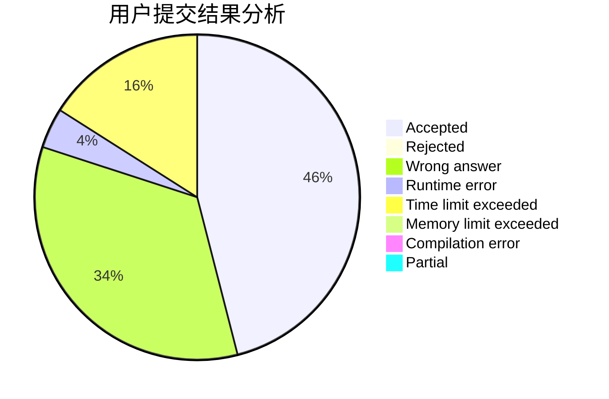
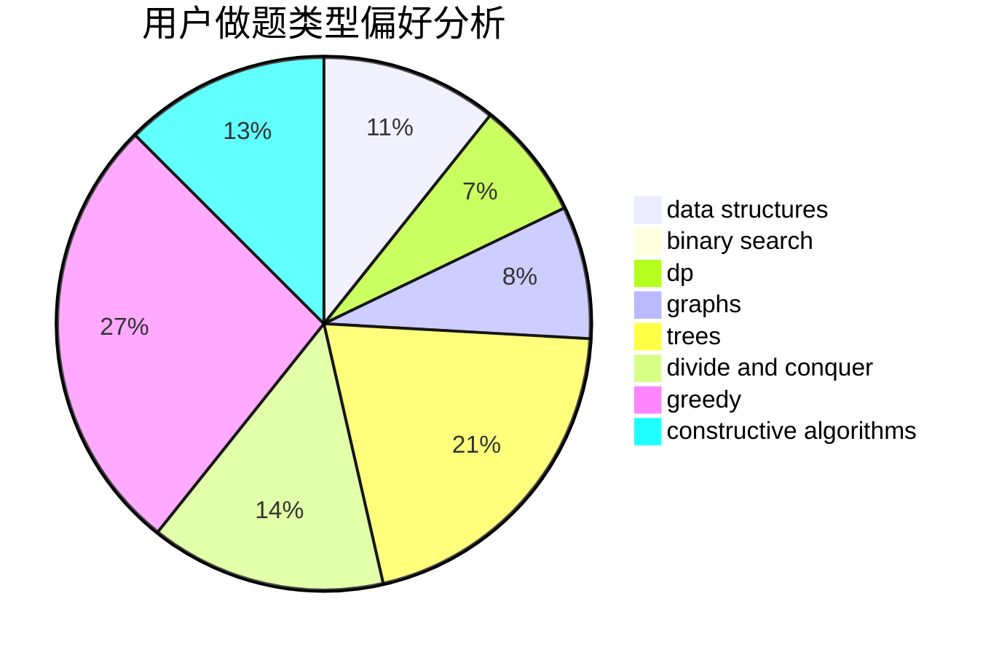
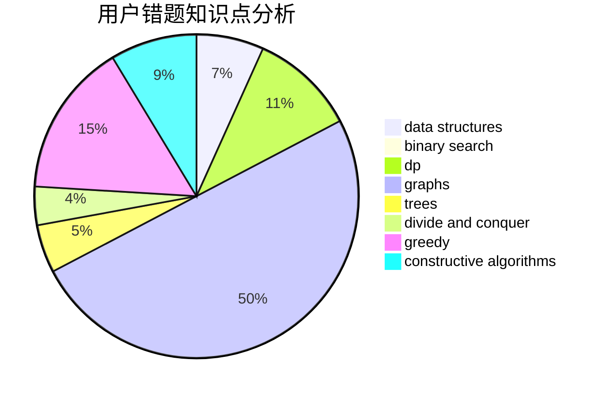

# Pecco

<!-- tabs:start -->

#### **用户提交结果分析**

#### **用户做题类型偏好分析**

#### **用户错题知识点分析**

<!-- tabs:end -->
# 推荐题目
[1020C](https://codeforces.com/contest/1020/problem/C)		dsu,graphs,sortings,trees		  
[1329B](https://codeforces.com/contest/1329/problem/B)		bitmasks,
                        combinatorics,
                        math		  
[1227G](https://codeforces.com/contest/1227/problem/G)		constructive algorithms		  
[1020E](https://codeforces.com/contest/1020/problem/E)		dsu,graphs,sortings,trees		  
[761F](https://codeforces.com/contest/761/problem/F)		brute force,
                        data structures,
                        dp,
                        implementation		  
[13541](https://codeforces.com/contest/1354/problem/1)		dsu,graphs,sortings,trees		  
[63C](https://codeforces.com/contest/63/problem/C)		brute force,
                        implementation		  
[582C](https://codeforces.com/contest/582/problem/C)		number theory		  
[522D](https://codeforces.com/contest/522/problem/D)		*special problem,
                        data structures		  
[1189E](https://codeforces.com/contest/1189/problem/E)		dsu,graphs,sortings,trees		  
