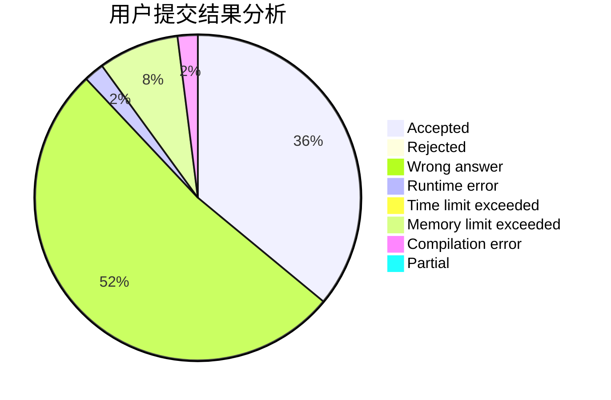
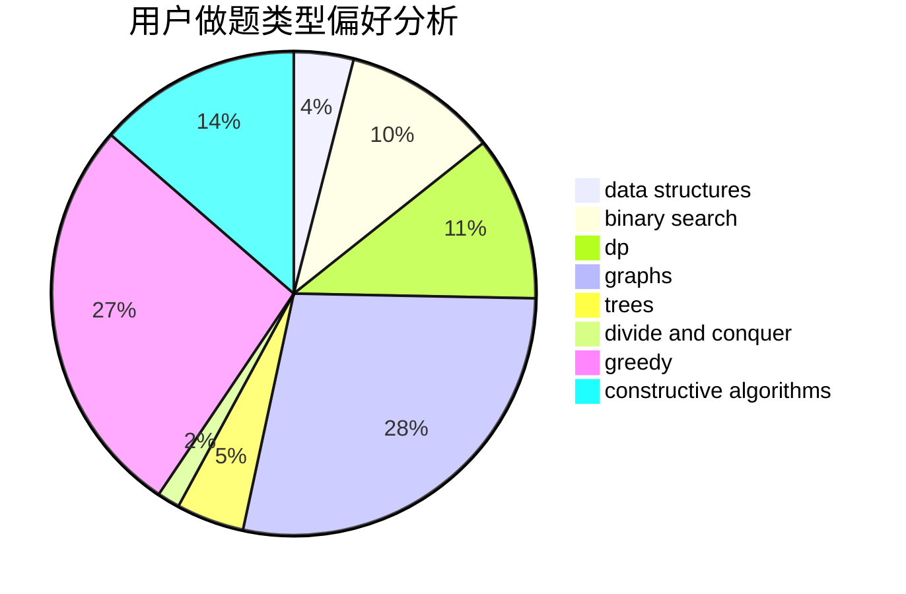
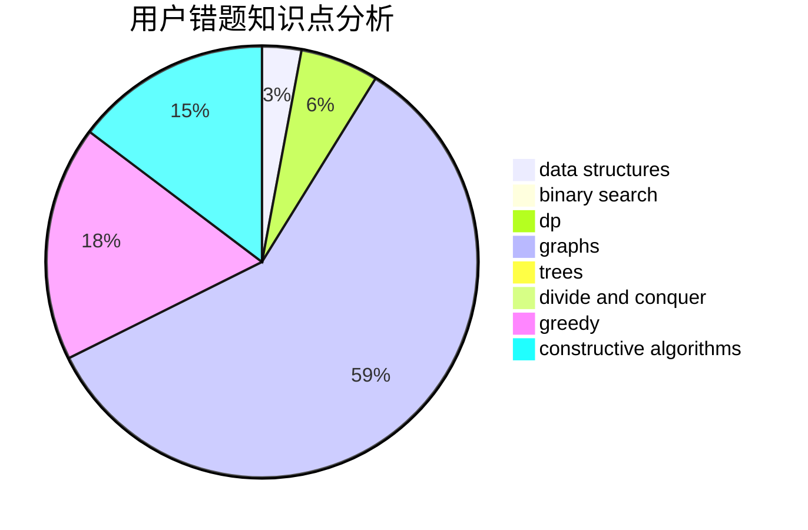

# Peipei

<!-- tabs:start -->

#### **用户提交结果分析**

#### **用户做题类型偏好分析**

#### **用户错题知识点分析**

<!-- tabs:end -->
# 推荐题目
[1238B](https://codeforces.com/contest/1238/problem/B)		greedy,
                        sortings		  
[356D](https://codeforces.com/contest/356/problem/D)		bitmasks,
                        constructive algorithms,
                        dp,
                        greedy		  
[710F](https://codeforces.com/contest/710/problem/F)		brute force,
                        data structures,
                        hashing,
                        interactive,
                        string suffix structures,
                        strings		  
[1334E](https://codeforces.com/contest/1334/problem/E)		combinatorics,
                        graphs,
                        greedy,
                        math,
                        number theory		  
[581B](https://codeforces.com/contest/581/problem/B)		implementation,
                        math		  
[1189D1](https://codeforces.com/contest/1189D/problem/1)		dsu,graphs,sortings,trees		  
[114D](https://codeforces.com/contest/114/problem/D)		dsu,graphs,sortings,trees		  
[809E](https://codeforces.com/contest/809/problem/E)		divide and conquer,
                        math,
                        number theory,
                        trees		  
[436B](https://codeforces.com/contest/436/problem/B)		implementation,
                        math		  
[1312A](https://codeforces.com/contest/1312/problem/A)		geometry,
                        greedy,
                        math,
                        number theory		  
